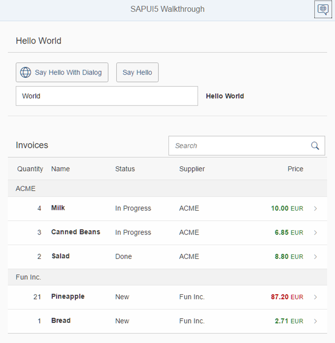

<!-- loio3da5f4be63264db99f2e5b04c5e853db -->

# Walkthrough

In this tutorial we will introduce you to all major development paradigms of SAPUI5.

We first introduce you to the basic development paradigms like *Model-View-Controller* and establish a best-practice structure of our application. We'll do this along the classic example of “Hello World” and start a new app from scratch. Next, we'll introduce the fundamental data binding concepts of SAPUI5 and extend our app to show a list of invoices. We'll continue to add more functionality by adding navigation, extending controls, and making our app responsive. Finally we'll look at the testing features and the built-in support tools of SAPUI5.

## Preview

  

> ### Tip:  
> You don't have to do all tutorial steps sequentially, you can also jump directly to any step you want. Just download the code from the previous step, copy it to your workspace and make sure that the application runs by calling the `webapp/index.html` file.
> 
> You can view and download the samples for all steps in the Demo Kit at [Walkthrough](https://ui5.sap.com/#/entity/sap.m.tutorial.walkthrough). Depending on your development environment you might have to adjust resource paths and configuration entries.
> 
> For more information check the following sections of the tutorials overview page \(see [Get Started: Setup, Tutorials, and Demo Apps](get-started-setup-tutorials-and-demo-apps-8b49fc1.md)\):
> 
> -   [Downloading Code for a Tutorial Step](get-started-setup-tutorials-and-demo-apps-8b49fc1.md#loio8b49fc198bf04b2d9800fc37fecbb218__tutorials_download)
> 
> -   [Adapting Code to Your Development Environment](get-started-setup-tutorials-and-demo-apps-8b49fc1.md#loio8b49fc198bf04b2d9800fc37fecbb218__tutorials_adaptation)

