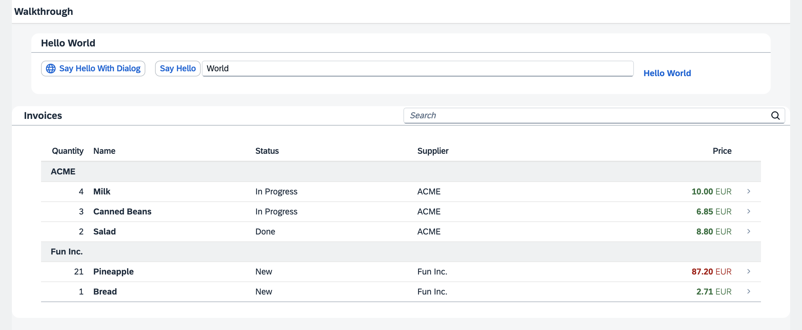

<!-- loiodad1905a07f849ce9c509721317d38d8 -->

# Walkthrough Tutorial \(TypeScript\)

In this tutorial we'll introduce you to all major development paradigms of SAPUI5. We'll demonstrate the use of TypeScript with SAPUI5 and highlight the specific characteristics of this approach.

We first introduce you to the basic development paradigms like *Model-View-Controller* and establish a best-practice structure of our application. We'll do this along the classic example of "Hello World" and start a new app from scratch. Next, we'll introduce the fundamental data binding concepts of SAPUI5 and extend our app to show a list of invoices. We'll continue to add more functionality by adding navigation, extending controls, and making our app responsive. We'll also have a look at the testing features and the built-in support tools of SAPUI5.

## Preview

> ### Tip:  
> You don't have to do all tutorial steps sequentially, you can also jump directly to any step you want. Just download the code from the previous step and make sure that the application runs as intended.
> 
> You can view the samples for all steps and download the solutions as zip files on GitHub at [OpenUI5 TypeScript Walkthrough](https://github.com/SAP-samples/ui5-typescript-walkthrough/tree/main/README.md).

The tutorial consists of the following steps. To start, just open the first link - you'll be guided from there.

