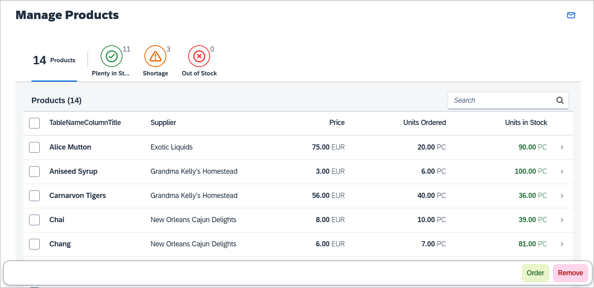
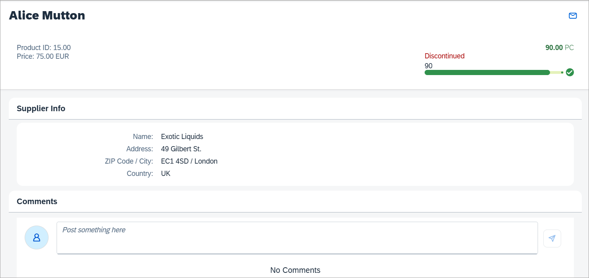

<!-- loio6a6a621c978145ad9eef2b221d2cf21d -->

# Worklist App

In this tutorial we will build an app using SAPUI5 that, for example, a shop owner can use to manage his product stock levels.

The app provides the following features:

-   Overview of all products

-   Track products with shortages or products that are completely out of stock

-   Reorder products that are low in stock

-   View product details and add comments

We will use the worklist template as a starting point for this tutorial and add additional features to the app as we go through the steps. The template implements a typical "Worklist" floorplan, one of the patterns that are specified by the SAP Fiori design guidelines, but you can also use it as a starting point for easily creating any kind of list-based apps. For more information about worklist floorplans, see the *Related Information* section at the bottom of this topic.

## Preview

   
  
<a name="loio6a6a621c978145ad9eef2b221d2cf21d__fig_swx_sgp_zt"/>Start page of the app with list of products and actions

  

   
  
<a name="loio6a6a621c978145ad9eef2b221d2cf21d__fig_wnz_wgp_zt"/>Product detail page of the app

  

> ### Tip:  
> You don't have to do all tutorial steps sequentially, you can also jump directly to any step you want. Just download the code from the previous step, and start there.
> 
> You can view and download the files for all steps in the Demo Kit at [Worklist App](https://ui5.sap.com/#/entity/sap.m.tutorial.worklist). Copy the code to your workspace and make sure that the application runs by calling the `webapp/index.html` file. Depending on your development environment you might have to adjust resource paths and configuration entries.
> 
> For more information check the following sections of the tutorials overview page \(see [Get Started: Setup, Tutorials, and Demo Apps](get-started-setup-tutorials-and-demo-apps-8b49fc1.md)\):
> 
> -   [Downloading Code for a Tutorial Step](get-started-setup-tutorials-and-demo-apps-8b49fc1.md#loio8b49fc198bf04b2d9800fc37fecbb218__tutorials_download)
> 
> -   [Adapting Code to Your Development Environment](get-started-setup-tutorials-and-demo-apps-8b49fc1.md#loio8b49fc198bf04b2d9800fc37fecbb218__tutorials_adaptation)

1.  [Step 1: Creating the Initial App](step-1-creating-the-initial-app-fc2c358.md "In this step, we set up the initial app.")  
In this step, we set up the initial app.
2.  [Step 2: Custom Mock Data](step-2-custom-mock-data-3118903.md "In this step, we want to change the mock data of the initial app.")  
In this step, we want to change the mock data of the initial app.
3.  [Step 3: Extending the Worklist Table](step-3-extending-the-worklist-table-84100bc.md "In this step, we will edit the worklist table to include additional columns for our
		manage product stocks scenario. We display the supplier, the product price, and the number
		of units on order for each product and format the values accordingly.")  
In this step, we will edit the worklist table to include additional columns for our manage product stocks scenario. We display the supplier, the product price, and the number of units on order for each product and format the values accordingly.
4.  [Step 4: Quick Filter for the Worklist](step-4-quick-filter-for-the-worklist-85ec3a9.md "For easily detecting and managing product shortages in our app, we will add a quick
		filter for the worklist table. Users can press the filter tabs to display the products
		according to whether they are in stock, have low stock or no stock. The table will update
		accordingly and show only the products matching the criteria.")  
For easily detecting and managing product shortages in our app, we will add a quick filter for the worklist table. Users can press the filter tabs to display the products according to whether they are in stock, have low stock or no stock. The table will update accordingly and show only the products matching the criteria.
5.  [Step 5: Adding Actions to the Worklist](step-5-adding-actions-to-the-worklist-2da220f.md "Now we can easily spot shortages on our stock, but we would also like to take action and resolve it. Either we can decide to remove the
		product until the shortage is resolved or order new items of the product. In this step, we will add these actions to the footer of the
		worklist table.")  
Now we can easily spot shortages on our stock, but we would also like to take action and resolve it. Either we can decide to remove the product until the shortage is resolved or order new items of the product. In this step, we will add these actions to the footer of the worklist table.
6.  [Step 6: Extending the Detail Page](step-6-extending-the-detail-page-b561d14.md "In this step, we will extend the detail page of our app to show more information of a
		given product with various UI controls. We will enrich the header area and display further
		attributes in an info panel for information about the supplier.")  
In this step, we will extend the detail page of our app to show more information of a given product with various UI controls. We will enrich the header area and display further attributes in an info panel for information about the supplier.
7.  [Step 7: Adding a Comments Section](step-7-adding-a-comments-section-c73dfe3.md "In this step, we extend the product detail view by adding a feature allowing to add
		comments to the product.")  
In this step, we extend the product detail view by adding a feature allowing to add comments to the product.

**Related Information**  

[SAP Fiori design guidelines: Worklist Floorplans](https://experience.sap.com/fiori-design/floorplans/work-list/)

[Developing Apps with SAP Fiori Tools](developing-apps-with-sap-fiori-tools-a460a73.md "SAP Fiori tools is a set of extensions for SAP Business Application Studio and Visual Studio Code that makes it faster and easier to develop basic SAP Fiori apps.")

