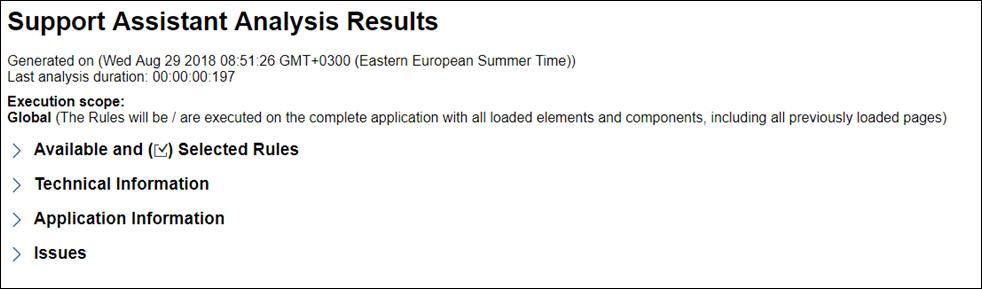
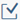
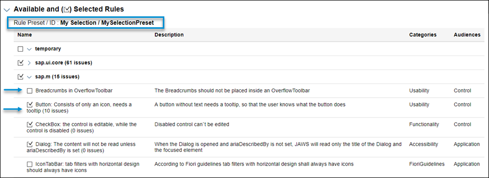
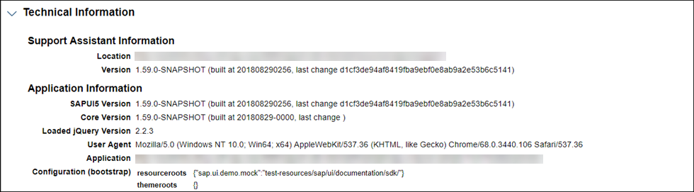
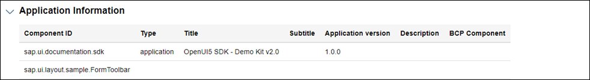
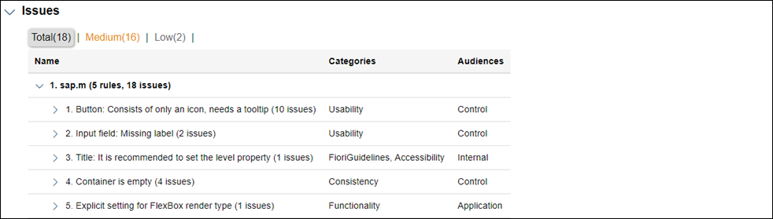

<!-- loio29bcdec715a2428092666212bb6bb875 -->

# Analysis Report

The information from the execution of the Support Assistant is available as a separate HTML document. It can be viewed from the *Report* dropdown menu.

The report contains information from the loaded components, a detailed list of the technical information and a list with all issues. The following image shows the report with collapsed sections.

  
  
**Analysis Results: Collapsed View**

The report contains the following elements:

1.  A time stamp for when it has been generated.

2.  Last analysis duration showing the time taken by the last analysis.

3.  An execution scope with short description.

4.  Available and selected rules.

    Here you can see all available rules per library. All rules that have been selected for the analysis are marked with a checkmark \(\). This section also gives you information about the used rule preset and its ID.

      
      
    **Analysis Results: Rules**

    

5.  Technical information section. Here you can see the version of the Support Assistant and the location from which it has been loaded as well as more information about the app.

      
      
    **Analysis Results: Technical Information**

    

6.  Application information section.

      
      
    **Analysis Results: Application Information**

    

7.  Issues section.

    The issues are grouped by library and rule. In the following example, there is one library \(`sap.m`\) with 5 rules. They have generated 18 issues in total - 16 with medium severity and 2 with low severity.

      
      
    **Analysis Results: Issues**

    

You can also download the report by selecting *Download* \(below the *View* button\). The report is going to be downloaded in a ZIP format containing the following files:

-   The report HTML \(*report.html*\)

-   A JSON file with all loaded components *\(appInfos.json*\)

-   A JSON file with all issues \(*issues.json*\)

-   A JSON file with all technical information \(*technicalInfo.json*\)

