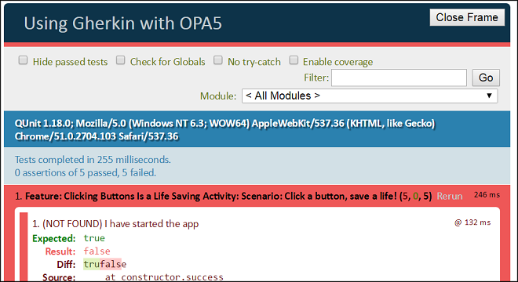
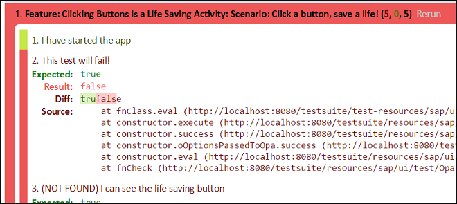
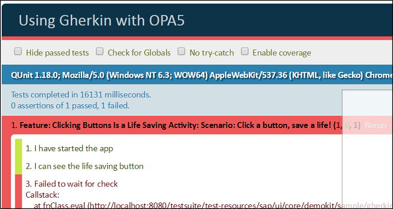
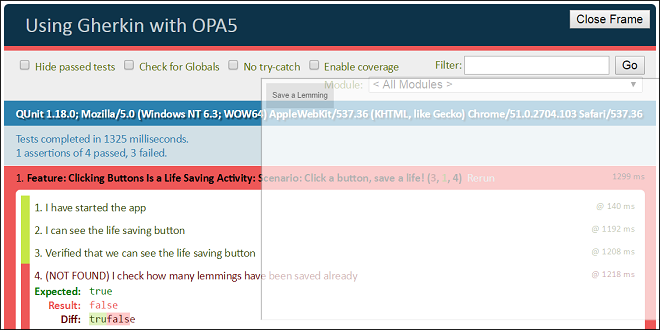

<!-- loio4b0c51965ebd40059daf3419ba35f694 -->

# Basic Example How to Use Gherkin

Like test-driven development \(TDD\), behavior-driven development \(BDD\) with Gherkin encourages us to write more tests because you do it right from the beginning. Having more tests makes it cheaper and easier to maintain the code over time. Let's dive into the specifics using following an example.


The ideal pattern for a BDD iteration goes like this:

1.  Write a scenario in the feature file.

2.  Execute the test to verify that the step definition is not found.

    This might seem strange since we haven't actually written a test yet, but this way we can check to see that our feature file works.

3.  Write the step definition in the steps file.

4.  Execute the test, see the test fail.

5.  Develop the missing code in the app.

6.  Execute the test and watch it pass.

7.  Return to step 1.


> ### Note:  
> You can find the code for this example in the *Samples* in the Demo Kit at [Using Gherkin with OPA5](https://ui5.sap.com/#/entity/sap.ui.test.Opa5/sample/sap.ui.core.sample.gherkin.GherkinWithOPA5).


## Write the first feature file

Do you like lemmings? According to legend, they occasionally throw themselves into the sea in a mass suicide attempt. Imagine that you are writing an app that allows you to save lemmings' lives by clicking a button. In the BDD style, the first thing you do is write a feature file to document what your app is supposed to do.


### Requirements1.feature

Create the following feature file \(make sure that you use file extension `.feature`\):

```
#!featureFeature: Clicking Buttons is a Life Saving Activity

    Let's save some lemmings' lives

  Scenario: Click a button, save a life!
    Given I have started the app
      And I can see the life saving button
      And I check how many lemmings have been saved already
     When I click on the life saving button
     Then I save a lemming's life
```


## Execute a test

Next we should execute the test. This might seem strange since we haven't actually written a test yet, but this way we can check to see that our feature file works. Also, if you are working in a large project, some of the tests might have already been written by a colleague. Gherkin notifies us of all of the missing tests, and then we can proceed to write them one by one.

To actually execute the test, we need to create an HTML bootstrap test runner file, and a `Steps.js` stub file.


### Steps.js

Here is a stub `Steps.js` file, without any step definitions, to get you started. You need to adjust the path and file name in the call to `extend` to match your scenario:

```js
sap.ui.define([
  "jquery.sap.global",
  "sap/ui/test/gherkin/StepDefinitions",
  "sap/ui/test/Opa5",
  "sap/ui/test/gherkin/dataTableUtils"
], function(StepDefinitions, Opa5, dataTableUtils) {
  "use strict";

  return StepDefinitions.extend("GherkinWithOPA5.Steps", {
    init: function() {
    }
  });

});

```

To execute Gherkin tests, you need to find a version of SAPUI5 or OpenUI5 that works for you. Here are some possibilities with different stability:

-   Stable: `https://ui5.sap.com/resources/sap-ui-core.js`

-   Stable: `https://sdk.openui5.org/resources/sap-ui-core.js`

-   Nightly: `https://openui5nightly.hana.ondemand.com/resources/sap-ui-core.js`


Our examples all use the nightly OpenUI5 build.


### Website.html

Here is a sample HTML bootstrap file for Gherkin. In this example, the feature file is named `Requirements.feature` and the steps file is named `Steps.js`. Both are located in the same directory as your HTML bootstrap. You will need to adjust the SAPUI5 `src` \(if you don't want to use the suggested build\), SAPUI5 resourceroots, and the feature and steps file names to match your scenario and your app:

```html
<!DOCTYPE html>
<html>
  <head>
    <meta charset="utf-8">
    <title>Using Gherkin with OPA5</title>

    <script
      id="sap-ui-bootstrap"
      src="https://openui5nightly.hana.ondemand.com/resources/sap-ui-core.js"
      data-sap-ui-resourceroots='{"GherkinWithOPA5": "./"}'
      data-sap-ui-loglevel="INFO"
    ></script>

    <script>
      sap.ui.require([
        "jquery.sap.global",
        "sap/ui/test/gherkin/opa5TestHarness",
        "GherkinWithOPA5/Steps"
      ], function(opa5TestHarness, Steps) {
        "use strict";

        opa5TestHarness.test({
          featurePath: "GherkinWithOPA5/Requirements",
          steps: Steps
        });

      });
    </script>

  </head>
  <body>
    <div id="qunit"></div>
    <div id="qunit-fixture"></div>
  </body>
</html>

```

When you load the HTML file in your browser, the Gherkin tests are executed automatically . If you are using Google Chrome, you may need to start it with the command line flags`--allow-file-access-from-files --disable-web-security`. When everything is working correctly, you should see something like the following in your browser:



We expect the test to fail because we haven't written any tests yet. You'll notice that Gherkin has explained that it was not able to find a matching step definition for the first test step, "I have started the app", in the steps file. Scrolling down, you can see that none of the test steps have been found. We will need to write these step definitions.

Looking back at the feature file that we wrote, "I have started the app" is the first test step in the test scenario. Hence, it makes sense that we would see this test step first in the test results. You can also see the exact wording of the `Feature` and `Scenario` text that you entered: `Feature: Clicking Buttons Is a Life Saving Activity: Scenario: Click a button, save a life!`. This should make it easier for you to find your way around in the test results.


## Write the first failing test

To verify the feature file, we will implement a steps file, which to recap is both the translation that allows the computer to understand the human-readable feature file, and also the verification steps \(tests\) to be run. Once you have a working feature file and can execute the test suite, then you are ready to write your first test. We will start by writing a simple test that we expect to fail.

In the `Steps` file, inside the `init` method, add the following code:

```js
this.register(/^I have started the app$/i, function() {
  Opa5.assert.ok(false, 'This test will fail!');
});

```

The `register` method defines a new step definition and takes two arguments:

-   a regular expression to match against the test steps in the feature file

-   a function to execute when there is a match


At test execution time, the Gherkin test harness tries to find a step definition with a matching regular expression, and execute the step definition's test function.

Try executing the test now. You should see something like this:



Step 1 is green because a matching step definition was found in the steps file. In Gherkin, the test harness always checks for the existence of the step definition first before executing the step definition's function. After Gherkin finds a step definition, it executes the step definition's function, and thus executes any QUnit assertions inside the function.

In step 2, notice how the text "This test will fail!" is copied from the steps file. You can use this functionality to make it easier to debug your test. We recommend that you start any QUnit assertion comment with the word “Verified” to make it easier to read your test executions.


## Write the second failing test

Let's write a bit more test code. To make a test useful, it will need to load your app and verify its properties. We will use OPA5 for this purpose. Replace the code inside your steps file's `init` method with the following code:

```js
var oOpa5 = new Opa5();

this.register(/^I have started the app$/i, function() {
  oOpa5.iStartMyAppInAFrame("Website.html");
});

this.register(/^I can see the life saving button$/i, function() {
  oOpa5.waitFor({
    id: "life-saving-button",
    success: function(oButton) {
      Opa5.assert.strictEqual(oButton.getText(), "Save a Lemming",
      "Verified that we can see the life saving button");
    }
  });
});
```

You may need to adapt the above code to fit your situation. When you execute this code, you should see something like this:



There are several important things to note here:

For one, now that you are actually testing the app, you will see a popup overlay of the application under test appear in the bottom right corner of the window. This overlay is interactive, although you should wait until the test is complete before trying to interact with it. The overlay is extremely helpful for debugging your tests since at any given point in time you can see what state the app is in, particularly when the debugger is running and execution is paused. If the overlay is getting in the way, then after the tests have finished executing you can get rid of it by selecting the *Close Frame* checkbox at the top left.

In the above screenshot, steps 1 and 2 are passing because Gherkin was able to match the feature file test step to a step definition in the steps file. The test step "I have started the app" does not actually execute any verifications \(that is, it does not call any QUnit assertion functions\) and hence there is no verification occurring between "I have started the app" and "I can see the life saving button". Step 3 is the actual verification of the app executed inside the step definition "I can see the life saving button" function, and since in this example the app is an empty Web page, the test is failing. The error message `Failed to wait for check` is an OPA5 error that happens when the `waitFor` function fails to find the SAPUI5 control that's being searched for.


## Write the first passing test

To make the "I can see the life saving button" test pass, you need to implement the app that is under test.


### Website.html

Here is a simple stub for a test Web site \(you may need to update the bootstrap source\):

```html
<html>
  <head>
    <title>Using Gherkin with OPA5 Website</title>
    <script
      id="sap-ui-bootstrap"
      src="https://openui5nightly.hana.ondemand.com/resources/sap-ui-core.js"
      data-sap-ui-libs="sap.m,sap.ui.layout"
    ></script>
    <script src="WebsiteCode.js"></script>
  </head>
  <body class="sapUiBody">
    <div id="uiArea"></div>
  </body>
</html>
```


### WebsiteCode.js

Here's some simple code for an app:

```js
sap.ui.getCore().attachInit(function() {
  "use strict";

  var oLayout = new sap.ui.layout.VerticalLayout({id: "layout"});

  var oButton = new sap.m.Button({
    id: "life-saving-button",
    text: "Save a Lemming",
    press: function() {}
  });

  oLayout.addContent(oButton);
  oLayout.placeAt("uiArea");

});
```

Now when you execute the test, you should see a passed verification step:



Steps 1 and 2 passed because the corresponding step definitions were found in the steps file. Here Gherkin is confirming that it was able to find the step definitions.

Step 3 was an actual verification step that executed a QUnit assertion to verify a property of the Web page.

Step 4 is failing because you haven't written that step definition yet.

Your next activity would be to write a step definition for step 4, execute the test and see it fail, then write the new code in the app, execute the test and see it pass, and so on.

