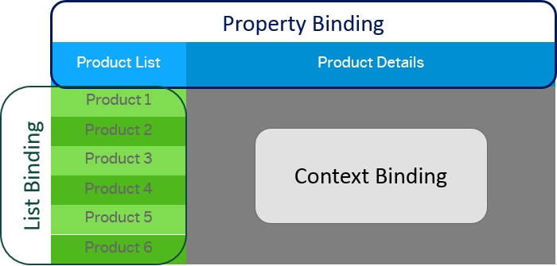

<!-- loio91f0d8ab6f4d1014b6dd926db0e91070 -->

# Binding Types

Depending on the different use cases, you can use different binding types: Propety binding, context binding, and list binding.

-   **Property binding** allows properties of the control to get automatically initialized and updated from model data. You can only bind control properties to model properties of a matching type, or you use a formatter or a data type to parse and convert the data as needed For more information, see [Formatting, Parsing, and Validating Data](formatting-parsing-and-validating-data-07e4b92.md).

-   **Context binding** \(or **"element binding"**\) allows to bind elements to a specific object in the model that creates a binding context and allows relative binding within the control and all of its children. This is especially helpful in list-detail scenarios.

-   **List binding** \(or **"aggregation binding"**\) can be used to automatically create child controls according to model. This can be done either by cloning a template control, or by using a factory function. Aggregations can only be bound to lists defined in the model, that is, to arrays in a JSON model or a collection in the OData model.

    > ### Note:  
    > The model has a default size limit to avoid too much data being rendered on the UI. This size limit determines the number of entries used for the list bindings. The default size limit is 100 entries.
    > 
    > This means that controls that don't support paging or don't request data in chunks \(e.g. `sap.m.ComboBox`\) only show 100 entries even though the model contains more items.
    > 
    > To change this behavior, you can either set a size limit in the model by using `oModel.setSizeLimit` or set the `length` property of the `oBindingInfo` parameter of the  [`sap.ui.base.ManagedObject#bindAggregation`](https://ui5.sap.com/#/api/sap.ui.base.ManagedObject/methods/bindAggregation) method.

-   **[Property Binding](property-binding-91f0652.md "With property binding, you can initialize properties of a control automatically and
		update them based on the data of the model.")**  
With property binding, you can initialize properties of a control automatically and update them based on the data of the model.
-   **[Context Binding \(Element Binding\)](context-binding-element-binding-91f05e8.md "Context binding (or element binding) allows you to bind elements to a specific object in the model data, which will create a binding
		context and allow relative binding within the control and all of its children. This is especially helpful in list-detail
		scenarios.")**  
Context binding \(or element binding\) allows you to bind elements to a specific object in the model data, which will create a binding context and allow relative binding within the control and all of its children. This is especially helpful in list-detail scenarios.
-   **[List Binding \(Aggregation Binding\)](list-binding-aggregation-binding-91f0577.md "List binding (or aggregation binding) is used to automatically create child controls
		according to model data.")**  
List binding \(or aggregation binding\) is used to automatically create child controls according to model data.

