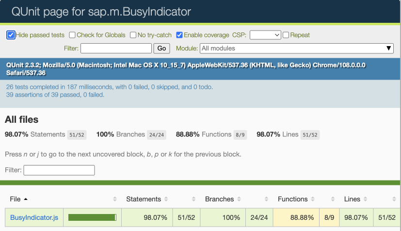
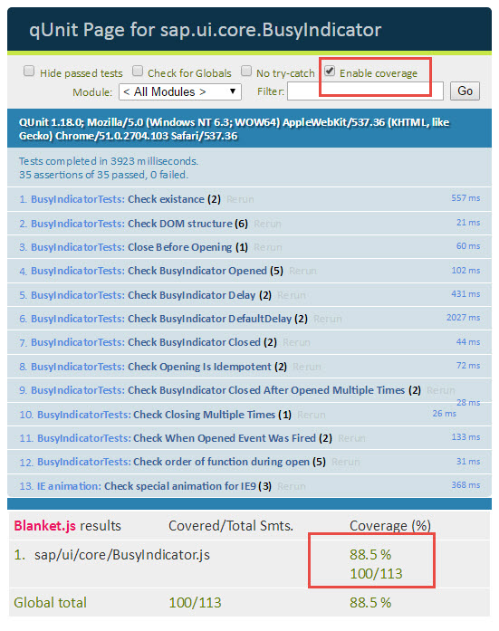

<!-- loio7ef32428dc7c4c048a8d7e8de0a556fb -->

# Code Coverage Measurement

You can measure the code coverage either via HTML or JavaScript code using a code coverage tool like `Istanbul` \(default\) or `Blanket.js` \(legacy\).


<a name="loio7ef32428dc7c4c048a8d7e8de0a556fb__section_STAMBUL"/>

## Istanbul

`Istanbul` offers code coverage and instrumentation for JavaScript files. It also supports branching and correctly identifies visited scopes in conditional clauses.

[UI5 Middleware Code Coverage](https://github.com/SAP/ui5-tooling-extensions/tree/main/packages/middleware-code-coverage) is a [UI5 server](https://sap.github.io/ui5-tooling/stable/pages/Server/) middleware that enables [`Istanbul`](https://istanbul.js.org/) in UI5 Tooling.

If you use UI5 Tooling's `ui5 serve`, you would need to enable it in `ui5.yaml` and `package.json` of your project.

For more information, see the [documentation](https://github.com/SAP/ui5-tooling-extensions/tree/main/packages/middleware-code-coverage).


### Enablement

You have two options to enable code coverage measurement by `Istanbul`:

-   **HTML:**

    In your HTML file bootstrapping your tests, you have to add the following line to the head tag:

    ```html
    <script type="text/javascript" src="../../resources/sap/ui/qunit/qunit-coverage-istanbul.js"></script>
    ```

-   **JS:**

    Inside your test page, you have to add these lines before running the tests:

    ```
    sap.ui.require(["sap/ui/qunit/qunit-coverage-istanbul"], function(/*coverage*/){
        // code
    });
    ```


### Configuration

By default all files that are executed during the test run are instrumented and added to the result. If you would like to limit the instrumented files, you can use the following code \(use either the HTML or the JS option\):

-   Limit instrumentation to a single file:

    **HTML:**

    ```html
    <script type="text/javascript" src="../../resources/sap/ui/qunit/qunit-coverage-istanbul.js"
    	data-sap-ui-cover-only="sap/ui/core/Popup.js"
    ></script>
    ```

    **JS:**

    ```
        var oScript = document.querySelector('script[src$="qunit/qunit-coverage-istanbul.js"]');
        if (oScript) {
            oScript.setAttribute("data-sap-ui-cover-only", "sap/ui/core/Popup.js");
        }
    ```

-   Limit instrumentation to multiple files \(provide an array with comma-separated sources that should occur in the result\):

    **HTML:**

    ```html
    <script type="text/javascript" src="../../resources/sap/ui/qunit/qunit-coverage-istanbul.js"
    	data-sap-ui-cover-only="[sap/ui/core/Popup.js, sap/ui/core/EventProvider]"
    ></script>
    ```

    **JS:**

    ```
        var oScript = document.querySelector('script[src$="qunit/qunit-coverage-istanbul.js"]');
        if (oScript) {
            oScript.setAttribute("data-sap-ui-cover-only", "['sap/ui/core/Popup.js', 'sap/ui/core/EventProvider']");
        }
    ```

-   Limit instrumentation to a specific library:

    **HTML:**

    ```html
    <script type="text/javascript" src="../../resources/sap/ui/qunit/qunit-coverage-istanbul.js"
    	data-sap-ui-cover-only="sap/ui/core/"
    ></script>
    ```

    **JS:**

    ```
        var oScript = document.querySelector('script[src$="qunit/qunit-coverage-istanbul.js"]');
        if (oScript) {
            oScript.setAttribute("data-sap-ui-cover-only", "sap/ui/core/");
        }
    ```

-   Exclude specific objects:

    **HTML:**

    ```html
    <script type="text/javascript" src="../../resources/sap/ui/qunit/qunit-coverage-istanbul.js"
    	data-sap-ui-cover-never="sap/ui/example/thirdparty/"
    ></script>
    ```

    **JS:**

    ```
        var oScript = document.querySelector('script[src$="qunit/qunit-coverage-istanbul.js"]');
        if (oScript) {
            oScript.setAttribute("data-sap-ui-cover-never", "sap/ui/example/thirdparty/");
        }
    ```


### Results

To view the results of the measurement, select the *Enable coverage* checkbox on the test page. This will trigger a new test run.

In this example the coverage is limited to one specific file - the only one that is important for this test.




## Blanket.js \(Legacy\)

`Blanket.js` offers code coverage and instrumentation for JavaScript up to ECMAScript Language Specification 5. As of SAPUI5 version 1.113.0, code coverage measurement via [`Istanbul`](code-coverage-measurement-7ef3242.md#loio7ef32428dc7c4c048a8d7e8de0a556fb__section_STAMBUL) is the recommended option.


### Enablement

You have two options to enable code coverage measurement by `Blanket.js`:

-   **HTML**

    In your HTML file bootstrapping your tests, you have to add the following line to the head tag:

    ```html
    <script type="text/javascript" src="../../resources/sap/ui/qunit/qunit-coverage.js"></script>
    ```

-   **JS**

    Inside your test page, you have to add these lines before running the tests:

    ```
    sap.ui.require(["sap/ui/qunit/qunit-coverage"], function(/*coverage*/){
        // code
    });
    ```


### Configuration

By default all files that are executed during the test run are instrumented and added to the result. If you would like to limit the instrumented files, you can use the following code \(use either the HTML or the JS option\):

-   Limit instrumentation to a single file:

    **HTML:**

    ```html
    <script type="text/javascript" src="../../resources/sap/ui/qunit/qunit-coverage.js"
    	data-sap-ui-cover-only="sap/ui/core/Popup.js"
    ></script>
    ```

    **JS:**

    ```
    if (window.blanket) {
    	blanket.options("sap-ui-cover-only", "sap/ui/core/Popup.js");
    }
    ```

-   Limit instrumentation to multiple files \(provide an array with comma-separated sources that should occur in the result\):

    **HTML:**

    ```html
    <script type="text/javascript" src="../../resources/sap/ui/qunit/qunit-coverage.js"
    	data-sap-ui-cover-only="[sap/ui/core/Popup.js, sap/ui/core/EventProvider]"
    ></script>
    ```

    **JS:**

    ```
    if (window.blanket) {
    	blanket.options("sap-ui-cover-only", "[sap/ui/core/Popup.js, sap/ui/core/EventProvider]");
    }
    ```

-   Limit instrumentation to a specific library:

    **HTML:**

    ```html
    <script type="text/javascript" src="../../resources/sap/ui/qunit/qunit-coverage.js"
    	data-sap-ui-cover-only="sap/ui/core/"
    ></script>
    ```

    **JS:**

    ```
    if (window.blanket) {
    	blanket.options("sap-ui-cover-only", "sap/ui/core/");
    }
    ```

-   Exclude specific objects:

    **HTML:**

    ```html
    <script type="text/javascript" src="../../resources/sap/ui/qunit/qunit-coverage.js"
    	data-sap-ui-cover-never="sap/ui/example/thirdparty/"
    ></script>
    ```

    **JS:**

    ```
    if (window.blanket) {
    	blanket.options("sap-ui-cover-never", "sap/ui/example/thirdparty/");
    }
    ```


### Results

To view the results of the measurement, select the *Enable coverage* checkbox on the test page. This will trigger a new test run.

In this example the coverage is limited to one specific file - the only one that is important for this test.



**Related Information**  


[`UI5 Middleware Code Coverage`](https://github.com/SAP/ui5-tooling-extensions/tree/main/packages/middleware-code-coverage)

[More information about `Blanket.js`](https://github.com/alex-seville/blanket/blob/master/docs/intermediate_browser.md)

