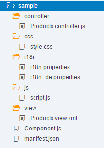

<!-- loio958ead51e2e94ab8bcdc90fb7e9d53d0 -->

# Components

Components are independent and reusable parts used in SAPUI5 applications.

An application can use components from different locations from where the application is running. Thus, components can be developed by different development teams and be used in different projects. Components also support the encapsulation of closely related parts of an application into a particular component. This makes the structure of an application and its code easier to understand and to maintain.

> ### Note:  
> Constraints due to cross-origin issues also apply to components.

SAPUI5 provides the following two types of components:

-   Faceless components \(class: `sap.ui.core.Component`\)

    Faceless components do **not** have a user interface and are used for coding where no UI elements are needed. Please consider that a faceless component can't be added to a `ComponentContainer`. For more information, see the API Reference: [`sap.ui.core.ComponentContainer`](https://ui5.sap.com/#/api/sap.ui.core.ComponentContainer%23associations).

-   UI components \(class: `sap.ui.core.UIComponent`\)

    UI components extend components and add rendering functionality to the component. They represent a screen area or element on the user interface, for example, a button or a shell, along with the respective settings and metadata. `sap.ui.core.UIComponent` extends `sap.ui.core.Component` and adds rendering functionality to the component.

The `sap.ui.core.Component` class is the base class and provides the metadata for both types of components. To extend the functionality, components can inherit from their base class or from another component.

Components are loaded and created via the component factory function `sap.ui.component`. You can either pass the name of the component or the URL of the descriptor file \(`manifest.json`\) to load it via the descriptor, see [Manifest First Function](descriptor-for-applications-components-and-libraries-manifest-json-be0cf40.md#loiobe0cf40f61184b358b5faedaec98b2da__manifirst). We recommend loading the component using the descriptor \(if available\) - it improves performance during the initial load since the loading process can be parallelized and optimized.

After loading the descriptor, the component factory can load the dependencies \(SAPUI5 libraries and other dependent components\) in parallel next to the component preload, and also models can be preloaded.

<a name="loio958ead51e2e94ab8bcdc90fb7e9d53d0__section_N10059_N10011_N10001"/>

## Structure of a Component

A component is organized in a unique namespace, the namespace of the component equals the component name.

Basically, a component consists of the component controller \(`Component.js`\) and a descriptor \(`manifest.json`\). Only the component controller is mandatory, but we recommend to also use the descriptor file. The descriptor then contains the component metadata, and also expresses the component dependencies and configuration \(see [Descriptor for Applications, Components, and Libraries \(manifest.json\)](descriptor-for-applications-components-and-libraries-manifest-json-be0cf40.md)\). All required and optional resources of the component have to be organized in the namespace of the component.

> ### Note:  
> Optional resources are, for example, `CSS`, `js`, or `i18n` files, views, and controllers.

The following figure gives an example of a component folder structure.

The `ComponentContainer` control wraps a UI component. You use the `ComponentContainer` control in the SAPUI5 control tree in the same way as any other control.

## Differentiation to Other Concepts in SAPUI5

The following list explains how other concepts used in SAPUI5 are distinguished from the SAPUI5 components concept:

-   Composite controls

    Both concepts provide a set of controls behind a single interface. Composite controls are intended for reuse within control development and allow to include existing controls in a complex control whereas components are intended for reuse in application development.

-   UI library

    The UI library is the deployable unit around controls: Controls are never deployed standalone, but as part of a control library. Components, however, are self-contained and should **not** be used to deploy controls.

-   Notepad control

    A notepad control is another way to define a control. Notepad controls have all the characteristics of a control.

-   MVC

    The MVC concept allows to define views and controllers and, thus, to structure and reuse parts within an application. As MVC can only be deployed separately and has no means to define dependent styles or scripts that are loaded together with a view, this concept is of limited use across different applications.

**Related Information**  

[Descriptor for Applications, Components, and Libraries \(manifest.json\)](descriptor-for-applications-components-and-libraries-manifest-json-be0cf40.md "The descriptor for applications, components, and libraries (in short: app descriptor) is inspired by the WebApplication Manifest concept introduced by the W3C. The descriptor provides a central, machine-readable, and easy-to-access location for storing metadata associated with an application, an application component, or a library.")

[API Reference: `sap.ui.core.Component`](https://ui5.sap.com/#/api/sap.ui.core.Component)

