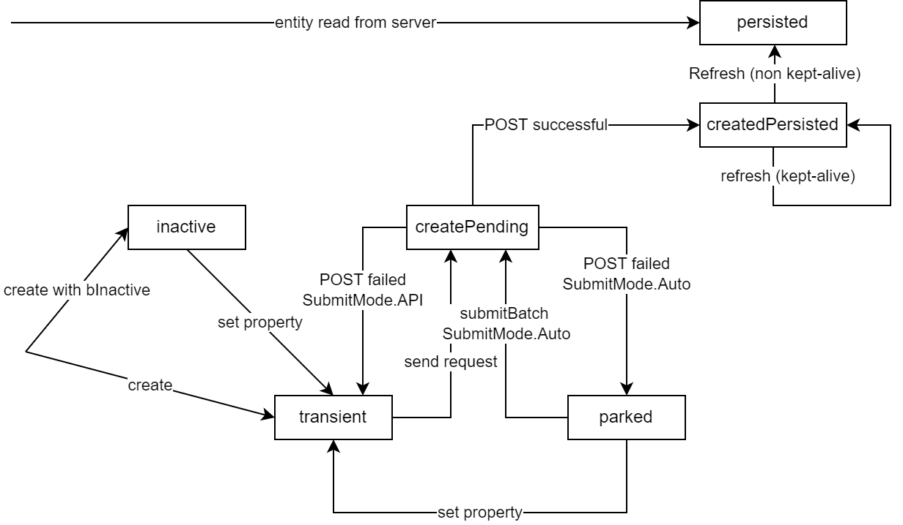

<!-- loioc9723f8265f644af91c0ed941e114d46 -->

# Creating an Entity

The `sap.ui.model.odata.v4.ODataListBinding#create` method creates a new entity. Users can interact with a newly created entity even before it has been sent to the server.

To create new entities, [`ODataListBinding#create`](https://ui5.sap.com/#/api/sap.ui.model.odata.v4.ODataListBinding/methods/create) uses the list binding's update group ID as group ID. For more information how this group ID is determined, see the documentation for the binding-specific parameter `$$updateGroupID` of [`ODataModel#bindList`](https://ui5.sap.com/#/api/sap.ui.model.odata.v4.ODataModel/methods/bindList).

A newly created entity can be inserted at the start or at the end of the list. This new entity is transient until it is successfully submitted, see [`Context#isTransient`](https://ui5.sap.com/#/api/sap.ui.model.odata.v4.Context/methods/isTransient). The initial data for the created entity can be supplied via the parameter `oInitialData` and modified via property bindings or [`Context#setProperty`](https://ui5.sap.com/#/api/sap.ui.model.odata.v4.Context/methods/setProperty). Properties that are not part of the initial data show the default value from the service metadata on the UI, but they are not sent to the server. If there is no default value, null is used instead, even if the property is not nullable. Updates for the transient entity are collected and added to the POST request which creates the entity on the server. The initial data may contain instance annotations.

Inserting an entity at the end of the list is done via the `bAtEnd` parameter in the `create` call. The first call determines the overall position of created contexts within the binding's context list. When creating the first new entity at the beginning of the list, every succeeding insertion is relative to the created contexts within this list. Creation at the end of the list is only possible if the list's length has been requested via the `$count` system query option. [`ODataListBinding#isFirstCreateAtEnd`](https://ui5.sap.com/#/api/sap.ui.model.odata.v4.ODataListBinding/methods/isFirstCreateAtEnd) can be used to determine whether any entries have already been created, and whether the first created entry was placed at the end of the list.

To delete transient entities, use [`Context#delete`](https://ui5.sap.com/#/api/sap.ui.model.odata.v4.Context/methods/delete). Active transient entities are also deleted when you reset the changes for the list binding on which the entity has been created, see [`ODataListBinding#resetChanges`](https://ui5.sap.com/#/api/sap.ui.model.odata.v4.ODataListBinding/methods/resetChanges) and [`ODataModel#resetChanges`](https://ui5.sap.com/#/api/sap.ui.model.odata.v4.ODataModel/methods/resetChanges). The promise returned by [`Context#created`](https://ui5.sap.com/#/api/sap.ui.model.odata.v4.Context/methods/created) is rejected in all cases where the created entity is deleted before it is created in the back end. As long as the list binding has a transient entity, [`ODataListBinding#hasPendingChanges`](https://ui5.sap.com/#/api/sap.ui.model.odata.v4.ODataListBinding/methods/hasPendingChanges) returns `true`. Transient entities are handled by the following methods:

-   `setContext` for all bindings,
-   `changeParameters`, `filter`, `refresh`/`requestRefresh`, `sort`, and `suspend`/`resume` for root bindings and bindings using `$$ownRequest`; for other bindings, these methods raise an error.

Use the `bIgnoreKeptAlive` parameter of `ODataListBinding#hasPendingChanges` to check for pending changes which cannot be ignored. The deletion of another entity of the same list binding is possible.

> ### Note:  
> The position of the created entity may change after the methods `refresh`, `filter`, or `sort` of an [`ODataListBinding`](https://ui5.sap.com/#/api/sap.ui.model.odata.v4.ODataListBinding).

If you have called [`ODataListBinding#create`](https://ui5.sap.com/#/api/sap.ui.model.odata.v4.ODataListBinding/methods/create) on a list binding where the update group ID has [`SubmitMode.API`](https://ui5.sap.com/#/api/sap.ui.model.odata.v4.SubmitMode) and the creation of the entity on the server fails, the creation is repeated with the next call of [`submitBatch`](https://ui5.sap.com/#/api/sap.ui.model.odata.v4.ODataModel/methods/submitBatch) for this group. If the update group ID has [`SubmitMode.Auto`](https://ui5.sap.com/#/api/sap.ui.model.odata.v4.SubmitMode) or [`SubmitMode.Direct`](https://ui5.sap.com/#/api/sap.ui.model.odata.v4.SubmitMode) and the creation fails, the creation is repeated automatically with the next update for the entity. `submitBatch` can also be used for update group IDs with `SubmitMode.Auto` to repeat, independently of an update. The error returned by the server is passed to the [`MessageManager`](https://ui5.sap.com/#/api/sap.ui.core.message.MessageManager) and the promise you get via [`Context.created`](https://ui5.sap.com/#/api/sap.ui.model.odata.v4.Context/methods/created) is not rejected. Each time the data for the created entity is sent to the server, a [`v4.ODataListBinding.createSent`](https://ui5.sap.com/#/api/sap.ui.model.odata.v4.ODataListBinding/events/createSent) event is fired. Each time the client receives a response for the creation, a [`v4.ODataListBinding.createCompleted`](https://ui5.sap.com/#/api/sap.ui.model.odata.v4.ODataListBinding/events/createCompleted) event is fired, independent of whether the creation was successful or not.

> ### Recommendation:  
> Lock the UI each time the \(`POST`\) request for the creation is sent to the server and unlock it, when the response from the server for that \(`POST`\) request is processed, because updates in between result in errors. If the update group ID is [`SubmitMode.API`](https://ui5.sap.com/#/api/sap.ui.model.odata.v4.SubmitMode), you can lock the UI when calling [`ODataModel#submitBatch`](https://ui5.sap.com/#/api/sap.ui.model.odata.v4.ODataModel/methods/submitBatch) and unlock it again when the promise returned by `ODataModel#submitBatch` is resolved or rejected. However, if the update group ID is `SubmitMode.Auto` or `SubmitMode.Direct`, use the `createSent` event to lock the related UI and the `createCompleted` event to unlock it.

```
// suppose this list binding has no own update group; it uses the model's update group instead (an application group)
...
        onCreateSalesOrder : function (oEvent) {
            var oContext = this.getView().byId("SalesOrders").getBinding("items")
                    .create({
                        "Note" : "My new Sales Order",
                        "NoteLanguage" : "E",
                        "BuyerID" : "0100000000",
                        "CurrencyCode" : "EUR"
                    });
 
            // Note: This promise fails only if the transient entity is deleted
            oContext.created().then(function () {
                    // sales order successfully created
                }, function (oError) {
                    // handle rejection of entity creation; if oError.canceled === true then the transient entity has been deleted 
                });
        },
 
        onDeleteSalesOrder : function () {
            var oSalesOrderContext = this.getView().byId("SalesOrders").getSelectedItem().getBindingContext();
 
            oSalesOrderContext.delete("$auto").then(function () {
                    // sales order successfully deleted
               }, function (oError) {
                    // do error handling
               });
        },
 
        onSaveSalesOrder : function () {
            var oView = this.getView();
 
            function resetBusy() {
                oView.setBusy(false);
            }
 
            // lock UI until submitBatch is resolved, to prevent errors caused by updates while submitBatch is pending
            oView.setBusy(true);
             
            oView.getModel().submitBatch(oView.getModel().getUpdateGroupId()).then(resetBusy, resetBusy);
        },
...
```

> ### Note:  
> To ensure that for a list binding all expanded data is available as soon as the promise returned by [`Context#created`](https://ui5.sap.com/#/api/sap.ui.model.odata.v4.Context/methods/created) is resolved, an additional single `GET` request for the newly created entity is sent automatically once the `POST` request has arrived.
> 
> If you want to skip this additional single `GET` request, call [`ODataListBinding#create`](https://ui5.sap.com/#/api/sap.ui.model.odata.v4.ODataListBinding/methods/create) with parameter `bSkipRefresh=true`.

The `promise` returned by [`Context#created`](https://ui5.sap.com/#/api/sap.ui.model.odata.v4.Context/methods/created) is resolved when the entity represented by this context has been created in the backend. Once the promise is resolved, [`sap.ui.model.Context#getPath`](https://ui5.sap.com/#/api/sap.ui.model.Context/methods/getPath) returns a path including the key predicate of the new entity. For returning the path including the key predicates, all key properties need to be available.


<a name="loioc9723f8265f644af91c0ed941e114d46__section_ICR"/>

## Inline Creation Rows

In some applications users need to be able to quickly enter a large amount of new records. A "Create" button or the related keyboard shortcut that needs to be explicitly pressed would slow down the user. To avoid this, the application could provide multiple **inline creation rows** in the table that are initially filled with default values and are not persisted in the back end.

You can create such an inline creation row by calling [`sap.ui.model.odata.v4.ODataListBinding#create`](https://ui5.sap.com/#/api/sap.ui.model.odata.v4.ODataListBinding/methods/create) with the `bInactive` parameter. Call it multiple times for multiple rows. These rows are called inactive because they are not sent to the server. Once the user modifies a property of such an inactive row, and the modification passes the client-side validation, a [`v4.ODataListBinding.createActivate`](https://ui5.sap.com/#/api/sap.ui.model.odata.v4.ODataListBinding%23events/createActivate) event is fired and the row will be sent to the server with the next batch for the binding's update group. The event can be used to create a new inline creation row. While inactive, an inline creation row does not count as a pending change and does not contribute to the collection's count.


### Context states

-   `persisted`: An already existing entity that was read from the server.
-   `inactive`: An inline creation row without any property update yet; it is waiting for a property change before adding a POST to the batch queue.
-   `transient`: A POST is waiting in the batch queue.
-   `createPending`: The POST has been sent to the server; the entity is waiting for the response.
-   `parked`: A POST via an auto group that failed is parked until a property update takes place.
-   `createdPersisted`: The POST succeeded, and the entity now exists on the server. If the binding is refreshed, the context's reaction depends on its `isKeepAlive` state. If it's set to `false`, the context is dropped and created anew when it's read from the server. If it's set to `true`, it is refreshed with a special request and remains in the `createdPersisted` state.

   
  
**Internal States of an OData V4 Binding Context**

  

The state of a context can be checked via the following API functions:

-    [`Context#isTransient`](https://ui5.sap.com/#/api/sap.ui.model.odata.v4.Context/methods/isTransient). This function does not distinguish between the `transient`, `createPending`, and `parked` states of a context. It returns `true` for any of them; the internal state of a such a context should not matter to the application. `Context#isTransient` also returns `true` for `inactive` contexts. It returns `false` for `createdPersisted` contexts, and `undefined` for `persisted` contexts. The value of `isTransient()` can also be observed via the bindable annotation `@$ui5.context.isTransient`.

-   [`Context#isInactive`](https://ui5.sap.com/#/api/sap.ui.model.odata.v4.Context/methods/isInactive): This function returns `true` for `inactive` contexts, `false` for contexts that were created in the `inactive` state and have been activated, and `undefined` otherwise. The value of `isInactive()` can also be observed via the bindable annotation `@$ui5.context.isInactive`.

**Related Information**  


[sap.ui.model.odata.v4.ODataListBinding](https://ui5.sap.com/#/api/sap.ui.model.odata.v4.ODataListBinding)

[sap.ui.model.odata.v4.ODataModel](https://ui5.sap.com/#/api/sap.ui.model.odata.v4.ODataModel)

[sap.ui.model.odata.v4.Context](https://ui5.sap.com/#/api/sap.ui.model.odata.v4.Context)

[sap.ui.core.message.MessageManager](https://ui5.sap.com/#/api/sap.ui.core.message.MessageManager)

