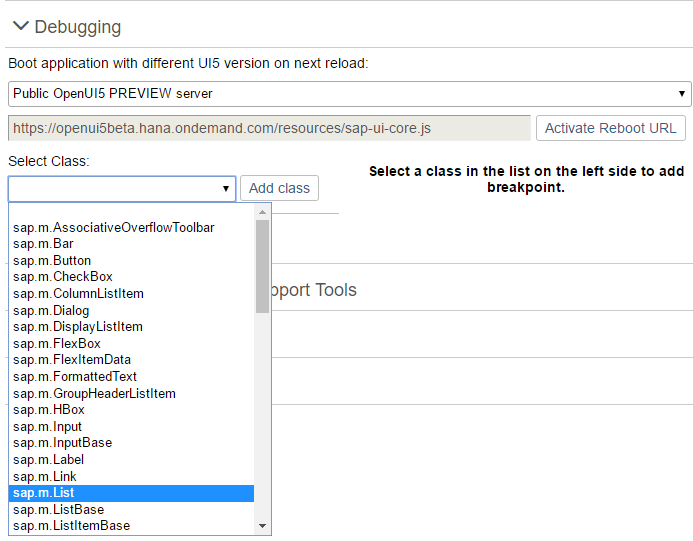
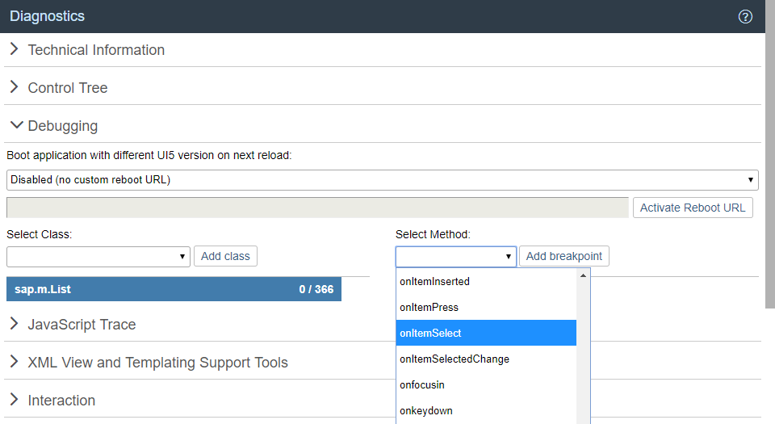
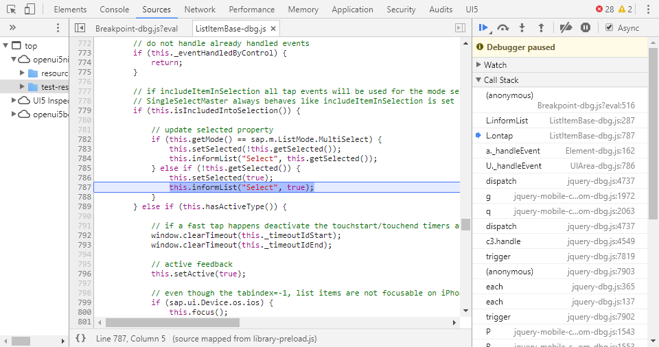
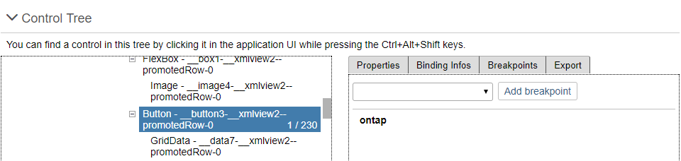

<!-- loioc9b0f8cca852443f9b8d3bf8ba5626ab -->

# Debugging

When developing apps, searching for bugs is an inevitable part of the process. To analyze an issue, you can use the developer tools of your browser and built-in SAPUI5 tools. In this section, we give an overview of the SAPUI5 tools you can use when debugging. To learn more about the developer tools of your browser, check the documentation of the browser.

> ### Note:  
> For information on browser debugging for ABAP developers, see [Browser Debugging for ABAP Developers](../05_Developing_Apps/browser-debugging-for-abap-developers-1e52fde.md).

<a name="loio81526aa4f21944109eef190bc06767b1"/>

<!-- loio81526aa4f21944109eef190bc06767b1 -->

## Experimental Debug Tools

SAPUI5 provides a set of built-in debug utilities that expose a global `ui5` object in the browser console. This object offers convenient access to modules, controls, and framework internals for interactive inspection and debugging.

> ### Caution:  
> The debug tools described here are **experimental**. They may be changed or removed in future versions without notice. Don't use these tools in productive scenarios.


<a name="loio81526aa4f21944109eef190bc06767b1__section_activation"/>

## Activation

Activate the debug tools using one of the following URL parameters:

-   `sap-ui-debug=true` – Activates both the debug sources \(see section below\) **and** the debug tools

-   `sap-ui-debug-tools=true` – Activates **only** the debug tools without loading the debug sources. This is useful for debugging against the minified production code.


After the page has loaded, the `ui5` object is available in the browser's developer console.


<a name="loio81526aa4f21944109eef190bc06767b1__section_usage"/>

## Usage

Once activated, you can interact with the `ui5` object directly in the console.

The `ui5` object always exposes a set of base commands. Libraries can contribute additional functionality, so the tools available to you can differ depending on the libraries used in your project.

The most important base commands are:

-   `ui5.require(module)` – Loads one or more modules asynchronously, for example `ui5.require('sap/m/Button')`

-   `ui5.control($0)` – Gets the SAPUI5 control for the currently selected DOM element in the *Elements* tab

-   `ui5.byId(id)` – Gets an SAPUI5 element by its ID

-   `ui5.spy(context, fn, callback)` – Spies on a function to intercept calls and inspect arguments

-   `ui5.config` – Accesses configuration APIs, such as `Localization`, `Formatting`, and `Security`

-   `ui5.device` – Accesses the device detection API


> ### Tip:  
> Type `ui5.help()` in the browser console to display a complete, up-to-date list of all available commands, including any library-specific tools, which are omitted here for brevity.


<a name="loio81526aa4f21944109eef190bc06767b1__section_loading_runtime"/>

## Loading Debug Tools at Runtime

If you need to activate the debug tools during a running session without reloading with URL parameters, you can lazily load the `DebugLoader` module:

```
sap.ui.require(["sap/ui/core/support/debug/DebugLoader"], function() {
    // The global "ui5" object is now available in the console
});
```

This loads the debug facade and any library-specific extensions into the current page without requiring a page reload.


<a name="loio81526aa4f21944109eef190bc06767b1__section_contributing_tools"/>

## Contributing Library-Specific Tools

Libraries can contribute their own commands and help entries to the global `ui5` object. When a library opts in, its tools are merged into the `ui5` namespace alongside the base tools.

To add library-specific tools, follow these steps:

1.  **Opt in via the library manifest**

    In your library's `library.js` in the `extensions` section, set `sap.ui.debug` to `true`:

    ```
    Lib.init({
        name: "my.lib",
        // ...
        extensions: {
            "sap.ui.debug": true
        }
    });
    ```

    The `DebugLoader` watches for libraries that declare this extension and loads their debug tools.

2.  **Provide a `debug-tools.js` module**

    By convention, the module must live at `<library-path>/support/debug/debug-tools.js`. For a library named `my.lib`, this resolves to `my/lib/support/debug/debug-tools.js`.

    The module must return an object whose properties are merged into the global `ui5` namespace:

    ```
    sap.ui.define([
        "sap/ui/core/support/debug/UI5Debug",
        "my/lib/SomeClass"
    ], function(UI5Debug, SomeClass) {
        "use strict";
    
        // scope() is a helper function to create a clean empty object without a prototype chain (see tip below)
        const { scope } = UI5Debug;
    
        return {
            // Help entries shown by "ui5.help()" (see Step 3)
            __help: [
                { cmd: "ui5.mylib.doSomething()", text: "description of your command" }
            ],
    
            // Tools are merged into the global "ui5" object
            // IMPORTANT: Always group your library tools under a dedicated sub-namespace to avoid
            // name clashes with the base tools or other libraries
            mylib: scope({
                doSomething: function() {
                    // e.g. evaluate and log the state of some controls
                }
            })
        };
    });
    ```

    > ### Tip:  
    > Use `UI5Debug.scope()` to create sub-namespaces. This helper returns objects without `Object.prototype`, which keeps the console output of the `ui5` object clean and free of inherited members.

3.  **Register help entries**

    The optional `__help` property is an array of `{ cmd, text }` entries. The `DebugLoader` extracts these entries and registers them with `ui5.help()`, where they appear under a dedicated section for your library. The `__help` property itself is removed from the returned object before the tools are merged, so it doesn't appear in the `ui5` namespace.

4.  **Naming conflicts**

    If a tool name already exists on the target namespace \(because another library or the base tools registered the same name\), the new entry is registered under a prefixed key `<library-name>:<tool-name>` and a warning is written to the log. To avoid this, group your tools under a library-specific sub-namespace as shown above.

5.  **Spying on framework APIs**

    `UI5Debug.spy(context, functionName, subscriber)` lets you intercept calls to a function, for example, to track all created views or to inspect arguments at runtime. The subscriber receives `{ originalFunction, args }` and may either let the original call run or short-circuit it by returning `{ preventDefault: true, returnValue: ... }`. See the `sap.ui.core` library's [debug-tools.js](https://github.com/SAP/openui5/blob/master/src/sap.ui.core/src/sap/ui/core/support/debug/debug-tools.js) for an example that spies on view creation.


> ### Note:  
> The `debug-tools.js` module is loaded asynchronously **after** the library has been initialized. This means it can safely depend on its own library's modules without causing dependency cycles during library bootstrapping. However, this also means you can't spy on any functions that are executed before or during the evaluation of your `library.js` and its dependencies.

<a name="loio1ed4b5f9f18848b1badee9b72d4ac261"/>

<!-- loio1ed4b5f9f18848b1badee9b72d4ac261 -->

## Loading Debug Sources

For performance reasons, the SAPUI5 files are loaded in a minified version, this means that all possible variable names are shortened and comments are removed. This makes debugging harder because the code is less readable.

For debugging, you first have to load the *Debug Sources*. You have the following options:

-   URL parameter `sap-ui-debug=true`

-   Select the *Use Debug Sources* in the *Technical Information Dialog*

    For more information, see [Technical Information Dialog](technical-information-dialog-616a3ef.md#loio616a3ef07f554e20a3adf749c11f64e9).


If you only want to load the debug sources for **specific packages**, you have the following options:

-   Add the module names to the `sap-ui-debug` URL parameter, separated by a comma. For example, `sap-ui-debug=sap/ui/core/Core.js,sap/m/InputType.js` loads the debug sources for the `sap.ui.core.Core` and `sap.m.InputType` libraries.

-   Choose the *Select specific modules* link in the *Technical Information Dialog*.

    For more information, see [Technical Information Dialog](technical-information-dialog-616a3ef.md#loio616a3ef07f554e20a3adf749c11f64e9).


After reloading the page, in the *Network* tab of the browser's developer tools you can see that the controls and framework assets are now loaded individually and have a `-dbg` suffix. These are the source code files that include comments, the uncompressed code of the app, and the SAPUI5 artifacts.

Choose [Ctrl\] + [O\]  \(Windows\) or [Command\] + [O\]  \(macOS\) and type the name of an SAPUI5 artifact to view its source code in debug mode.

> ### Note:  
> Turning on debug sources also increases the log level. For more information, see [Logging and Tracing](logging-and-tracing-9f4d62c.md).
> 
> To improve performance, you must deactivate the debug sources once you're done with debugging.

<a name="loioc57cb1c50c584fb1930d8da5f709b3ba"/>

<!-- loioc57cb1c50c584fb1930d8da5f709b3ba -->

## Switching the SAPUI5 Version


Open the *Diagnostics* window with the shortcut [CTRL\] + [SHIFT\] + [ALT\] + [S\].

At the top of the *Debugging* view, you can configure a custom URL from which the application should load SAPUI5 the next time that the app opens.

Either select a known SAPUI5 installation from the dropdown box, or enter a different URL that points to the `sap-ui-core.js` file within a complete SAPUI5 runtime.

Once you have entered the URL, press *Activate Reboot URL*. When you then reload the application page, the application loads SAPUI5 from the alternative URL. This only happens for the next single reboot; after that, SAPUI5 is loaded again from the standard URL referenced within the app.

This feature can be used to test an application against a newer or older version of SAPUI5 as part of compatibility testing, or for verifying a bug fix or regression.



<a name="loio9d57287c155741e7ad15f42736605ffa"/>

<!-- loio9d57287c155741e7ad15f42736605ffa -->

## Setting Breakpoints

Breakpoints are helpful when you debug the event handling of an SAPUI5 object. You can either set breakpoints in the developer tools of your browser, or use the *Diagnostics* window.

For more information, see [Diagnostics](diagnostics-6ec18e8.md#loio6ec18e80b0ce47f290bc2645b0cc86e6).

<a name="loio549150aa11cf432780c1801a6e2dc3c4"/>

<!-- loio549150aa11cf432780c1801a6e2dc3c4 -->

## Breakpoints on the Class Level

In the *Debugging* section of the *Diagnostics* window, you can set breakpoints on the class level.

1.  Open the *Debugging* view of the *Diagnostics* window.

2.  Select a class from the dropdown list or enter the name of the class and choose *Add Class*.

    The selected class is now visible below the dropdown list.

    The number next to the method name shows the number of methods that belong to the class and the number of methods for which a breakpoint is set.

3.  Select the class. On the right side of the view, you can now select methods of the selected class from a dropdown list.

4.  From the dropdown list, select the method for which you want to set the breakpoint and choose *Add breakpoint*.

    The selected methods are listed below the dropdown list.

5.  Open the developer tools of your browser. Whenever the selected methods are called for any instance of the selected control, the code execution is paused in the debugger.

    

    In the call stack you find the method for which you set a breakpoint.

    

6.  To remove a breakpoint, select the red x.


<a name="loiob691c4e7e970484991007a4e30fcd6d0"/>

<!-- loiob691c4e7e970484991007a4e30fcd6d0 -->

## Breakpoints on the Object Level

In the *Control Tree* of the *Diagnostics* window, you can set breakpoints on the object level.

1.  Open the *Control Tree* view of the *Diagnostics* window.

2.  Select a control in the tree.

    You can also press and hold [Ctrl\] + [Shift\] + [Alt\] and select a control in your app to select it in the tree.

3.  Select the *Breakpoints* tab on the right.

4.  From the dropdown list, select the method for which you want to set the breakpoint and choose *Add breakpoint*.

    The selected methods are listed below the dropdown list.

5.  Open the developer tools of your browser. Whenever the selected methods are called for any instance on the control, the code execution is paused in the debugger.

    

6.  To remove a breakpoint, select the red x.


