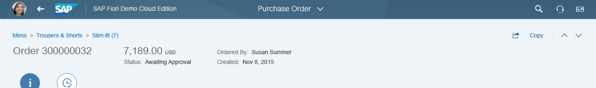
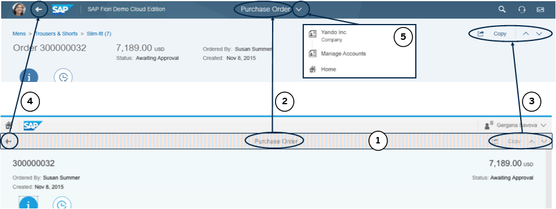

<!-- loio0635156f3950494885ca314a13e15e29 -->

# Enabling the Automatic SAP Fiori 2.0 Header Adaptation in the Descriptor

Application developers can enable automatic adaptation of their existing applications from the manifest.json app descriptor. This helps to easily convert applications to the new look-and-feel of SAP Fiori 2.0.


## SAP Fiori 2.0

SAP Fiori 2.0 is the next evolution step of the SAP Fiori UX. SAP Fiori 2.0 features new themes, a more unified user experience, and smoother, more intuitive application interactions.

Application headers, written based on older SAP Fiori design guidelines, can now be easily adapted to the new SAP Fiori 2.0 look-and-feel by using the automatic adaptation mechanism in the app descriptor.


## The SAP Fiori 2.0 Header

The SAP Fiori 2.0 design concept requires changes with regards to the headers of applications and the SAP Fiori launchpad \(FLP\). If your application has a header, it needs to be merged into the standardized SAP Fiori 2.0 header. SAPUI5 offers an adapter mechanism to let existing apps automatically adjust their header layout according to the SAP Fiori 2.0 guidelines.

> ### Note:  
> The screenshots in this topic are mockups and are used to visually outline the adaptations. The final apps will look somewhat different.

   
  
**SAP Fiori 2.0 header of a fullscreen application**

  

The complete adaptation of a fullscreen app to SAP Fiori 2.0 consists of five main steps:

1.  Remove the app-specific header bar. The header is made transparent and collapsed if there is no content in it after the adaptation.

2.  Display the title in the center of the FLP header

3.  Move the action buttons from the app header to the header content area below the FLP header.

4.  Move the *Back* button from the app-specific header to the FLP header.

5.  Drill-down hierarchy levels can be added to the dropdown menu adjacent to the FLP title.


You can see how the elements are moved and transformed from the old SAP Fiori version \(below\) to the new SAP Fiori 2.0 design in the screenshot below.

   
  
**SAP Fiori 2.0 header adaptation**

  

> ### Note:  
> These adaptations are primarily valid only for **fullscreen** apps. Other floorplans, like List-Detail, are affected differently and the adaptation there will not be the same.


## Enabling the Adaptation in the App Descriptor

You can override the adapter default behavior for a single application by adding an entry in the app descriptor in the `sap.ui5/config` section. Setting `sapFiori2Adaptation` to **true** enables the full functionality of the SAP Fiori 2.0 Adapter.

```
"config": {
            ...
            "sapFiori2Adaptation": true,
            ...
}

```

Alternatively, you can use five fine-grained settings to enable only some of the adaptations. In the following example, you can see how to trigger transparent headers \(`style` attribute\) and title propagation to FLP \(`title` attribute\). The other adaptations are not applied.

```
"config": {
            ...
            "sapFiori2Adaptation": {
                  "style": true,       
                  "collapse": false,   
                  "title": true,       
                  "back": false,       
                  "hierarchy": false   
            },
            ...
}

```

In the list below, you can see what each of the settings enables.

-   `style` - Triggers header transparency

-   `collapse` - Triggers collapsing of the header when empty

-   `title` - Triggers moving the header to FLP

-   `back` - Triggers the *Back* button visibility in the app

-   `hierarchy` - Triggers propagation of the hierarchy to FLP


> ### Note:  
> In rare cases this automatic adaptation of the header area may not work, due to the application structure or other reasons. In this case the headers will still appear in the old design, but the apps will continue to be usable.

Some old SAP Fiori applications do not have an app descriptor yet. If you consider the effort to provide proper app descriptors for all applications as too high, there is a second way to do this configuration. This alternative configuration is done in the `metadata` section of <code><b>Component.js</b></code> \(the app’s root component\), which also has a `config` section. The configuration options can be done there in the same manner.

> ### Note:  
> If both the metadata and manifest are configured, and contradict each other, the configuration in **manifest.json** is applied.

