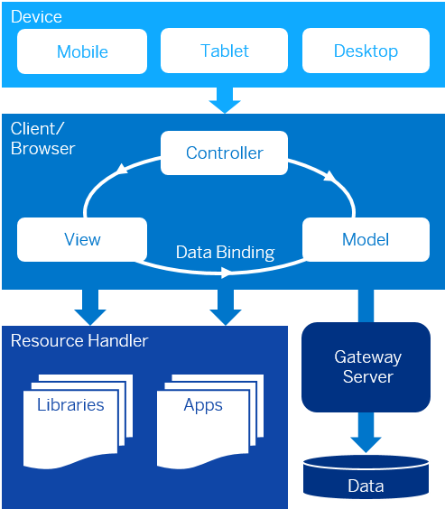

<!-- loioec699e0817fb46a0817b0fa276a249f8 -->

# Essentials

This chapter and its sections describe the development concepts of SAPUI5, such as the Model View Controller, data binding, and components. Use this section as a reference.

<a name="loioec699e0817fb46a0817b0fa276a249f8__section_jdv_3zg_yz"/>

## SAPUI5 Architecture

  

SAPUI5 is a client UI technology based on JavaScript, CSS and HTML5.

Apps developed with SAPUI5 run in a browser on any device \(mobile, tablet or desktop PC\).

When users access an SAPUI5 app, a request is sent to the respective server to load the application into the browser. The view accesses the relevant libraries. Usually the model is also instantiated and business data is fetched from the database.

Depending on the environment in which SAPUI5 is used, the libraries or your applications can be stored, for example, on an SAP NetWeaver Application Server or an SAP Business Technology Platform, and business data can be accessed, for example, using the OData model through a SAP Gateway.

## Artifacts in the Framework

The top-level structural unit is called a **library**. Libraries are the master artifacts in the extensibility concept. They bundle a set of controls and related types and make them consumable by Web applications. There are predefined and standard libraries, like `sap.m`, with many commonly used controls. At the same time, it treats custom UI libraries as first-class citizens, making it easy for you to write and use your own controls alongside the predefined ones.

A UI **element** is the basic building block of our user interfaces; it is a reusable entity with properties, events, methods, and relations. The most important relations are aggregations to other UI elements, and in this way a tree structure of elements can be created.

From a developer's point of view, a **control** \(e.g. `Button`, `Label`, `TextField`, or `Table`\) is the most important artifact. It is an object which controls the appearance and user interaction of a rectangular screen region. It is a special kind of user interface element which can be used as the root of such a tree structure. In this way, it serves as an entry point, especially for rendering. Besides controls, there are also other **non-control elements**, which cannot be used as the root of such a tree structure, but only as a dependent part within it \(e.g. `TableRow`, `TableCell`\).

**Data types** are first-class entities in the meta model. This allows reuse of types across libraries and extensibility of the type system. The core library \(technically, this is the `sap.ui.core` library\) already defines a core set of types that can be used in other libraries.

