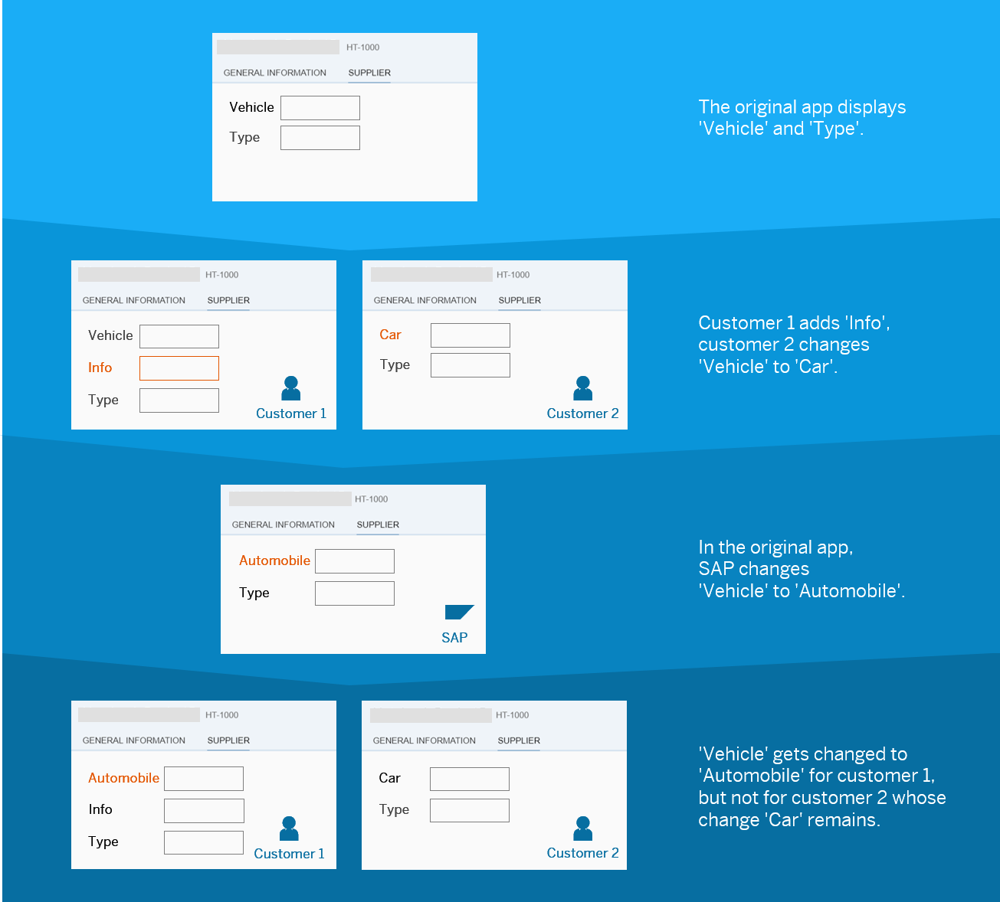

<!-- loio17d2d4e8f9f3416da8865c1032f3dc19 -->

# Example: Layering of UI Changes

Here's an example of how the layering of UI changes based on SAPUI5 flexibility works.

The original app displays the fields *Vehicle* and *Type*.

Using SAPUI5 flexibility, customer 1 adds the additional field *Info* and customer 2 renames the existing field *Vehicle* to *Car*. After the app was shipped to the customers, SAP changes *Vehicle* to *Automobile* in the original app.

Applying the changes based on the layering concept, the customers would now get the following:

-   In the app of customer 1, *Vehicle* would be replaced by *Automobile*. The *Info* field added by the customer would also be applied.

-   In the app of customer 2, the change made by SAP \(*Vehicle* renamed to *Automobile*\) would not be applied. Reason: customer 2 renamed this field to *Car* and changes made by customers overrule changes made by SAP.

