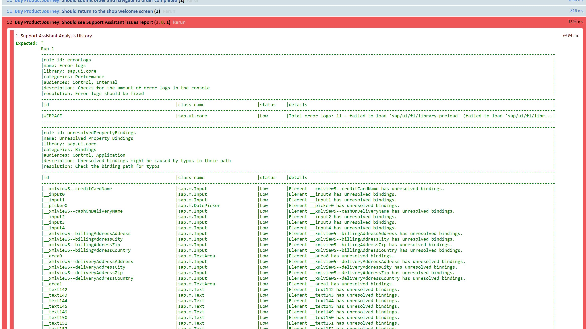

<!-- loiocfabbd4dfc054936997d9d00916e1668 -->

# Integrating the Rules in OPA Tests

The Support Assistant can be used as part of an existing OPA test to cover more test aspects of the application.


## Context

The Support Assistant can be used in OPA tests to check if there are issues in the different states of the application. To do that, you need to use the Support Assistant OPA extension. This extension is available as of version 1.48. It provides three assertions:

-   `noRuleFailures` - Analyzes the current state of the application, and if errors are found, the assertion will fail. A non-mandatory `options` object can be passed to the assertion containing the following properties:

    -   `failOnAnyIssues (boolean)` - Determines if the assertion should fail if issues of *any* severity type are found.

    -   `failOnHighIssues (boolean)` - Determines if the assertion should fail if issues of severity type *high* are found. Warning - this parameter will ignore issues of severity types: *medium* and *low*.

        > ### Note:  
        > This parameter overrides `failOnAnyIssues`.

    -   `rules (Array)` - Determines a subset of rules to check. By default if this property is not set, all rules are checked. The rules have two properties `libName` \(for example, `sap.ui.core`\) and `ruleId` \(for example, `orphanedElement`\).

    -   `executionScope (Object)` - The execution scope defines the scope of the analysis. Can be of type *global*, *subtree*, *components*.

        > ### Note:  
        > If types *subtree* or *components* are selected, the `selectors` property should also be set to define the IDs of the subtree/components.


-   `getFinalReport` - If there are issues found, the assertion fails and a report is created as part of the message of that assertion.

-   `getReportAsFileInFormat` - Collects the past history analysis and stores it in `window._$files` array for further usage. The main purpose of this assertion is to allow the OPA extension to serve the history to external services like Jenkins job or other services so that the data can be stored on the filesystem.

    The assertion can be called with two optional parameters: `historyFormat` - The format into which the history object will be converted. Possible values are listed in `sap.ui.support.HistoryFormats.` and `fileName` – the name of the file in which the history will be stored.


In addition, if you pass `sap-skip-rules-issues=true` as a URL parameter to your OPA test, the assertion results of `noRuleFailures` and `getFinalReport` assertions will be `true`, overriding the actual results.

This special URL parameter could be used temporarily in cases when you extend an existing OPA test to run the Support Assistant rule checks initially but you don’t want the entire OPA journey to fail immediately. After you gain experience and clean up any check issues, you can set it to `false` or omit passing it and use once again the desired `onError` behavior.

> ### Note:  
> When the `sap-skip-rules-issues` URL parameter is set, it affects all tests globally, unlike the `FailOnAnyIssues` parameters, which only affect a specific test level.


## Procedure

1.  Enable the Support Assistant OPA extension in the OPA configuration file.

    You need to change two parameters:

    -   `extensions` - You need to include the Support Assistant OPA extension path \(`sap/ui/core/support/RuleEngineOpaExtension`\).

    -   `appParams` - You need to add `sap-ui-support` with a value of `true,silent`. This will start the application in support mode and will start the Support Assistant in silent mode \(without UI\).


    The configuration file will look like this:

    ```
    sap.ui.define([
    ...
    ], function(Opa5, Arrangement) {
    ...
    extensions: ["sap/ui/core/support/RuleEngineOpaExtension"],
    
    appParams: {
      "sap-ui-support": "true,silent"
    }
    
    ...
    });
    });
    
    ```

2.  Add additional assertions to the OPA configuration file.

    Add generic or specific assertions - depending on the use case. For example:

    -   `iShouldSeeNoHighSeverityErrors` - This assertion calls `noRuleFailures` with a few parameters set, as you can see in the example code below. It checks for high issues and ignores medium and low. The rules checked are `preloadAsyncCheck`, `orphanedElement`, `deprecatedEntities` and the scope is set to *global*.

    -   `iShouldGetSupportRuleReport`- This assertion calls `getFinalReport` and if there are any issues after all the analysis, it fails and a report is created as part of the message.


    The configuration file should look like this:

    ```
    assertions: new Opa5({
    ...
    iShouldSeeNoHighSeverityErrors: function() {
      return this.waitFor({
        success: function() {
          Opa5.assert.noRuleFailures({
            "failOnHighIssues": true,
            rules: [{
              libName: "sap.ui.core",
              ruleId: "preloadAsyncCheck"
            }, {
              libName: "sap.ui.core",
              ruleId: "orphanedElement"
            }, {
              libName: "sap.ui.core",
              ruleId: "deprecatedEntities"
            }],
            executionScope: {
              type: "global"
            }
          });
        }
      });
    },
    iShouldGetSupportRuleReport: function() {
      return this.waitFor({
        success: function() {
          Opa5.assert.getFinalReport();
        }
      });
    }
    ...
    
    ```

3.  The added assertions can now be used inside the journeys.

    Knowing the flow of the tests, choose the right place in your OPA test journey to add the needed assertion:

    ```
    ...
    opaTest("Should see no Support Assistant issues with high severity", function (Given, When, Then) {
    	Then.iShouldSeeNoHighSeverityErrors();
    });
    ...
    
    ```

    > ### Note:  
    > Put these assertions after the web page being tested has been rendered and displayed with a stable UI.

4.  Repeat the extended OPA test and see how your specific Support Assistant assertions are triggered.

    You can see a detailed report for each run. The report is tabular and lists all executed rules with their details, followed by a list of the issues generated by that rule. It looks like this:

       
      
    **OPA Test Results**

      


**Related Information**  


[Execution Scope](execution-scope-e15067d.md "SAPUI5 apps consist of multiple views, components and fragments. If you run the rules on the complete app with all loaded elements and components, you may not get the desired results. Therefore, the Support Assistant allows you to change the scope of an analysis run and thus narrow down your result set. This helps you focus on specific issues, components or controls within your app.")

[Integration Testing with One Page Acceptance Tests \(OPA5\)](integration-testing-with-one-page-acceptance-tests-opa5-2696ab5.md "OPA5 is an API for SAPUI5 controls. It hides asynchronicity and eases access to SAPUI5 elements. This makes OPA especially helpful for testing user interactions, integration with SAPUI5, navigation, and data binding.")

[Samples: `Running OPA tests with Support Assistant checks`](https://ui5.sap.com/#/entity/sap.ui.test.Opa5/sample/sap.ui.core.sample.OpaWithSupportAssistant)

