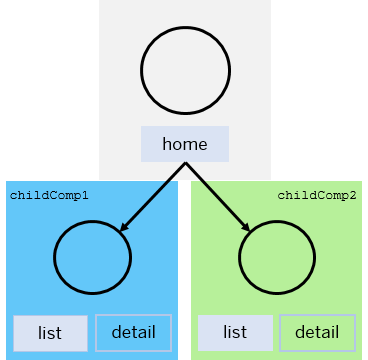
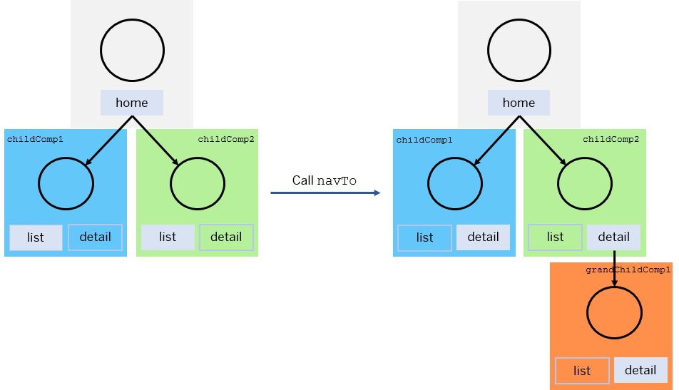
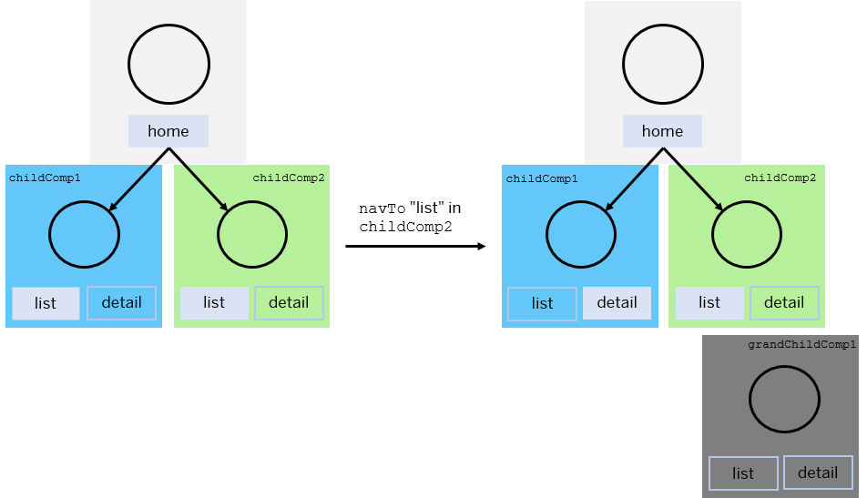

<!-- loio8e9d6e4df5464eb5a6e40696c4d2ccd6 -->

# Navigate with Nested Components

The `navTo` method in the `sap.ui.core.routing.Router` class enables you to define a set of parameters to navigate to a specific route.

To use the `navTo` method for navigation with nested components, you need to call the method with the following information:

-   Name of the route

-   Parameters for the route

-   Target information for the route name and the parameters in the nested components \(optional\)

-   Information, whether the current browser hash is replaced or a or a new hash entry is set \(optional\)


For more information, [`sap.ui.core.routing.Router.navTo`](https://ui5.sap.com/#/api/sap.ui.core.routing.Router/methods/navTo) in the API Reference.

The call triggers the following actions in the given order:

1.  For the new hash, the variable placeholders in the route's pattern are replaced with the given parameters. If the method is called with information for a router in nested components, the targets with type `Component` are loaded to compose the hash parts of these `Component` targets.

2.  The new hash is set to the browser.

3.  The browser fires a `hashchange` event.

4.  The router processes the event and propagates the event along the hierarchy which was built while loading the nested components.

5.  Each router checks its own hash part and informs the matched route. The matched route displays the targets which are configured for this route.

6.  Each targets loads its `View` or `Component` and adds it to the configured `controlAggregation` of the `controlId` container.

7.  The router fires a `routeMatched` event and the route fires a `matched` event to inform the application that the hash change is completed.


<a name="loio8e9d6e4df5464eb5a6e40696c4d2ccd6__section_jnj_rgx_mjb"/>

## Using `navTo` for Passing Information to a Nested Router

For passing information about the route name and parameters for a nested router, you use the `oComponentTargetInfo` parameter of the `navTo` method. By this, the router in nested components can show the targets which are configured to one specific route instead of giving the router an empty hash as default. This `oComponentTargetInfo` parameter contains key-value pairs with the name of a `Component` target as the key, and the value must be an object which has at least the route name in the `route` property. The route name should be matched within the router of this component with the parameters for this route. If this route has again `Component` targets, the property `componentTargetInfo` can be used to specify the route information. The value of the `componentTargetInfo` property has the same structure as the `oComponentTargetInfo` parameter of the `navTo` method.

The following example shows a top level router with a "home" route with two `Component` targets:

-   `Component` target `childComp1` with the following two defined routes:

    -   Route `list`: Has an empty string hash as pattern and shows a list of items

    -   Route `detail`: Shows the details for an item


-   `Component` target `childComp2` with the following two defined routes:

    -   Route `list`: Has an empty string hash as pattern and shows a list of items

    -   Route `detail`: Shows the details for an item which displays again a nested `Component` target `grandChildComp1`


The `grandChildComp1` target has the following two routes defined:

-   Route `list`: Has an empty string hash as pattern and shows a list of items

-   Route `detail`: Shows the details for an item


When the `home` route in the top level router is matched, the `Component` targets `childComp1` and `childComp2` are loaded and shown. Each of them receives an empty string hash as default, and so the `list` routes of their routers are matched.



By using the `navTo` method, specific route information can be given to multiple nested components and, if available, their deep nested components. For example, the `detail` routes in both `Component` targets `childComp1` and `childComp2` need to be matched. Since the `detail` route of target `childComp2` loads another nested component \(`grandChildComp1`\), it is also possible to match the `detail` route in the deep nested component `grandChildComp1` with the same `navTo` call, see the following code snippet.

```js
oRouter.navTo("home", {
    // this route doesn't need any parameter
}, {
    childComp1: {
        route: "detail",
        parameters: {
            ...
        }
    },
    childComp2: {
        route: "detail",
        parameters: {
            ...
        },
        componentTargetInfo: {
            grandChildComp1: {
                route: "detail",
                parameters: {
                    ...
                }
            }
        }
    }
});
```

After the `navTo` call, the route state of each router looks as depicted in the following figure:




<a name="loio8e9d6e4df5464eb5a6e40696c4d2ccd6__section_u1j_1hx_mjb"/>

## Navigating Away From a Nested Component

When a new route is matched within a router and a `Component` target was displayed within the old route, it is necessary to avoid that this `Component` target still reacts to unnecessary events such as `hashChanged`. For example, after switching from the `detail` route to the `list` route within the `Component` target `childComp2`, the deep nested `Component` target `grandChildComp1` is no longer relevant for the UI. This is shown in the following figure:



To avoid this,

-   the hash part is removed from the browser hash.

-   the router is stopped, so that it no longer reacts to the `hashChanged` event.


