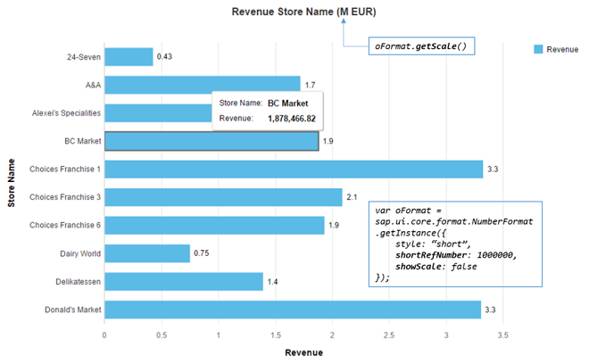

<!-- loio91f2f2866f4d1014b6dd926db0e91070 -->

# Number Format

The `sap.ui.core.format.NumberFormat` class can be used to parse a string representing a number \(float or integer\) into a JavaScript `number` and vice versa \(also known as `format`\).

`NumberFormat` uses the parameters defined for the current locale. These parameters can be overwritten on each instance by setting the format options.

There are four types of formatters defined in `NumberFormat`:

-   Integer formatter: formats and parses only the integer digits; decimal digits are ignored

-   Float formatter: formats and parses both integer and decimal digits.

-   Percent formatter: formats the number into a string with percentage sign. It validates the number whether it contains the right percentage sign in its parser.

-   Currency formatter: formats the number by using the parameters defined for the given currency code. Either currency symbol, currency code, or none of both can be included in the final formatted string. It parses the given string into an array which contains both the currency number and currency code.


## Instantiation

The instantiation of `sap.ui.core.format.NumberFormat` is done by calling `getter` defined on `NumberFormat` \(and not by using the constructor\).

```js
// "NumberFormat" required from module "sap/ui/core/format/NumberFormat"
var oIntegerFormat = NumberFormat.getIntegerInstance();
var oFloatFormat = NumberFormat.getFloatInstance();
var oPercentFormat = NumberFormat.getPercentInstance();
var oCurrencyFormat = NumberFormat.getCurrencyInstance();
```


## Parameters

All parameters have their default value defined in the current locale. Therefore, if no parameter is given when instantiating the formatter instance, it fetches the parameters from the current locale. The samples here assume that the current locale is `en-US`.

All parameters can be overwritten by giving a format option object in the `getter` of the formatter. There are a bunch of parameter defined for the four types of formatters. Most of them are shared among the types, and the rest are specifically defined for a certain kind of formatter.


### Integer and Decimal Digits

-   `minIntegerDigits`: minimal number of non-fraction digits. If there are less integer digits in the number than the value here, `'0'(s)` is prepended in the final result.

-   `maxIntegerDigits`: maximal number of non-fraction digits. If there are more digits in the number than the value here, all integer digits in the final result are replace by `?`.

-   `minFractionDigits`: minimal number of fraction digits. If there are less decimal digits in the number than the value here, '0'\(s\) is appended in the final result.

-   `maxFractionDigits`: maximal number of fraction digits. If there are more decimal digits in the number than the value here, those digits are discarded from the result and the least significant digit is calculated by using the given `roundingMode` parameter.

-   `decimals`: number of decimal digits in the final result. Same result is achieved by setting both `minFractionDigits` and `maxFractionDigits` to this value.

-   `precision`: number of digits used to display the number, for example with precision 5 a number could be 1.3456 or 134.45.

-   `shortDecimals`: number of decimal digits in the shortifed number when parameter `style` is set to `short` or `long`. If this isn't set, the parameter `decimal` is used instead.


```js
var oFormatOptions = {
    minIntegerDigits: 3,
    maxIntegerDigits: 5,
    minFractionDigits: 2,
    maxFractionDigits: 4
};

// "NumberFormat" required from module "sap/ui/core/format/NumberFormat"
var oFloatFormat = NumberFormat.getFloatInstance(oFormatOptions);
oFloatFormat.format(1.1); // returns 001.10
oFloatFormat.format(1234.567); // returns 1,234.567
oFloatFormat.format(123456.56789); // returns ??,???.5679
```

```js
var oFormatOptions = {
    style: "short",
    decimals: 1,
    shortDecimals: 2
};

// "NumberFormat" required from module "sap/ui/core/format/NumberFormat"
var oFloatFormat = NumberFormat.getFloatInstance(oFormatOptions);
oFloatFormat.format(1234.56); // returns 1.23K (shortified number takes the shortDecimals parameter)
oFloatFormat.format(123.456); // returns 123.5 (non-shortified number takes the decimals parameter)
```


### Separator and Signs

-   `groupingEnabled` defines whether the integer digits are put into groups which are separated by the `groupingSeparator` parameter

-   `groupingType` defines the type of grouping. Either `Arabic` or `Indian` can be set here.

-   `groupingSeparator` defines the separator of grouping.

-   `decimalSeparator` defines the symbol of decimal point.

-   `groupingSize` only used if you don't want the locale-dependent grouping, for example 3 digits for de or en

-   `groupingBaseSize` only used if your locale uses a specific group size for the first group \(like Indian\), and you don't want to use the standard

-   `plusSign`

-   `minusSign`


### Compact Format

You can use compact format to format a number using a given scale. For example, 1000000 may be formatted under en-US locale as *1 Million*.

To format a number in compact format, set the option `style` to either `short` or `long`. These styles control which version of scale name is used. For example, 1000000 is formatted as *1M* with `short` and *1 Million* with `long`.

The scale can be selected automatically based on the given number, or you can set it explicitely by using `shortRefNumber`. You can set this option with a number which is then used for calculating the scaling factor for formatting all given numbers to this formatter.

To hide the scaling formatter from the formatted number and only be shown once on the screen, you can use option `showScale`. In order to get the scaling factor name of the number set to `shortRefNumber` under the current running locale, you use method `getScale`.

To control the start the starting point of numbers which should be displyed in compact format, you use `shortLimit`.

> ### Example:  
> In the following chart, all numbers both on the chart and axis should be formatted using the same scaling factor. The scaling factor should only appear in the chart title and be hidden from the formatted number. In order to achieve this, the option `shortRefNumber` is set to `1000000` and `showScale` is set to `false`. The corresponding scaling factor name is returned by calling the `getScale` method.
> 
> 


### Miscellaneous

-   `emptyString` defines what empty string \(`""`\) is parsed as and what is formatted as `emptyString`. The allowed values are only `NaN`, `null` or `0`. Default setting is `NaN`.

-   `pattern`: a pattern which follows the CLDR syntax. The number is then formatted according to the given pattern.

-   `roundingMode`: defines a rounding behavior for discarding the digits after the maximum decimal digits defined by `maxFractionDigits` or `decimals`. Rounding will only be applied, if the formatting value is of type number.

    **Rounding Modes \(with decimals parameter set to 1\)**


    <table>
    <tr>
    <th valign="top">

    Number
    
    </th>
    <th valign="top">

    `FLOOR` 
    
    </th>
    <th valign="top">

    `CEILING` 
    
    </th>
    <th valign="top">

    `TOWARDS_ZERO` 
    
    </th>
    <th valign="top">

    `AWAY_FROM_ZERO` 
    
    </th>
    <th valign="top">

    `HALF_FLOOR` 
    
    </th>
    <th valign="top">

    `HALF_CEILING` 
    
    </th>
    <th valign="top">

    `HALF_TOWARDS_ZERO` 
    
    </th>
    <th valign="top">

    `HALF_AWAY_FROM_ZERO` 
    
    </th>
    </tr>
    <tr>
    <td valign="top">
    
    2.21
    
    </td>
    <td valign="top">
    
    2.2
    
    </td>
    <td valign="top">
    
    2.3
    
    </td>
    <td valign="top">
    
    2.2
    
    </td>
    <td valign="top">
    
    2.3
    
    </td>
    <td valign="top">
    
    2.2
    
    </td>
    <td valign="top">
    
    2.2
    
    </td>
    <td valign="top">
    
    2.2
    
    </td>
    <td valign="top">
    
    2.2
    
    </td>
    </tr>
    <tr>
    <td valign="top">
    
    2.25
    
    </td>
    <td valign="top">
    
    2.2
    
    </td>
    <td valign="top">
    
    2.3
    
    </td>
    <td valign="top">
    
    2.2
    
    </td>
    <td valign="top">
    
    2.3
    
    </td>
    <td valign="top">
    
    2.2
    
    </td>
    <td valign="top">
    
    2.3
    
    </td>
    <td valign="top">
    
    2.2
    
    </td>
    <td valign="top">
    
    2.3
    
    </td>
    </tr>
    <tr>
    <td valign="top">
    
    2.29
    
    </td>
    <td valign="top">
    
    2.2
    
    </td>
    <td valign="top">
    
    2.3
    
    </td>
    <td valign="top">
    
    2.2
    
    </td>
    <td valign="top">
    
    2.3
    
    </td>
    <td valign="top">
    
    2.3.
    
    </td>
    <td valign="top">
    
    2.3
    
    </td>
    <td valign="top">
    
    2.3
    
    </td>
    <td valign="top">
    
    2.3
    
    </td>
    </tr>
    <tr>
    <td valign="top">
    
    \-2.21
    
    </td>
    <td valign="top">
    
    \-2.3
    
    </td>
    <td valign="top">
    
    \-2.2
    
    </td>
    <td valign="top">
    
    \-2.2
    
    </td>
    <td valign="top">
    
    \-2.2
    
    </td>
    <td valign="top">
    
    \-2.2
    
    </td>
    <td valign="top">
    
    \-2.2
    
    </td>
    <td valign="top">
    
    \-2.2
    
    </td>
    <td valign="top">
    
    \-2.2
    
    </td>
    </tr>
    <tr>
    <td valign="top">
    
    \-2.25
    
    </td>
    <td valign="top">
    
    \-2.3
    
    </td>
    <td valign="top">
    
    \-2.2
    
    </td>
    <td valign="top">
    
    \-2.2
    
    </td>
    <td valign="top">
    
    \-2.3
    
    </td>
    <td valign="top">
    
    \-2.3
    
    </td>
    <td valign="top">
    
    \-2.2
    
    </td>
    <td valign="top">
    
    \-2.2
    
    </td>
    <td valign="top">
    
    \-2.3
    
    </td>
    </tr>
    <tr>
    <td valign="top">
    
    \-2.29
    
    </td>
    <td valign="top">
    
    \-2.3
    
    </td>
    <td valign="top">
    
    \-2.2
    
    </td>
    <td valign="top">
    
    \-2.2
    
    </td>
    <td valign="top">
    
    \-2.3
    
    </td>
    <td valign="top">
    
    \-2.3
    
    </td>
    <td valign="top">
    
    \-2.3
    
    </td>
    <td valign="top">
    
    \-2.3
    
    </td>
    <td valign="top">
    
    \-2.3
    
    </td>
    </tr>
    </table>
    


## Parsing

A formatted number which contains a locale-dependent grouping separator, decimal point, or percentage sign can be parsed into a number object using `sap.ui.core.format.NumberFormat`. Those number string may not be correctly parsed by using `parseInt` or `parseFloat` in JavaScript.

```js
// "NumberFormat" required from module "sap/ui/core/format/NumberFormat"
var oFloatFormat = NumberFormat.getFloatInstance();

oFloatFormat.parse("1,234.567"); // returns 1234.567
oFloatFormat.parse("12.34%"); // returns 0.1234
```

**Related Information**  


[API Reference: `sap.ui.core.format.NumberFormat`](https://ui5.sap.com/#/api/sap.ui.core.format.NumberFormat)

[Unit Formatting](unit-formatting-8e618a8.md "SAPUI5 supports the formatting and parsing of units. These unit formats are by default taken from the CLDR. Besides the default units defined in the CLDR, you can also define custom units.")

[Currency Formatting](currency-formatting-e978728.md "")

