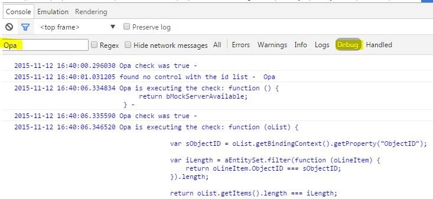

<!-- loio698f8c0a889f48d3a8b7fbcd26779be2 -->

# Pitfalls and Troubleshooting

Tips and tricks if OPA isn't behaving or reacting the way you expect it to.


## Why Can't OPA Find the Control I'm Looking For?

OPA checks many conditions before it passes a control to your matchers/actions/success functions. If your control doesn't match these conditions, you're not able to set a breakpoint. For such instances, OPA logs lots of information into the browser's console if you turn on the SAPUI5 debug mode. You can either use the `sap-ui-debug=true` URL parameter or the SAPUI5 [Diagnostics](diagnostics-6ec18e8.md#loio6ec18e80b0ce47f290bc2645b0cc86e6). The diagnostics can also be helpful to see the state of your UI.

After turning on the debug mode, you can have a look at the log and also filter it by looking for ***opa*** or ***matchers***.

  

A frequent cause of error is typos in the view name or control IDs. These are easily found by looking through the logs.


### Multiple Views with the Same `viewName`

If there are multiple views with the same `viewName`, OPA5 may not find the exact control you're looking for.

As of version 1.62, there are a couple of ways to ensure a correct match:

-   `viewId` parameter is introduced. You can set it in `Opa5.extendConfig()`, `Opa5.waitFor()` and in page object definitions. `viewId` can be used standalone or in combination with `viewName`. If OPA5 finds multiple views with the same name, it prompts you to add a view ID with the test failure message "Please provide `viewId` to locate the exact view.".

-   Only views that are rendered are used in OPA5 control search.


### Control Isn't Found When Running the Test on a Different Machine or in a Suite

The size of the iFrame in which the app is loaded is as large as the browser window. It's scaled down to leave space for the QUnit info but the content is preserved the same as when run in full size. This means that regardless of the small iFrame, you shouldn't see any responsive change in the app's appearance.

If the test runs fine locally but control isn’t found on another machine, there’s a chance that the other machine's screen is too small and triggers the responsive behaviour of some controls. For example, CI executors with smaller screens or when the test is part of a suite and the iFrame is placed inside a suite wrapper much smaller than the screen.

One way is to test for the responsive behavior and add conditional `waitFors` and test cases. Tests for different screens, such as phone and desktop, are better separated in different test files.

If you want to work around the sizing issue and don't want to test responsive behavior, you can set a fixed size for the iFrame. The idea is to write the test for the small size which most probably results in the central environment. You can use the `width` and `height` parameters of `iStartMyAppInAFrame` or the `opaFrameWidth` and `opaFrameHeight` URL parameters.

If either width or height isn’t defined, a default value is assigned. The default screen size is 1280x1024 px. The iFrame takes 60% of the screen size, which makes the default iFrame size to be 768x614.4 px.


## Sometimes My Test Fails, Sometimes It Doesn't


### Is It the Startup That's Failing?

Maybe the app is loading too slowly for the OPA tests. If there's a local index file that doesn't contain the library dependencies your app needs, the SAPUI5 bootstrap is very slow. To fix this, add the dependencies you need in your application descriptor's `sap.ui.dependencies` namespace. If you don't have a descriptor, use the bootstrap option libs. For more information, see [Descriptor for Applications, Components, and Libraries \(manifest.json\)](descriptor-for-applications-components-and-libraries-manifest-json-be0cf40.md) and [Configuration Options and URL Parameters](configuration-options-and-url-parameters-91f2d03.md).


### It's Failing During the Execution

If this happens, your test is probably executing actions faster than it should. If you encounter a failure, look at the current state of the UI - in almost all cases an action couldn't be triggered or a JavaScript error occurred. This error should be included in the console logs. If an action couldn't be executed, make sure that you use the action parameter of OPA5's `waitFor` function. When using the success function for triggering actions, OPA5 doesn't check many things.

Here are some examples that have occurred in known apps:

-   An app was using the `bindingContext` of a control in a press handler. OPA5 was way faster than a human user, so the HTTP-Request that was sometimes finished by the time OPA5 was executing the check, was sometimes still pending and so an exception was thrown. The test failed because OPA was trying to reach a page that couldn't be shown because of this error. This had to be fixed in the app.

-   When there was no action parameter available, a `ListItem` got rerendered while a press action was executed on it. Due to the rerendering, the `List` wasn't able to perform the click, meaning it wasn't executed and the test failed. This only happened on certain occasions, depending on the execution speed of the machine executing the test. This is now detected automatically when using actions.


## OPA5 Is Failing on a Specific Browser: What Should I Do?


### Am I Comparing Language-Dependent Texts and the Browser Has a Different Language?

Check the logs to see if your matcher is failing because it's checking a text against a different language. If you want to always execute your tests with the same language, use the `sap-ui-language=` URL or bootstrap parameter.


## OPA Isn't Even Starting and There's No Logging Either

If you require `sinon-qunit.js`, it overwrites the browser functions `setTimeout` and `setInterval`. OPA needs these functions and without them the tests don't start. You can either set the `fakeTimers` to `false` in your test setup, or maybe consider not using `sinon-qunit.js` together with OPA.

```js
module("Opatests", {
    beforeEach : function () {
        sinon.config.useFakeTimers = false;
    },
    afterEach : function () {
        sinon.config.useFakeTimers = true;
    }
});
```


<a name="loio698f8c0a889f48d3a8b7fbcd26779be2__section_c3r_j2q_43b"/>

## OPA Tests Aren't Stable

For example, the tests run fine most of the time, but they fail:

-   in automated test runs

-   when run with different OPA speeds

-   sporadically on various steps


One way to stabilize your tests is to use OPA `autoWait` and `actions`.


<a name="loio698f8c0a889f48d3a8b7fbcd26779be2__section_alm_s2q_43b"/>

## Working with Controls Which Set Timeouts

Examples of such controls are busy indicators, notification popups, and message toasts. These controls set a timeout after which the control is supposed to disappear. In some apps, it can be important to ensure that such a control is displayed. Note that if you enable `autoWait` in your tests globally, then you have to disable `autoWait` specifically in the `waitFor` statements related to these special controls. For example, if you want to test that a busy indicator is displayed during the sending of a request, you don't want to wait for controls to be interactable:

```js
oOpa.waitFor({
	autoWait: false,
	id: "myBusyList", // a control that is expected be covered by a busy indicator
	matchers: new PropertyStrictEquals({
		name: "busy",
		value: true
	}),
	success: function (oList) {
		Opa5.assert.ok(true, "My list is busy");
	}
});
```

**Related Information**  


[Cookbook for OPA5](cookbook-for-opa5-ce4b180.md "Advanced topics and best practices for OPA tests.")

[Diagnostics](diagnostics-6ec18e8.md#loio6ec18e80b0ce47f290bc2645b0cc86e6 "The Diagnostics window available in SAPUI5 is a support tool that runs within an existing SAPUI5 app.")

