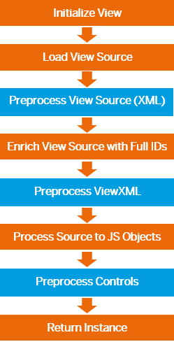

<!-- loio48b81b967af34ad08f1f88c962b4740a -->

# Preprocessing XML Views

Applying preprocessing to views enables you to use features like XML templating. This feature is currently only enabled for XML views. On an abstract level, preprocessing means that a view can be modified during runtime before it is rendered. This makes it possible to use the templating syntax, as it is interpreted by the preprocessor. It also makes it possible to apply user customization.

The following figure shows the different stages of view initialization. There are three hooks, XML, ViewXML and controls, which differ mainly in the source that is passed to the preprocessor.

  

-   XML

    The raw view source in the XML format is passed to the preprocessor. This enables example templating on XML level.

-   ViewXML

    The raw view source with all XML preprocessing results gets enhanced with its full IDs for the controls and passed on to the preprocessor. Adaptions on a valid view source can now be made before the XML is being parsed into a control tree.

-   Controls

    The view source is already processed to the JavaScript object and the control tree is available. This enables you to make changes to the view after design time, like special customizations, stored at some persistence layer or similar, the user has made previously. Or customizations depending on the user role which are not applicable during design time.


For preprocessor for view sources of type XML or ViewXML which create cacheable results, see [VML View Cache: Preprocessor Integration](xml-view-cache-3d85d5e.md#loio3d85d5eec1594be0a71236d5e61f89aa__ViewCache_Preprocessor).


## Using the Preprocessor

First, you need a preprocessor implementation. SAPUI5 provides a default preprocessor for XML templating which can be enabled by default. You can also build your own preprocessor based on the `Preprocessor` interface. For more information, see the [API Reference](https://ui5.sap.com/#/api/sap.ui.core.mvc.View.Preprocessor) and the [sample](https://ui5.sap.com/#/entity/sap.ui.core.mvc.View/sample/sap.ui.core.sample.View.preprocessor) in the Demo Kit. 

To use the preprocessor, you can choose one of the following options:

-   Global availability

    Makes the preprocessor available to all XML views and processes it every time a View is initialized. This maybe the right case for essential operations you want to apply to every view in your application. Therefore you can make use of the `registerPreprocessor` method:

    ```
    // "XMLView" required from module "sap/ui/core/mvc/XMLView"
    XMLView.registerPreprocessor("xml", "sap.ui.sample.samplepreprocessor",
    /* bSyncSupport = */ false, {sampleInfo: "this is a global preprocessor",
    moreInfo: "…"});
    ```

    For more information, see [API Reference: `sap.ui.core.mvc.XMLView.registerPreprocessor`](https://ui5.sap.com/#/api/sap.ui.core.mvc.XMLView/methods/sap.ui.core.mvc.XMLView.registerPreprocessor). 

-   Local availability

    Make a preprocessor available to one instance. This can be achieved by passing the preprocessor to the view factory function, which then processes it for this special instance. This would be the choice for smaller tasks the preprocessor should perform.

    ```
    // "XMLView" required from module "sap/ui/core/mvc/XMLView"
    XMLView.create({
           viewName: "sap.ui.core.sample.View.preprocessor.Sample",
           preprocessors: {
                 xml: [{
                       preprocessor: "sap.ui.sample.samplepreprocessor",
                       sampleInfo: "this is a local preprocessor",
                       moreInfo: "…"
                 },
                 {
                       preprocessor: “another.preprocessor”
                 }]
           }
    }).then(function(oView) {
           oView.doSomething();
    });
    ```

-   On demand availability

    This enables the developer to activate a preprocessor for a view instance, without the need to provide an implementation, by just specifying a preprocessor, which has been registered globally earlier. This is currently used by the XML templating.


> ### Note:  
> Preprocessors are per default only available for async views. Although it is possible to enable the preprocessor for sync views, we strongly recommend to only use them with async views.

> ### Note:  
> The information that is provided when using a preprocessor locally will be passed to the preprocessor according to the `mSettings` of the register method.

**Related Information**  


[XML View Cache](xml-view-cache-3d85d5e.md "To be able to speed up processing times of XML views that make heavy use of the preprocessor feature, you can use the view cache to store its processed XML source. Then according network requests for the source and all preprocessor runs that modify the XML source are skipped and the source is taken from the cache.")

