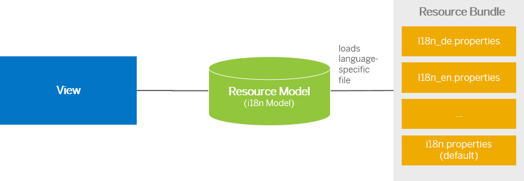

<!-- loio91f122a36f4d1014b6dd926db0e91070 -->

# Resource Model

The resource model is used as a wrapper for resource bundles. In data binding you use the resource model instance, for example, to bind texts of a control to language-dependent resource bundle properties.

A resource model is instantiated with a `bundleName` or a `bundleURL`. The bundle name is the name of the resource bundle and equals a SAPUI5 module name within the define/require concept. The bundle URL points to a resource bundle. If you use the bundle name, the file must have the `.properties` suffix. If you do not specify a `locale`, the system uses the login language: `var oModel = new sap.ui.model.resource.ResourceModel({bundleName:"myBundle",locale:"en"});`

In this resource model implementation you cannot pass parameters to your texts within the resource bundle. If you have to pass parameters, you must do this on your own. Therefore, you can load the bundle yourself or retrieve it from the model.

```js
var myBundle = oModel.getResourceBundle();
```

After the resource model has been instantiated, you have a model containing the resource bundle texts as data.




**Related Information**  


[Modules and Dependencies](modules-and-dependencies-91f23a7.md "The SAPUI5 framework has built-in support for modularizing comprehensive JavaScript applications. That means, instead of defining and loading one large bundle of JavaScript code, an application can be split into smaller parts which then can be loaded at runtime at the time when they are needed. These smaller individual files are called modules.")

[Localization](localization-91f217c.md "The framework concepts for text localization in SAPUI5 are aligned with the general concepts of the Java platform.")

[Resource Bundles](resource-bundles-91f225c.md "A resource bundle file is a Java properties file (as described in the Javadoc of class java.util.Properties). It contains key-value pairs where the values are the language-dependent texts and the keys are language-independent and used by the application to identify and access the corresponding values.")

[API Reference: `sap.ui.model.resource.ResourceModel`](https://ui5.sap.com/#/api/sap.ui.model.resource.ResourceModel)

<a name="loiof05c6f2cf18241cbbb2b126989108765"/>

<!-- loiof05c6f2cf18241cbbb2b126989108765 -->

## Binding Path Syntax for Resource Models

The binding path syntax for the resource model only contains a flat list of properties.

The following example shows a simple resource model that illustrates the possible binding paths: Resource bundle content:

```js

CLOSE_BUTTON_TEXT=Close
OPEN_BUTTON_TEXT=Open
CANCEL_BUTTON_TEXT=Cancel
```

Binding paths within the model:

```js

CLOSE_BUTTON_TEXT
OPEN_BUTTON_TEXT
CANCEL_BUTTON_TEXT
```

<a name="loio7341396326c34631813c805d44058b05"/>

<!-- loio7341396326c34631813c805d44058b05 -->

## Binding Texts to a Resource Bundle

If you don't want to use a component or descriptor file, or you want to use a more fine-grained resource bundle, you can declaratively instantiate a resource model in an XML or JSON view. To do so, you define the resource bundle by a name \(`resourceBundleName` property\) or a URL \(`resourceBundleUrl` property\) and assign an alias \(`resourceBundleAlias` property\) for the bundle in the view definition.

The `ResourceModel` required for binding these texts is created during view instantiation. The model is set as secondary model with the given alias to the view instance. If you want to bind other properties to another model, you have to create the model on your own in the corresponding controller or HTML page and attach it to the view with another alias. The binding itself behaves in the same way as every SAPUI5 data binding and as described above.

1.  Define the following resource bundle content: `MY_TEXT=Hello World`

2.  To bind this resource bundle content in XML views, insert the following code:

    ```xml
    <mvc:View resourceBundleName="myBundle"
        resourceBundleAlias="i18n" 
        controllerName="sap.hcm.Address"
        xmlns="sap.m"
        xmlns:mvc="sap.ui.core.mvc">
        <Panel>
            <Button text="{i18n>MY_TEXT}"/>
        </Panel>
    <mvc:View>
    ```


