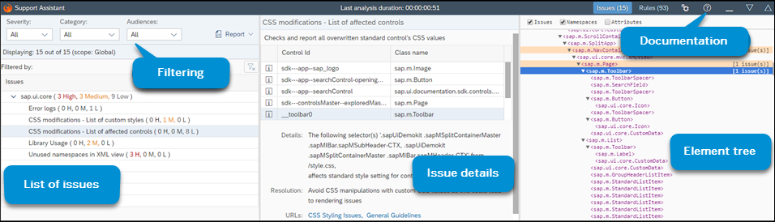
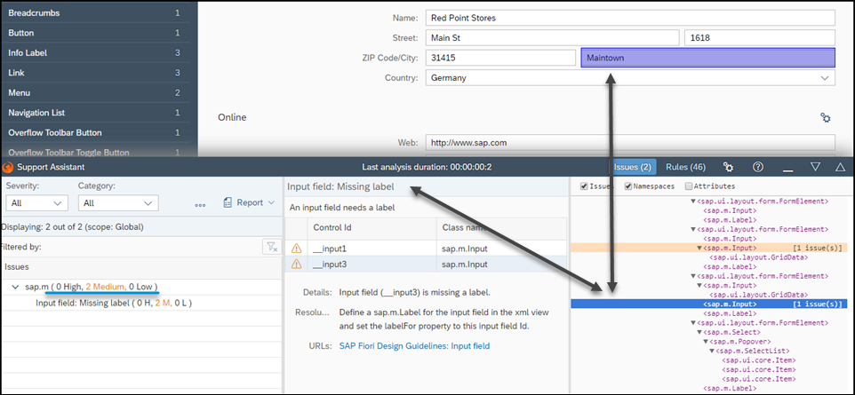

<!-- loiof09fab15373b4735a36cbc3cace0c1f4 -->

# Results and Analysis

After an analysis run, you can view a list of all triggered rules, their description, resolution steps, and a control tree with highlighted problematic elements.

Below you can see an example of how the results are displayed.

  
  
**Support Assistant Issues View**

## Issues List

The left side shows a list of the triggered rules sorted by severity \(High, Medium, Low\). You can use the dropdown menus to filter on *Severity*, *Category*, or *Audience*. You can clear your filtering by choosing *Clear Filtering* \(\).

Selecting *Report* generates an HTML report with the current set of rules and scope. You can view it in a new tab or download it as a `.ZIP` file.

## Issue Details

The middle part shows a detailed view of the selected rule. It contains the following:

-   Description - general description of the rule

-   Resolution - steps to resolve the issue

-   URLs - useful links \(for example, API Reference or Documentation\)

-   Severity - the severity of the identified issue

-   Element ClassName and ID - the namespace of the element

## Element Tree

The right side shows the element tree of the application. The root of the tree is called `<WEBPAGE>`. All rules that are not specific for a given control are mapped to this element. If these rules are triggered, the resulting issues will be mapped to the `<WEBPAGE>` element.

-   Hovering on an element in the tree highlights it in the application \(if it is visible\).

-   Selecting an element with issues in the element tree loads those issues in the issues list.

-   The table in the issues list shows all other elements that have triggered the same rule. The list also shows you the severity of each issue.

  
  
**Support Assistant DOM Tree**

