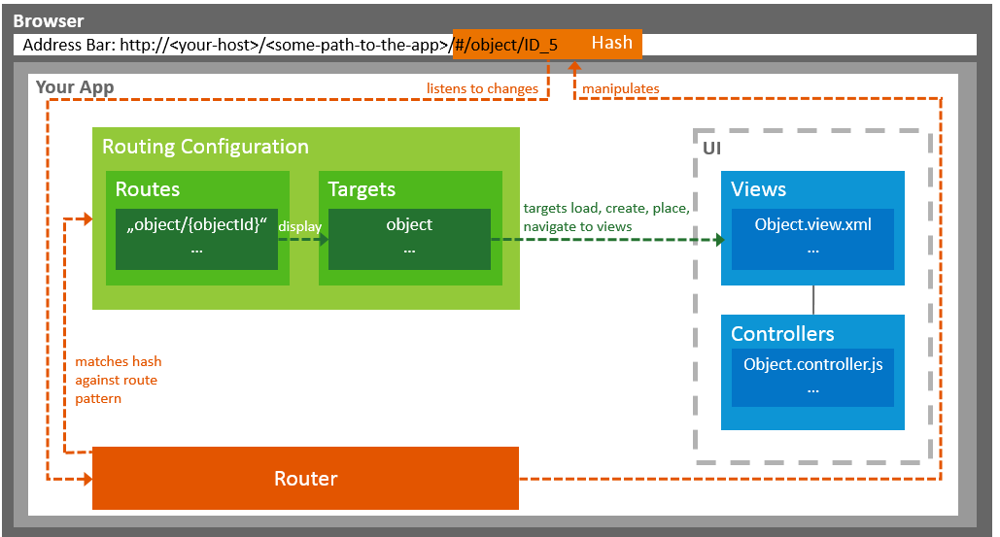

<!-- loio3d18f20bd2294228acb6910d8e8a5fb5 -->

# Routing and Navigation

SAPUI5 offers hash-based navigation, which allows you to build single-page apps where the navigation is done by changing the hash. In this way the browser does not have to reload the page; instead there is a callback to which the app and especially the affected view can react. A hash string is parsed and matched against patterns which will then inform the handlers.

You use routing in the following cases:

-   Enable users to navigate back using the browser history, for example, the *Back* button of the browser or a physical back button on mobile devices.

-   Enable bookmarks and deep links to pages inside an app; this means that you can start the app and resume the bookmarked state.

-   Pass on data via the hash to application logic.

   
  
**Routing overview**

  

In SAPUI5, navigation and routing is implemented using a “router” to forward the hash change and the data in the hash to one or more views of the app.

You use **routes** to notify your application that the hash has changed to a certain value. For each route, you define the pattern that can be used in the app implementation.

With **targets**, you define where a view or a component is loaded and where the view or component is shown on the UI. By referring to one or multiple targets in a route's definition, you can load and show the views or components once the route's pattern matches the current hash.

You configure routing in SAPUI5 in the descriptor file \(`manifest.json`\) \(see [Descriptor for Applications, Components, and Libraries \(manifest.json\)](descriptor-for-applications-components-and-libraries-manifest-json-be0cf40.md)\) or in the `Component.js` file \(see [Components](components-958ead5.md) \) to have it available globally throughout your app, but you can also define routes and targets locally by calling the constructors of the classes, for example under the `sap.ui.core.routing` and `sap.m.routing` namespaces.

> ### Note:  
> You can also define only routes or only targets, but then just have to make sure that you implement the counterpart elsewhere.

## Routing Patterns

Whenever a hash is added to a URL, the router checks whether there is a route with a matching pattern. The first matching route is taken and the corresponding target view is called. The data provided with the hash are passed on to the target.

You can use the following kinds of patterns:

-   **Hard-coded pattern**:

    The pattern matches the hash exactly. For example, when a pattern is defined as `product/settings`, this pattern matches only if the hash is ***product/settings*** and no data is passed on to the events of the route.

    For more information, see the tutorial [Step 6: Navigate to Routes with Hard-Coded Patterns](../03_Get-Started/step-6-navigate-to-routes-with-hard-coded-patterns-782aac0.md).

-   **Route with mandatory parameter**:

    You can define mandatory parameters for the pattern by placing the parameter in curly brackets \(<code>{<i>parameter ID</i>}</code>\).

    For example, if you define the pattern `product/{id}`, the hashes ***product/5*** and ***product/3*** \(where 3 and 5 are product IDs\) match the pattern. The matched event handler gets `5` or `3` passed on with the key `id` in its arguments. But hash ***product/*** does not match the pattern because the mandatory parameter is missing.

    For more information, see the tutorial [Step 7: Navigate to Routes with Mandatory Parameters](../03_Get-Started/step-7-navigate-to-routes-with-mandatory-parameters-f96d252.md).

-   **Route with optional parameter**:

    You can define optional parameters for the pattern by placing the parameter between colons \(<code>:<i>parameter ID</i>:</code>\).

    For example, if you define a pattern `product/{id}/detail/:detailId:`, the `detailId` parameter is optional, whereas `id` is mandatory. Both hashes `product/5/detail` and `product/3/detail/2` match the pattern.

-   **Route with query parameter**:

    The query parameter allows you to pass on queries with any parameter. A query parameter starts with `?`, and you can either define it as mandatory \(`product/{?query}`\) or optional \(`product/:?query:`\).

    The matched value will be converted into an object saved with the parameter name as the key when passed to the event handler.

    For more information, see the tutorial [Step 9: Allow Bookmarkable Tabs with Optional Query Parameters](../03_Get-Started/step-9-allow-bookmarkable-tabs-with-optional-query-parameters-b8561ff.md).

-   **"rest as string" parameter**:

    A parameter that ends with an asterisk \(`*`\) is called a "rest as string" parameter. Such a parameter matches as much as possible. It can be combined with the syntax of mandatory or optional parameters.

    For example, a pattern `product/{id}/:detail*:` defines a mandatory parameter with the name `id` and an optional "rest as string" parameter with the name `detail`. It matches `product/5/3` and `product/5/detail/3/foo`. The event handler gets `3` or `detail/3/foo` passed on with the key `detail` in its arguments.

> ### Tip:  
> For a better understanding about how patterns work and what matched parameters look like, see the following page in the *Samples* in the Demo Kit: [sap.ui.core.sample.PatternMatching/preview](https://ui5.sap.com/#/entity/sap.ui.core.routing.Route/sample/sap.ui.core.sample.PatternMatching).

> ### Note:  
> SAPUI5 uses Crossroads.js for parsing the hash and the Hasher framework for manipulating the hash.

**Related Information**  

[Tutorial: Navigation and Routing](../03_Get-Started/navigation-and-routing-1b6dcd3.md "SAPUI5 comes with a powerful routing API that helps you control the state of your application efficiently. This tutorial will illustrate all major features and APIs related to navigation and routing in SAPUI5 apps by creating a simple and easy to understand mobile app. It represents a set of best practices for applying the navigation and routing features of SAPUI5 to your applications.")

[API Reference: `sap.ui.core.routing`](https://ui5.sap.com/#/api/sap.ui.core.routing)

[API Reference: `sap.m.routing.Router`](https://ui5.sap.com/#/api/sap.m.routing.Router)

[API Reference: `sap.ui.core.routing.Route`: Constructor Detail](https://ui5.sap.com/#/api/sap.ui.core.routing.Route/constructor)

[Crossroads.js](https://millermedeiros.github.io/crossroads.js/)

[Hasher framework on GitHub](https://github.com/millermedeiros/hasher/)

