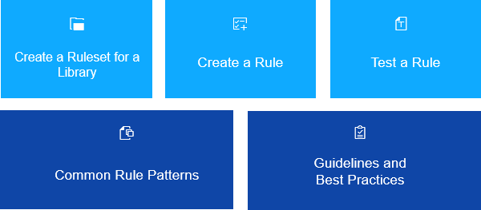

<!-- loiocd356daf2c444ace9edfc532f5833e11 -->

# Rule Development Guide

The Support Assistant allows you to create custom rules and rulesets and test them on your apps.

Rules can check different aspects of an app depending on the desired result. Each rule belongs to a specific ruleset. The ruleset is a JavaScript file named `library.support.js` that defines a set of rules. It consists of all the rules for an SAPUI5 library. Before creating a rule, you first need to create the ruleset. You can only have one ruleset per library.

The next subsections contain more detailed information on how to create new rules and test them. You can also see examples of best practices and common types of rules.

-   **[Create a Ruleset for a Library](create-a-ruleset-for-a-library-b5a5135.md "The Support Assistant allows you to create your own ruleset.")**  
The Support Assistant allows you to create your own ruleset.
-   **[Create a Rule](create-a-rule-c24569d.md "A rule consists of properties that test and advise on how possible issues can be
		resolved and a check function that tests the application for a specific issue. To create a
		rule, you need to set the properties and add a check function. ")**  
A rule consists of properties that test and advise on how possible issues can be resolved and a check function that tests the application for a specific issue. To create a rule, you need to set the properties and add a check function.
-   **[Test a Rule](test-a-rule-f5e4fe6.md "After you create a rule, you can test it manually on an app. ")**  
After you create a rule, you can test it manually on an app.
-   **[Common Rule Patterns](common-rule-patterns-3fc1412.md "The Support Assistant checks verify different aspects of your web application - from
        the view/elements structure and control properties to the dynamic, data and event-driven
        interactions. You can traverse the DOM tree, look at error logs during startup or check the
        CSS.")**  
The Support Assistant checks verify different aspects of your web application - from the view/elements structure and control properties to the dynamic, data and event-driven interactions. You can traverse the DOM tree, look at error logs during startup or check the CSS.
-   **[Guidelines and Best Practices](guidelines-and-best-practices-eaeea19.md "There are some general guidelines for writing succinct and meaningful rules to ensure
		high quality, consistency and better usability of the reported issues.")**  
There are some general guidelines for writing succinct and meaningful rules to ensure high quality, consistency and better usability of the reported issues.

