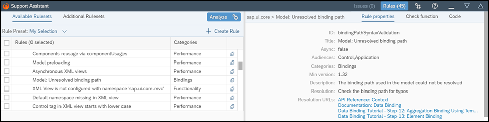
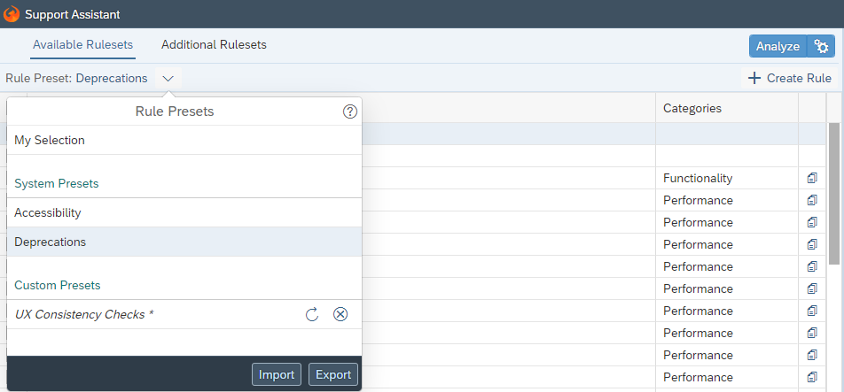
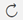
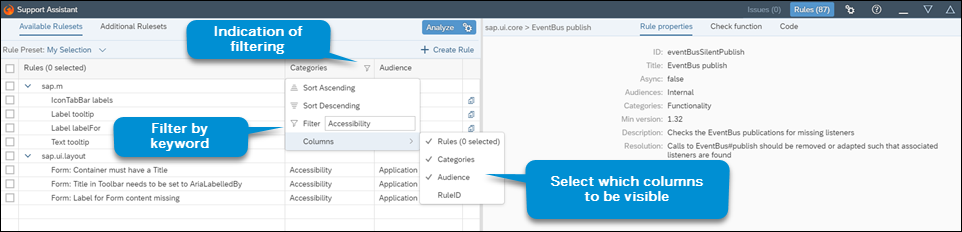

<!-- loio3fc864acf926406194744375aa464fe7 -->

# Rules Management

The user interface of the Support Assistant lets you choose which rules you can load for a library. It also allows you to organize your Rules view according to your preference and to import and export predefined rule selections.


<a name="loio3fc864acf926406194744375aa464fe7__section_os3_cyq_32b"/>

## Available and Additional Rulesets

The *Available Rulesets* tab contains the list of the currently loaded rulesets used by your application. On the left, there is a list of the available rules per library. On the right, you can see more details on the currently selected rule. By selecting the checkbox in front of each rule, you determine which rules are executed in the analysis. The list of available rulesets is dynamic and changes based on the libraries used for the current state of your application.

  
  
**Support Assistant Available Rulesets**



The *Additional Rulesets* tab shows rules for libraries that are not used by the application at the particular moment.

  
  
**Support Assistant Additional Rulesets**


You can select the rules from the *Additional Rulesets* tab and choose *Load* to move them to the set of *Available Rulesets* and use them in your analysis.


<a name="loio3fc864acf926406194744375aa464fe7__section_jjd_pgp_y2b"/>

## Rule Presets

The Support Assistant allows you to export and import subsets of preselected rules or *Rule Presets*. The rule presets are semantically grouped selection variants which you can export and save for future analyses of your apps. There are two general types of rule presets - *Custom Presets* and *System Presets*.

  
  
**Support Assistant Rule Presets**




### Custom Presets

Custom presets are rule selections which you can group according to your particular analysis purposes and export as `.json` files. You can give the exported file a title, ID and description that are meaningful to you.

The ID is an alphanumeric string which, although not mandatory, is useful if you collect data and generate reports on your rule presets. It makes it easier to identify and report on specific rule preset executions which are of interest to you. In case you don't create an ID, the system will automatically generate one. For more information, check [Analysis Report](analysis-report-29bcdec.md).

Once exported and saved, your rule presets can be imported and used again. They are listed in a dropdown menu allowing you to easily switch between them.

> ### Tip:  
> In *My Selection* on the Support Assistant toolbar and tick the checkbox in front of *I agree to use local storage persistency for*.


### System Presets

For your convenience, the Support Assistant is also equipped with ready-to-use system-defined rule presets. They contain selections of rules related within the context of a scenario, functional area, or other aspects of the app UI that can be verified using support rules. The first system preset which has been added is for Accessibility-related rules. You can find your most current selection of rules. To preserve it for your next analysis together with your choice of imported presets, go to the settings menu

You can't delete system presets but you have the option to modify and export them as you do with your custom ones. Although the rules selected within one system preset are grouped according to their relevance to a certain scenario, they can belong to different categories.

> ### Tip:  
> If you modify the rule selection within a system preset, an asterisk appears next to its name as an indication of changes that haven't been saved. You can undo these changes by selecting the refresh icon opposite the preset name .

> ### Tip:  
> You can use the Deprecations \(experimental\) system preset to check your application for usages of deprecated controls, properties, aggregations, and others.


<a name="loio3fc864acf926406194744375aa464fe7__section_e5c_sgp_y2b"/>

## Columns Personalization

You have the option to personalize the Rules view by choosing which columns to be displayed. Just click on the column header and select or deselect the columns you want to use. You can also sort the content of all four columns or filter by keyword.

  
  
**Support Assistant Columns Personalization**



> ### Note:  
> Choosing *I agree to use local storage persistency for* from the settings menu  will also preserve your choice of visible columns.


<a name="loio3fc864acf926406194744375aa464fe7__section_lj4_nnr_52b"/>

## Creating Rules

Selecting the *Create Rule* button allows you to create a new rule. You can create a completely new rule \(*Create Rule*\) or use an existing one as a template by clicking the *Copy* \(\) icon next to *Categories*. For each rule, you need to fill out the *ID*, *Categories*, *Audiences*, *Title*, *Description*, *Resolution*, *Min version* and, if available, *Resolution URLs* in the *Rule properties* tab. You also have the option to select if the *Async* value should be `true` or `false`. This value determines whether the rule check function will contain asynchronous operations. By default, it is set to `false`.

> ### Note:  
> Keep in mind that if you set *Async* to true, you need to use `fnResolve` as the 4th parameter in your check function to indicate that the asynchronous check function has finished. The asynchronous function waits 10 seconds before it times out.
> 
> Here is an example of the Async check function:
> 
> ```
> function(issueManager, oCoreFacade, oScope, fnResolve) {
>   // Some async operation
>   setTimeout(function () {
>     …
>     fnResolve();
>   }, 2000);
> }
> 
> ```

Additionally you need to provide or modify the JavaScript check function that implements the rule in the *Check function* tab. You can directly test the newly added or modified rule on the already loaded page.

The newly created rule remains *temporary* until you submit and assign it to a library.

> ### Remember:  
> Don't forget to copy and paste the resulting new rule and submit it separately in the IDE of your choice. You can select all the code from the *Code* tab.


<a name="loio3fc864acf926406194744375aa464fe7__section_u5s_vgp_y2b"/>

## Executing Rules

Once you load your rulesets or select a rule preset, you can run an analysis with them. To do this, select *Analyze*. For more information about the execution scope, you can refer to [Execution Scope](execution-scope-e15067d.md)

> ### Note:  
> If you have enforced a strict Content Security Policy \(CSP\), your temporary rules would not be executed. For more information about CSP, check [Content Security Policy](../05_Developing_Apps/content-security-policy-fe1a6db.md).

**Related Information**  


[Create a Ruleset for a Library](create-a-ruleset-for-a-library-b5a5135.md "The Support Assistant allows you to create your own ruleset.")

[Create a Rule](create-a-rule-c24569d.md "A rule consists of properties that test and advise on how possible issues can be resolved and a check function that tests the application for a specific issue. To create a rule, you need to set the properties and add a check function.")

