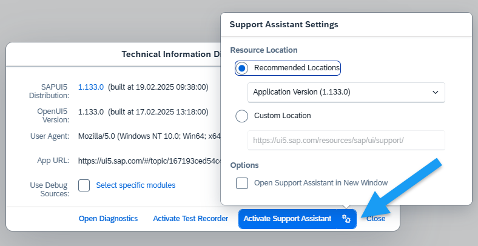
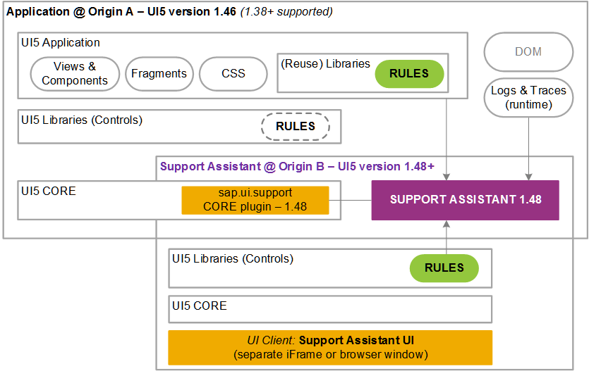

<!-- loio473201b547734e0eb66612df5bae8553 -->

# Running the Support Assistant on an Older SAPUI5 Version

In some cases you may want to run the Support Assistant against a different version of SAPUI5. You can do so by following a few steps.

<a name="loio473201b547734e0eb66612df5bae8553__prereq_jhq_pbl_n1b"/>

## Prerequisites

The minimum SAPUI5 version in which the Support Assistant is available is 1.44.17.

<a name="loio473201b547734e0eb66612df5bae8553__steps_efg_dsc_sz"/>

## Procedure

1.  Open the *Technical Information Dialog* using the [shortcut](../02_Read-Me-First/keyboard-shortcuts-for-sapui5-tools-154844c.md)  [Ctrl\] + [Shift\] + [Alt\] / [Option\] + [P\] .

2.  Choose the settings button for the Support Assistant \(\).

3.  Select a predefined version from the dropdown, or select *Custom Location* to paste a custom URL in the input field.

       
      
    <a name="loio473201b547734e0eb66612df5bae8553__fig_ixn_yl1_k1b"/>Technical Information Dialog: Support Assistant Settings

      

    > ### Note:  
    > When you choose a custom location, keep in mind that the URL should match the protocol of the application. For example, if the application is HTTP, the location should also be HTTP. If it is HTTPS, the location should be HTTPS. The URL should also end in `sap/ui/support/`.

    -   Under *Options* you can select if the Support Assistant should be opened in a separate window.

        > ### Note:  
        > Additional window popups may be blocked by your browser settings.

4.  Select *Activate Support Assistant*.

    Your application will reload and the Support Assistant will start.

    In the following diagram, you can see how the different SAPUI5 versions interact with the Support Assistant.

      
      
    <a name="loio473201b547734e0eb66612df5bae8553__fig_r2j_2wz_n1b"/>Support Assistant - Multi-Version Support

      

<a name="loio473201b547734e0eb66612df5bae8553__result_lcv_jxc_sz"/>

## Results

You are now able to run the Support Assistant on the version that you selected.

> ### Note:  
> Rules with a higher `minVersion` than the one currently loaded are not checked.

> ### Remember:  
> These settings are stored in your local storage \(if selected\) and are reused on consecutive runs.

**Related Information**  

[Technical Information Dialog](technical-information-dialog-616a3ef.md#loio616a3ef07f554e20a3adf749c11f64e9 "The Technical Information dialog shows details of the SAPUI5 version currently being used in an app built with SAPUI5. You can use the Technical Information dialog to enable debug resources and open additional support tools to debug your app.")

