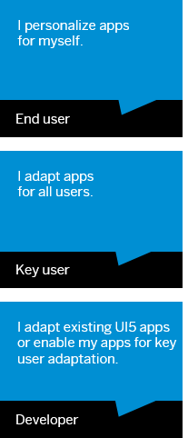
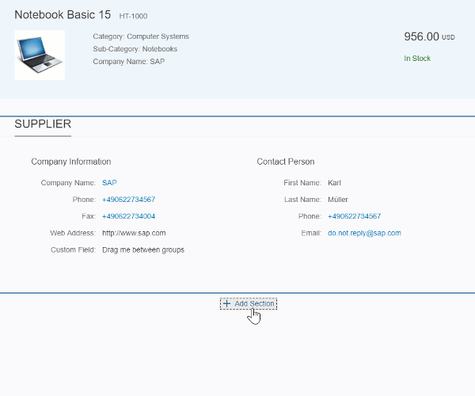

<!-- loioa8e55aa2f8bc4127923b20685a6d1621 -->

# SAPUI5 Flexibility: Adapting UIs Made Easy

Modification-free, cost-saving, easy to use, and performant: Discover the new flexibility when adapting SAP Fiori UIs using SAPUI5 flexibility.

<table>
<tr>
<td valign="top">

Flexibility is key! Enterprise software must adapt to rapidly changing environments. For example, customers need their apps to fit their processes without long IT projects to adapt them, and cloud providers want to run the same software for everyone to reduce TCO. You think adapting the user interface of SAP Fiori apps \(for example, by adding, hiding or rearranging fields\) is a complex process? Think again! SAPUI5 flexibility features allow upgrade-safe and modification-free UI changes on different levels \(for example, at customer side\) that can be performed by different users \(end users, key users, and developers\).

</td>
<td valign="top">

</td>
</tr>
</table>

**Here are four reasons why you want to use SAPUI5 flexibility:**

-   **It allows modification-free UI changes.**

    In contrast to extension points, UI changes made with SAPUI5 flexibility are modification-free. This means better lifecycle stability over release cycles, as the original app stays untouched and the changes are applied to the views only at runtime. This is achieved by storing the changes by the different users in separate layers. For more information, see [Layering Concept](layering-concept-9e63057.md).

-   **It saves time and money.**

    In the past, changing the UI was a complex, time and money consuming process. SAPUI5 flexibility changes all that! For example, with its *key user adaptation* feature, even users without technical knowledge can easily make UI changes themselves.

-   **It's easy to use.**

    Using SAPUI5 flexibility makes adapting the UIs of apps simple and intuitive, with WYSIWYG features and tools that are available right in the context the user is working in: end users personalize object pages of their apps and key users adapt apps for their teams directly on SAP Fiori launchpad; developers can use the SAPUI5 Visual Editor in SAP Business Application Studio.

-   **It's performant.**

    Last but not least: This flexibility doesn't come at the expense of performance! By caching the UI changes, SAPUI5 flexibility guarantees smooth working with your adapted apps.

<a name="loioa8e55aa2f8bc4127923b20685a6d1621__section_dsg_bx1_p1b"/>

## How SAPUI5 flexibility supports its users

### End users can personalize object pages directly on SAP Fiori launchpad

They just start the personalization mode and use intuitive WYSIWYG functions to adapt the UI to meet their unique, day-to-day needs.

For the personalization feature to be available on SAP Fiori launchpad on ABAP or on SAP BTP Portal, the app needs to be assigned to one of the user's roles.

> ### Note:  
> For more information, open the documentation for *SAP Fiori Launchpad in SAP NetWeaver AS for ABAP 7.52 with SAP\_UI 752* on the [SAP Fiori Launchpad](https://help.sap.com/viewer/product/SAP_FIORI_LAUNCHPAD/EXTERNAL/en-US) overview page, and search for ***Enabling Personalization of Object Pages \(Experimental\)***

For more information about personalizing object pages in SAP Fiori apps using SAPUI5 flexibility, open the [SAP Fiori Launchpad](https://help.sap.com/viewer/product/SAP_FIORI_LAUNCHPAD/EXTERNAL/en-US) product page. Open the documentation for your product version and search for ***Personalizing Apps \(Experimental\)***.

### Key users can adapt apps, which can then be used by all users, directly on SAP Fiori launchpad

Here's a typical scenario: A team lead who has business knowledge, but probably no technical or development skills, wants to adapt an app for all users of the app. In the context of SAPUI5 flexibility, we call this team lead a *key user*. Let's assume, the users would need to see the supplier number in addition. Using the *key user adaptation* feature of SAPUI5 flexibility, the key user just starts the adaptation mode and changes the user interface using intuitive WYSIWYG functions. So, for example, it's very easy to rearrange UI elements using drag and drop or to add fields to the user interface. The supplier number would be added in no time. After releasing the adapted version of the app, it's available for all users working with the app.Depending on your platform, you can even save the adapted app as a separate app variant.

For more information about adapting the user interface of SAP Fiori apps using the key user adaptation feature of SAPUI5 flexibility, open the [SAP Fiori Launchpad](https://help.sap.com/viewer/product/SAP_FIORI_LAUNCHPAD/EXTERNAL/en-US) product page. Open the documentation for your product version and search for ***Adapting SAP Fiori UIs at Runtime***.

Administrators have to enable key users to be able to use key user adaptation. For more information, open the [SAP Fiori Launchpad](https://help.sap.com/viewer/product/SAP_FIORI_LAUNCHPAD/EXTERNAL/en-US) product page. Open the documentation for your product version and search for ***Enabling UI Adaptation at Runtime***. If you use SAP BTP, you can find the relevant information here: [Enabling Key User Adaptation](https://help.sap.com/viewer/8422cb487c2146999a2a7dab9cc85cf7/Cloud/en-US/f7f671f6c26348d7a662c2c3d120202d.html).

### Developers can adapt the UIs of existing SAPUI5 apps and enable their own apps for key user adaptation

If you want to change the UI of an app that you haven't developed yourself, SAPUI5 flexibility helps you with this. You don’t need to change the source code of the original app. Instead, you use SAP’s development environment SAP Business Application Studio to create an adaptation project for the app that you want to change. This adaptation project is the basis for your UI changes. The UI changes themselves are made graphically in the SAPUI5 Visual Editor, which is also part of SAP Business Application Studio. As soon as you are ready with your changes, you deploy a “variant” of your app to the same ABAP repository that the original app belongs to. This app variant has its own app ID, but still references the original app – which remains untouched. If the original app is updated, this is also reflected in your app variant. For more information, see [Extending an SAP Fiori Application](https://help.sap.com/viewer/584e0bcbfd4a4aff91c815cefa0bce2d/Cloud/en-US/ada9567b767941aba8d49fdb4fdedea7.html) in the SAP Business Application Studio guide.

> ### Tip:  
> Not all SAP Fiori apps support key user adaptation. How to find out whether an app does? Either contact the developers of the app or check whether it uses the controls supported by key user adaptation as well as stable IDs. To do so, access the diagnosis window and choose *Control Tree*. For more information, see [Diagnostics](diagnostics-6ec18e8.md#loio6ec18e80b0ce47f290bc2645b0cc86e6).

If you want to enable key user adaptation for an app that you developed yourself, you need to consider a few simple things, such as using supported controls as well as stable IDs. For more information, see [SAPUI5 Flexibility: Enable Your App for UI Adaptation](../05_Developing_Apps/sapui5-flexibility-enable-your-app-for-ui-adaptation-f1430c0.md).

For a high-level overview on the different features for developers, key users, and end users, see [What is SAPUI5 Flexibility?](https://help.sap.com/viewer/UI5_Flex)

-   **[Layering Concept](layering-concept-9e63057.md "SAPUI5 flexibility uses a consistent layering concept to store the UI changes as
		semantic delta information. This layering concept applies consistently to all users of SAPUI5 flexibility (end users, key users, and developers).")**  
SAPUI5 flexibility uses a consistent layering concept to store the UI changes as semantic delta information. This layering concept applies consistently to all users of SAPUI5 flexibility \(end users, key users, and developers\).
-   **[Example: Layering of UI Changes](example-layering-of-ui-changes-17d2d4e.md "Here's an example of how the layering of UI changes based on SAPUI5 flexibility
		works.")**  
Here's an example of how the layering of UI changes based on SAPUI5 flexibility works.
-   **[Bootstrapping SAPUI5 Flexibility](bootstrapping-sapui5-flexibility-642dab2.md "You can define an alternative route from where to load SAPUI5 flexibility. ")**  
You can define an alternative route from where to load SAPUI5 flexibility.

**Related Information**  

[Layering Concept](layering-concept-9e63057.md "SAPUI5 flexibility uses a consistent layering concept to store the UI changes as semantic delta information. This layering concept applies consistently to all users of SAPUI5 flexibility (end users, key users, and developers).")

[Example: Layering of UI Changes](example-layering-of-ui-changes-17d2d4e.md "Here's an example of how the layering of UI changes based on SAPUI5 flexibility works.")

[Extending Apps](../08_Extending_SAPUI5_Applications/extending-apps-a264a9a.md "You can adapt an SAPUI5 app to your specific requirements. For example, you can adapt or replace views, extend or replace controllers, or change language-specific texts.")

[Stable IDs: All You Need to Know](../05_Developing_Apps/stable-ids-all-you-need-to-know-f51dbb7.md "Stable IDs are IDs for controls, elements, or components that you set yourself in the respective id property or attribute as opposed to IDs that are generated by SAPUI5. Stable means that the IDs are concatenated with the application component ID and do not have any auto-generated parts.")

[SAPUI5 Flexibility: Enable Your App for UI Adaptation](../05_Developing_Apps/sapui5-flexibility-enable-your-app-for-ui-adaptation-f1430c0.md "Here's what you have to consider when developing apps that support UI adaptation.")

[What is SAPUI5 Flexibility?](https://help.sap.com/viewer/UI5_Flex)

