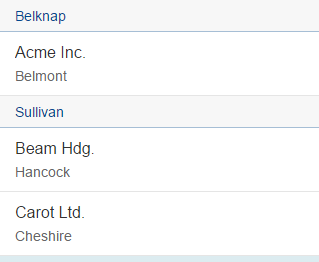

<!-- loioec79a5d5918f4f7f9cbc2150e66778cc -->

# Sorting, Grouping, and Filtering for List Binding


<a name="loioec79a5d5918f4f7f9cbc2150e66778cc__section_606348F7CECC432C9E18DACEFB3127CF"/>

## Initial Sorting, Grouping and Filtering for List Binding

To provide initial **sorting and grouping** in an XML view, proceed as follows:

```xml
<mvc:View
	controllerName="sap.ui.sample.App"
	xmlns="sap.m"
	xmlns:l="sap.ui.layout"
	xmlns:mvc="sap.ui.core.mvc">		
	<List items="{ path: '/companies', 
		sorter: { path: 'county', descending: false, group: '.getCounty'}, 
		groupHeaderFactory: '.getGroupHeader'}">
		<items>
			<StandardListItem
				title="{name}"
				description="{city}"
			/>
		</items>
	</List>
	
</mvc:View>
```

The `this` context of a group header factory function is generally set to the control \(or managed object\) that owns the binding. However, in XML views, the reference to the group header factory is done in the view controller by putting a dot \(`.`\) in front of the name of the group header factory function \(`{ groupHeaderFactory:'.myGroupHeader' }`\). In this case, the group header factory's this context is bound to the controller.

The list uses a sorter which sorts the list of companies in ascending order by the `county` column. It also groups its rows using the App.controller's `getCounty` method to provide the captions and the `getGroupHeader` function to provide non-standard group header controls, as shown here:

```js
sap.ui.define([
	"sap/ui/core/mvc/Controller",
	"sap/ui/model/json/JSONModel",
	"sap/m/GroupHeaderListItem "
], function (Controller, JSONModel, GroupHeaderListItem) {
	"use strict";
	return Controller.extend("sap.ui.sample.App", {
		onInit : function () {
			…
		},	

		getCounty: function(oContext) {
			return oContext.getProperty('county');
		},
		
		getGroupHeader: function(oGroup) {
			return new GroupHeaderListItem({
				title : oGroup.key
			}
		);
	},   
});
```

As you can see, `getCounty` generates the key for a division into groups as well as a group caption, which in this case is the county of the current companies. `getGroupHeader` serves as a group header factory function. After sorting and grouping, the company list looks like this:



The following XML snippet provides initial filtering:

```xml
<mvc:View
	controllerName="sap.ui.sample.App"
	xmlns="sap.m"
	xmlns:l="sap.ui.layout"
	xmlns:mvc="sap.ui.core.mvc">		
	<List items="{ path: '/companies', 
		filters: [{path: 'city', operator: 'StartsWith', value1: 'B'},
			{path: 'revenue', operator: 'LT', value1: 150000000}]}">		
		<items>
			<StandardListItem
				title="{name}"
				description="{city}"
			/>
		</items>
	</List>	  
</mvc:View>
```

The example shown here will only display companies whose city name begins with a 'b' and whose revenue is less than 150 million. As you can see, you can provide more than one filter, each of which may refer to different columns using different filter operators. For a complete list of permitted filter operators, see [sap.ui.model.FilterOperator](https://ui5.sap.com/#/api/sap.ui.model.FilterOperator) in the *API Reference* part of the Demo Kit.

As shown below, initial sorting, grouping and filtering can of course also be provided using JavaScript.

You can define a sorter and/or filters:

```js
sap.ui.define([
    "sap/ui/model/Sorter",
    "sap/ui/model/Filter"
], function(Sorter, Filter) {
//returns group header captions
var fnGetCounty = function(oContext) {
    return oContext.getProperty('county');
}

var oSorter = new Sorter({
    path: 'county', 
    descending: false, 
    group: fnGetCounty});

var oFilterCity = new Filter("city",
    sap.ui.model.FilterOperator.StartsWith, "B"),
    oFilterRevenue = new sap.ui.model.Filter("revenue",
        sap.ui.model.FilterOperator.LT, 150000000);
);

});

```

You can pass sorters and filters to the list binding:

```js

var oList = new sap.m.List({
	items: {path: "/companies", template: oItemTemplate, 
		sorter: oSorter, filters:[oFilterCity, oFilterRevenue]  
	}
});
```

You can also use the other list binding possibilities \(for example `bindAggregation` or `bindItems`\) and provide the sorter and filters as parameters.


<a name="loioec79a5d5918f4f7f9cbc2150e66778cc__section_N100CF_N10013_N10001"/>

## Manual Sorting and Filtering for List Binding

You can sort or filter data manually after the list binding is complete by getting the corresponding binding and calling the sort/filter function:

```js
// manual sorting
oList.getBinding("items").sort(oSorter);

// manual filtering
oList.getBinding("items").filter([oFilterCity, oFilterRevenue]);
```

> ### Note:  
> `getBinding` requires the name of the bound list. In this example, we are looking at the `items` of the `sap.m.List` control.

For more information about the various sorting and filter methods and operators, see the documentation for Filter, Sorter, and Filter operations under [sap.ui.model](https://ui5.sap.com/#/api/sap.ui.model) in the *API Reference* part of the Demo Kit.


<a name="loioec79a5d5918f4f7f9cbc2150e66778cc__section_jxn_fmp_rcb"/>

## Using Complex Syntax to Add Filters and Sorters

Complex syntax can be used to add filters and sorters for list binding. One or multiple objects can be defined.

```js

<table:Table rows="{
    path: '/table', 
    filters: [{
        path: 'field3', 
        operator: 'EQ',
        value1: 'test'
    }],
    sorter: [{
        path: 'field1', 
        descending: false
    }, {
        path: 'field2', 
        descending: true
    }]
 }">
...
</table:Table>

```

