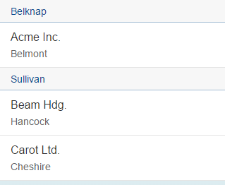

<!-- loioec79a5d5918f4f7f9cbc2150e66778cc -->

# Sorting, Grouping, and Filtering for List Binding


<a name="loioec79a5d5918f4f7f9cbc2150e66778cc__section_606348F7CECC432C9E18DACEFB3127CF"/>

## Initial Sorting, Grouping and Filtering for List Binding

To provide initial **sorting and grouping** in an XML view, proceed as follows:

```xml
<mvc:View
	controllerName="sap.ui.sample.App"
	xmlns="sap.m"
	xmlns:l="sap.ui.layout"
	xmlns:mvc="sap.ui.core.mvc">		
	<List items="{ path: '/companies', 
		sorter: { path: 'county', descending: false, group: '.getCounty'}, 
		groupHeaderFactory: '.getGroupHeader'}">
		<items>
			<StandardListItem
				title="{name}"
				description="{city}"
			/>
		</items>
	</List>
	
</mvc:View>
```

The `this` context of a group header factory function is generally set to the control \(or managed object\) that owns the binding. However, in XML views, the reference to the group header factory is done in the view controller by putting a dot \(`.`\) in front of the name of the group header factory function \(`{ groupHeaderFactory:'.myGroupHeader' }`\). In this case, the group header factory's this context is bound to the controller.

The list uses a sorter which sorts the list of companies in ascending order by the `county` column. It also groups its rows using the App.controller's `getCounty` method to provide the captions and the `getGroupHeader` function to provide non-standard group header controls, as shown here:

```js
sap.ui.define([
	"sap/ui/core/mvc/Controller",
	"sap/ui/model/json/JSONModel",
	"sap/m/GroupHeaderListItem "
], function (Controller, JSONModel, GroupHeaderListItem) {
	"use strict";
	return Controller.extend("sap.ui.sample.App", {
		onInit : function () {
			…
		},	

		getCounty: function(oContext) {
			return oContext.getProperty('county');
		},
		
		getGroupHeader: function(oGroup) {
			return new GroupHeaderListItem({
				title : oGroup.key
			}
		);
	},   
});
```

As you can see, `getCounty` generates the key for a division into groups as well as a group caption, which in this case is the county of the current companies. `getGroupHeader` serves as a group header factory function. After sorting and grouping, the company list looks like this:



The following XML snippet provides initial filtering:

```xml
<mvc:View
	controllerName="sap.ui.sample.App"
	xmlns="sap.m"
	xmlns:l="sap.ui.layout"
	xmlns:mvc="sap.ui.core.mvc">		
	<List items="{ path: '/companies', 
		filters: [{path: 'city', operator: 'StartsWith', value1: 'B'},
			{path: 'revenue', operator: 'LT', value1: 150000000}]}">		
		<items>
			<StandardListItem
				title="{name}"
				description="{city}"
			/>
		</items>
	</List>	  
</mvc:View>
```

The example shown here will only display companies whose city name begins with a 'b' and whose revenue is less than 150 million. As you can see, you can provide more than one filter, each of which may refer to different columns using different filter operators. For a complete list of permitted filter operators, see [sap.ui.model.FilterOperator](https://ui5.sap.com/#/api/sap.ui.model.FilterOperator) in the *API Reference* part of the Demo Kit.

As shown below, initial sorting, grouping and filtering can of course also be provided using JavaScript.

You can define a sorter and/or filters:

```js
sap.ui.define([
    "sap/ui/model/Sorter",
    "sap/ui/model/Filter"
], function(Sorter, Filter) {
//returns group header captions
var fnGetCounty = function(oContext) {
    return oContext.getProperty('county');
}

var oSorter = new Sorter({
    path: 'county', 
    descending: false, 
    group: fnGetCounty});

var oFilterCity = new Filter("city",
    sap.ui.model.FilterOperator.StartsWith, "B"),
    oFilterRevenue = new sap.ui.model.Filter("revenue",
        sap.ui.model.FilterOperator.LT, 150000000);
);

});

```

You can pass sorters and filters to the list binding:

```js

var oList = new sap.m.List({
	items: {path: "/companies", template: oItemTemplate, 
		sorter: oSorter, filters:[oFilterCity, oFilterRevenue]  
	}
});
```

You can also use the other list binding possibilities \(for example `bindAggregation` or `bindItems`\) and provide the sorter and filters as parameters.


<a name="loioec79a5d5918f4f7f9cbc2150e66778cc__section_N100CF_N10013_N10001"/>

## Manual Sorting and Filtering for List Binding

You can sort or filter data manually after the list binding is complete by getting the corresponding binding and calling the sort/filter function:

```js
// manual sorting
oList.getBinding("items").sort(oSorter);

// manual filtering
oList.getBinding("items").filter([oFilterCity, oFilterRevenue]);
```

> ### Note:  
> `getBinding` requires the name of the bound list. In this example, we are looking at the `items` of the `sap.m.List` control.

For more information about the various sorting and filter methods and operators, see the documentation for Filter, Sorter, and Filter operations under [sap.ui.model](https://ui5.sap.com/#/api/sap.ui.model) in the *API Reference* part of the Demo Kit.


<a name="loioec79a5d5918f4f7f9cbc2150e66778cc__section_jxn_fmp_rcb"/>

## Using Complex Syntax to Add Filters and Sorters

Complex syntax can be used to add filters and sorters for list binding. One or multiple objects can be defined.

```js

<table:Table rows="{
    path: '/table', 
    filters: [{
        path: 'field3', 
        operator: 'EQ',
        value1: 'test'
    }],
    sorter: [{
        path: 'field1', 
        descending: false
    }, {
        path: 'field2', 
        descending: true
    }]
 }">
...
</table:Table>

```


<a name="loioec79a5d5918f4f7f9cbc2150e66778cc__section_BF"/>

## Bound Filters

Bound filters let you use data binding for the `value1` or `value2` properties of a filter. When a filter value changes through data binding, the system automatically re-evaluates the list or tree binding using the filter and updates the bound control aggregation.

You can specify bound filters initially in the `boundFilters` property of the [aggregation binding info](https://ui5.sap.com/#/api/sap.ui.base.ManagedObject.AggregationBindingInfo%23overview). The following example filters the team members shown in a table by first-name prefix, last-name prefix, and department values defined in a model named "filter":

```xml
<table:Table id="membersTable" rows="{path: '/teamMembers',
    boundFilters: [
        { path: 'firstName', operator: 'StartsWith', value1: '{filter>/firstNamePrefix}' },
        { path: 'lastName', operator: 'StartsWith', value1: '{filter>/lastNamePrefix}' },
        { path: 'department', operator: 'EQ', value1: '{filter>/department}' }
    ]
}">
...
</table:Table>
```

A bound filter is *neutral* if its bound value is nullish. Neutral filters are not considered when filtering. To filter only by department, set the values for `/firstNamePrefix` and `/lastNamePrefix` to `null` in the filter model of the example above. A binding for a filter value can also be *unresolved* if it has a relative path and no binding context. A bound filter is always neutral if its binding is unresolved because models return a nullish value for these bindings.

The following more comprehensive example shows a table of customers where each row allows for selection of a key account manager for the respective customer. The selection is filtered so that only account managers in the same region as the customer are displayed.

Note that the binding expression `'{region}'` for the filter's `value1` resolves with the binding context of the enclosing customer table row. With this, each `Select` for account managers filters by the corresponding customer region:

```xml
<table:Table rows="{rows="{/customers}"
<table:title><Title text="Customers"/></table:title>
	<table:columns>
		<table:Column>
			<Label text="Customer"/>
			<table:template>
				<Text text="{name}"/>
			</table:template>
		</table:Column>
		<table:Column>
			<Label text="Region"/>
			<table:template>
				<Text text="{region}"/>
			</table:template>
		</table:Column>
		<table:Column>
			<Label text="Key Account Manager"/>
			<table:template>
				<Select items="{path: '/accountManagers', templateShareable: false,
						boundFilters: [{
							path: 'region',
							operator: 'EQ',
							value1: '{region}'
						}]}">
					<core:Item text="{parts: ['firstName', 'lastName']}" />
				</Select>
			</table:template>
		</table:Column>
	</table:columns>
</table:Table>
```

If your list or tree binding implementation supports bound filters, you can replace them using the `filter` method of the [list binding](https://ui5.sap.com/#/api/sap.ui.model.ListBinding%23methods/filter) or [tree binding](https://ui5.sap.com/#/api/sap.ui.model.TreeBinding%23methods/filter) associated with the control's aggregation.

-   To replace bound filters, use the `ApplicationBound` [filter type](https://ui5.sap.com/#/api/sap.ui.model.FilterType). This filter type corresponds to filters that you initially set using the `boundFilters` property of the [aggregation binding info](https://ui5.sap.com/#/api/sap.ui.base.ManagedObject.AggregationBindingInfo%23overview).
-   To replace unbound application filters, use the `Application` filter type. These are filters that you initially set using the `filters` property of the [aggregation binding info](https://ui5.sap.com/#/api/sap.ui.base.ManagedObject.AggregationBindingInfo%23overview).

The following example shows a view controller code snippet. It replaces the bound filters from the team members example above with a new filter for the age of the team members:

**Example**: Filter with lower and upper age boundary

```js
// FilterOperator imported from sap/ui/model/FilterOperator
// FilterType imported from sap/ui/model/FilterType
...
const oListBinding = this.getView().byId("membersTable").getBinding("rows");
const oAgeFilterFrom = new Filter({path: "age", operator: FilterOperator.GE, value1: "{filter>/fromAge}"}); 
const oAgeFilterTo = new Filter({path: "age", operator: FilterOperator.LE, value1: "{filter>/toAge}"});
oListBinding.filter([oAgeFilterFrom, oAgeFilterTo], FilterType.ApplicationBound); 
...
```

List and tree bindings created by the [`v4.ODataModel`](https://ui5.sap.com/#/api/sap.ui.model.odata.v4.ODataModel) and all models that are subclasses of [`sap.ui.model.ClientModel`](https://ui5.sap.com/#/api/sap.ui.model.ClientModel) support bound filters. Additionally, [`v2.ODataListBinding`](https://ui5.sap.com/#/api/sap.ui.model.odata.v2.ODataListBinding) supports them.

To support bound filters, your custom list binding implementations must call the [`computeApplicationFilters`](https://ui5.sap.com/#/api/sap.ui.model.ListBinding%23methods/computeApplicationFilters) method in their implementation of the `filter` method. This method correctly combines bound and unbound filters into the new application filters. You need to make this call before you call [`sap.ui.model.FilterProcessor.combineFilters`](https://ui5.sap.com/#/api/module:sap/ui/model/FilterProcessor%23methods/sap/ui/model/FilterProcessor.combineFilters). This is because `combineFilters` combines application and control filters and also removes neutral filters.

> ### Note:  
> Binding expressions for the values of bound filters can be any [property binding info](https://ui5.sap.com/#/api/sap.ui.base.ManagedObject.PropertyBindingInfo). However, bound filters in XML views don't support the syntactic binding constructs that are specific to XML views. These constructs are described in the documentation sections under [XML View](xml-view-91f2928.md). For example, the following are not supported:
> 
> -   The "`.`" prefix to refer to a formatter function in the view controller, as described in [Handling Events in XML Views](handling-events-in-xml-views-b0fb4de.md).
> -   A reference to a type that is required as a module in the view, as described in [Require Modules in XML View and Fragment](require-modules-in-xml-view-and-fragment-b11d853.md).

