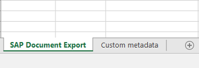

<!-- loio7e12e6b9154a4607be9d6072c72d609c -->

# Spreadsheet Export Configuration

To perform a spreadsheet export for any content other than `SmartTable` or `sap.ui.mdc.Table`, you have to set up the configuration for the columns and data sources, and you can configure some other additional properties.


<a name="loio7e12e6b9154a4607be9d6072c72d609c__section_m11_nx3_ffb"/>

## Overview

If you export data from the `SmartTable` control, the configuration is already available. You can use it without making any modifications. You can also adapt the configuration to make it suitable for your own requirements. The existing export configuration is attached as an event parameter to the `beforeExport` event provided by `SmartTable`. The event is fired once the `SmartTable` control has finished creating the export configuration. To adapt the export configuration, you have to modify the event parameter by registering an event handler and then adjusting the provided configuration.

If you want to use the export for any content other than the `SmartTable` control, you have to define your own export configuration.

The export configuration is a JSON object that contains three major parts that are required to process the data export. While the column configuration and the data source information are mandatory, additional properties that are used for the processing are optional. The export configuration needs to be valid, otherwise the export process will be cancelled.


## Details


### Column Configuration

The column configuration is an array of JSON objects that is assigned to the column property of the export configuration.

```js
var exportConfiguration = {
    workbook: {
        columns: [
            {
                // Place your column definition here
            }
        ]
    }
}
```

First you need to identify all the columns you want to export, since there has to be a column definition object for every column that is exported. Regardless of the data source \(OData or JSON array\), each row represents an instance of an entity with several properties, and each row is mapped to one of these properties. It is also possible to map multiple properties to a single column.

A column definition object is a JSON object that contains at least one `property` property that maps the column to the property of the entity. Its value must be of type `string` or an array of strings and must not be empty; otherwise the column definition is invalid. The string value must contain the name of a property of the entity. If there is no property with the given name, the column in the exported Office Open XML spreadsheet will be empty.

**Property Types**

Apart from the `property` property, a column definition can have additional properties. The following properties are used:

-   Type-independent

-   Type-dependent


The following table shows the different kind of properties.

**Properties**


<table>
<tr>
<th valign="top">

Type-Independent Properties

</th>
<th valign="top">

Type-Dependent Properties

</th>
</tr>
<tr>
<td valign="top">

`property` \(`string`\)

</td>
<td valign="top">

`scale` \(`number`\)

</td>
</tr>
<tr>
<td valign="top">

`label` \(`string`\)

</td>
<td valign="top">

`delimiter` \(`boolean`\)

</td>
</tr>
<tr>
<td valign="top">

`type` \(`string`\)

</td>
<td valign="top">

`unit` \(`string`\)

</td>
</tr>
<tr>
<td valign="top">

`width` \(`number`\)

</td>
<td valign="top">

`unitProperty` \(`string`\)

</td>
</tr>
<tr>
<td valign="top">

`textAlign` \(`string`\)

</td>
<td valign="top">

`displayUnit` \(`boolean`\)

</td>
</tr>
<tr>
<td valign="top">

 

</td>
<td valign="top">

`trueValue` \(`string`\)

</td>
</tr>
<tr>
<td valign="top">

 

</td>
<td valign="top">

`falseValue` \(`string`\)

</td>
</tr>
<tr>
<td valign="top">

 

</td>
<td valign="top">

`template` \(`string`\)

</td>
</tr>
<tr>
<td valign="top">

 

</td>
<td valign="top">

`inputFormat` \(`string`\)

</td>
</tr>
<tr>
<td valign="top">

 

</td>
<td valign="top">

`valueMap` \(`object|Map`\)

</td>
</tr>
<tr>
<td valign="top">

 

</td>
<td valign="top">

`wrap` \(`boolean`\)

</td>
</tr>
<tr>
<td valign="top">

 

</td>
<td valign="top">

`autoScale` \(`boolean`\)

</td>
</tr>
<tr>
<td valign="top">

 

</td>
<td valign="top">

`timezone` \(`string`\)

</td>
</tr>
<tr>
<td valign="top">

 

</td>
<td valign="top">

`timezoneProperty` \(`string`\)

</td>
</tr>
<tr>
<td valign="top">

 

</td>
<td valign="top">

`displayTimezone` \(`boolean`\)

</td>
</tr>
<tr>
<td valign="top">

 

</td>
<td valign="top">

`utc` \(`boolean`\)

</td>
</tr>
</table>

In this section, you can find out more about type-independent properties.

The `label` property is optional, and its value must be of type `string`. Its value will be used as column header for the column. If no `label` property has been provided, the value of the `property` property will be used instead.

The optional `type` property defines the data type for this column and needs to match one of the values of the `sap.ui.export.EdmType` enumeration. If the `type` property has not been defined or the enumeration does not contain its value, the default type \(`sap.ui.export.EdmType.String`\) is used. For more information, see the [API Reference: `EdmType`](https://ui5.sap.com/#/api/sap.ui.export.EdmType). 

The optional `width` property defines the column width based on the number of characters that can be visible. The Office Open XML spreadsheet standard uses a width calculation that is not equivalent to the CSS sizes. Therefore, the calculation is handled by the library. If no `width` property has been provided, or if its value is smaller than *1*, the default width is used. The default width is 10 characters. If the column header text has a length that is greater than the actual width, it will override the width with the length of the column header text.

The optional `textAlign` property defines the horizontal text alignment. Its value must be of type `string` and either be `left`, `right`, or `center`. Other CSS alignments like `begin` or `end` are not supported. If no `textAlign` property has been provided or its value is empty or not supported, the default alignment is used. The default alignment is defined by the type of the column. This is done by the application using the scenario and the generated Office Open XML spreadsheet, for example, Microsoft Excel.

> ### Note:  
> If you set the alignment for a particular column, the cell content is not always aligned as originally defined for every data type. The application that displays the spreadsheet can ignore the alignment depending on the column's data type or even the content of the cell, for example, in right-to-left scenarios.

The following code shows you an example of a column definition:

```js
var exportConfiguration = {
    workbook: {
        columns: [
            {
                property: "Firstname",
                width: 15
            },
            {
                property: "Lastname",
                width: 15
            },
            {
                property: "User",
                label: "Username",
                width: 20
            },
            {
                property: "Attempts",
                label: "Login Attempts",
                type: sap.ui.export.EdmType.Number
            },
            {
                property: "LastLogin",
                label: "Last Successful Login",
                type: sap.ui.export.EdmType.DateTime
                width: 20,
                textAlign: "center"
            }
        ]
    }
}
 
```


### Data Source Configuration

Apart from the column configuration, data source configuration is the most important configuration for the export process. Data source configuration is mandatory. It can be a JSON array containing all data, a JSON object, `sap.ui.model.ListBinding`, or `sap.ui.model.TreeBinding`. If it is a JSON object, the following properties are required:

**Data Source Configuration Properties**


<table>
<tr>
<th valign="top">

Property

</th>
<th valign="top">

Type

</th>
<th valign="top">

Optional

</th>
<th valign="top">

Description

</th>
</tr>
<tr>
<td valign="top">

`type` 

</td>
<td valign="top">

`string` 

</td>
<td valign="top">


</td>
<td valign="top">

Defines the type of the data service that provides the data. If it is an OData service, the value `odata` must be assigned.

</td>
</tr>
<tr>
<td valign="top">

`dataUrl` 

</td>
<td valign="top">

`string` 

</td>
<td valign="top">


</td>
<td valign="top">

Request URL that is needed to request the data with all the filters and its order. The URL can either be relative or absolute. If the URL is relative, the current origin will be used as a host.

</td>
</tr>
<tr>
<td valign="top">

`serviceUrl` 

</td>
<td valign="top">

`string` 

</td>
<td valign="top">


</td>
<td valign="top">

URL of the data service that serves the entity which is requested by the `dataUrl`. It is usually a substring of `dataUrl`. The URL can either be relative or absolute. If `dataUrl` is relative, `serviceUrl` must not be absolute.

> ### Note:  
> This property is required if OData batch requests are enabled.


</td>
</tr>
<tr>
<td valign="top">

`count` 

</td>
<td valign="top">

`number` 

</td>
<td valign="top">


</td>
<td valign="top">

Indicator of the line items available through the service. During the export process there is neither a dedicated *$count* request nor is the `inlineCount` request property used. If `count` is provided, it splits the requests so that not all data is requested at once, and the progress indicator can show reliable information.

> ### Note:  
> If the OData service is an analytical service, the ratio of processing time and number of queried items is not linear. For example, 200 items take up about two seconds, 1,000 items about 2.2 seconds. Therefore, it might be necessary to configure the requested size using the `sizeLimit` property.


</td>
</tr>
<tr>
<td valign="top">

`useBatch` 

</td>
<td valign="top">

`boolean` 

</td>
<td valign="top">


</td>
<td valign="top">

If set to `true`, the export library will use OData batch requests. Once batch requests are enabled, you'll have to provide the `serviceUrl` and `headers` properties. If batch requests are not supported by your OData service, you can disable this functionality by setting this property to `false`.

</td>
</tr>
<tr>
<td valign="top">

`headers` 

</td>
<td valign="top">

`object` 

</td>
<td valign="top">


</td>
<td valign="top">

Provides additional request headers within an OData batch request. Every property you add to the `headers` object will be put into the HTTP header section of the respective GET request within the batch request.

> ### Note:  
> This property is required if OData batch requests are enabled.


</td>
</tr>
<tr>
<td valign="top">

`sizeLimit` 

</td>
<td valign="top">

`number` 

</td>
<td valign="top">


</td>
<td valign="top">

Defines the number of records that are requested from the service with a single request. This is important to make fine adjustments.

</td>
</tr>
<tr>
<td valign="top">

`downloadLimit` 

</td>
<td valign="top">

`number` 

</td>
<td valign="top">


</td>
<td valign="top">

Defines the maximum number of rows that can be exported. If not specified, all rows are exported.

</td>
</tr>
</table>

The following code shows you an example of data source configuration:

```js
/* JSON array as dataSource */
var exportConfiguration = {
    dataSource: [
        // Several line items that contain actual data
    ]
}
/* OData service as dataSource */
exportConfiguration = {
    dataSource: {
        type: "odata",
        dataUrl: "/sap/opu/odata/sap/MM_PUR_PODWNPAYT_MNTR_SRV/C_PurOrdDownPaymentMntr(P_DisplayCurrency=%27EUR%27)/Results?sap-client=715&$format=json&$select=PurchaseOrder,PurchaseOrderItem,DisplayCurrency,DownPaymentsRequest,NetAmount,PurchasingDocumentStatus&$filter=(Supplier%20eq%20%2710300001%27)&$orderby=PurchasingDocumentStatus%20asc",
        serviceUrl: "/sap/opu/odata/sap/MM_PUR_PODWNPAYT_MNTR_SRV",
        count: 17491,
        useBatch: true,
        headers: {
            /* Some sample headers DO NOT copy them */
            "Accept": "application/json",
            "Accept-Language": "en",
            "sap-cancel-on-close": "true",
            "DataServiceVersion": "2.0",
            "x-csrf-token": "XvR_WdN7nCw83ngZnH9lZQ=="
        },
        sizeLimit: 500
    }
}
```


### Context Information

Apart from the mandatory configuration, you can add context information to the generated Office Open XML spreadsheet. This part of the configuration is optional. It is provided within a JSON object that is assigned to the `context` property within the workbook object of the export configuration. Built-in properties are not visible on a data sheet and stored as document properties in the generated file while custom metadata is visible on a data sheet in the workbook.



> ### Note:  
> Apart from the actual data that is exported, sometimes additional information is required in the spreadsheet. For example, this meta information could be the URL of the system from which the data is exported, the system ID, a timestamp of the export date, or the name of the user who exported this data.

The `sap.ui.export.Spreadsheet` library always exports the actual data to the main sheet of the Office Open XML spreadsheet but it can also add an additional sheet for meta information. The consuming applications can then assign their own specific names to both sheets.

The following code shows you an example of context configuration:

```js
var exportConfiguration = {
    workbook: {
        context: {
            // Place your context information here
        }
    }
}
```

You can use the following properties:

**Context Information Properties**


<table>
<tr>
<th valign="top">

Property \(optional\)

</th>
<th valign="top">

Description

</th>
<th valign="top">

Built-in Context Information

</th>
<th valign="top">

Custom Metadata Context Information

</th>
</tr>
<tr>
<td valign="top">

`application` \(`string`\)

</td>
<td valign="top">

Adds information about the business application that created a particular file.

We recommend to use this property because there are often several similar apps that work on the same data entity but with a different scope or view. This makes it easier to identify where the data comes from if the exported file is shared, for example, among employees and managers.

</td>
<td valign="top" rowspan="4">


</td>
<td valign="top" rowspan="4">

 

</td>
</tr>
<tr>
<td valign="top">

`version` \(`string`\)

</td>
<td valign="top">

Identifies the application version through which a particular Office Open XML spreadsheet was created. This can be helpful for debugging because you can identify the version that caused the issues and compare it to previous builds. The more detailed your version information is, the easier it will be to identify your application changes within your source code management system.

> ### Note:  
> You can only include the major and minor version in the version information. If you use more than one period as a separator, this can cause corrupt spreadsheet files in some system locales, which is also checked by the validation.


</td>
</tr>
<tr>
<td valign="top">

`title` \(`string`\)

</td>
<td valign="top">

Adds a self-explanatory title to the document generated. This can be useful if the exported entity is not the main entity of the application in question, for example, company codes within a purchase order application.

</td>
</tr>
<tr>
<td valign="top">

`modifiedBy` \(`string`\)

</td>
<td valign="top">

Adds information about the user who created this document.

If you do not use this property, the `sap.ui.export.Spreadsheet` library automatically adds SAPUI5 *Document Export* as the author of the document to the generated file and generates the creation timestamp.

</td>
</tr>
<tr>
<td valign="top">

`sheetName` \(`string`\)

</td>
<td valign="top">

Changes the name of the sheet that contains the exported data. If this property is not used, the default value `SAP Document Export` is used. The maximum length of `sheetName` is limited to 31 characters.

</td>
<td valign="top" rowspan="3">

 

</td>
<td valign="top" rowspan="3">


</td>
</tr>
<tr>
<td valign="top">

`metaSheetName` \(`string`\)

</td>
<td valign="top">

Changes the name of the sheet that contains the metadata. In contrast to `sheetName`, it only affects the name of the additional sheet that contains the metadata. If no metadata has been provided, the additional sheet will not be created, and this property will not take effect.

</td>
</tr>
<tr>
<td valign="top">

`metainfo` \(`array`\)

</td>
<td valign="top">

An array of JSON objects that follow an exact specification, the so-called meta information groups. Each meta information group has an explicit `name` property which accepts a string that is not empty. Apart from the group name, it contains an array that is assigned to the `items` property of the group. This array can contain several JSON objects that provide the `key` and `value` properties \(type `string`\).

</td>
</tr>
</table>

> ### Note:  
> Properties other than the ones listed are ignored during configuration.

The following code shows you an example of context configuration with some of the properties mentioned:

```js
var exportConfiguration = {
    workbook: {
        context: {
            application: "Supplier Invoices List",
            version: "6.1",
            title: "Supplier Invoices",
            modifiedBy: "Doe, John",
            sheetName: "Invoices"
        }
    }
}
```

The following code shows you an example of context configuration with the `metainfo` property:

```js
var exportConfiguration = {
    workbook: {
        context: {
            metainfo: [
                {
                    name: "Application settings",
                    items: [
                        {
                            key: "Name",
                            value: "Purchase Orders"
                        },
                        {
                            key: "Version",
                            value: "1.23.8742-p"
                        }
                    ]
                }
            ]
        }
    }
}
```

> ### Note:  
> The reasoning behind this design is that different layers \(SAPUI5 framework, SAP Fiori elements, smart controls, and applications\) can add metadata without depending on each other. As long as there is at least one valid meta information group within the `metainfo` array, the additional sheet will be shown in the generated file.


### Configuration of Additional Properties

The `sap.ui.export.Spreadsheet` library offers some other additional properties that you can configure. This part of the configuration is also optional.

The following properties are available for configuration:

-   `count` \(type `number`\)

    The value of this property must be positive. This property is only used if `dataSource` is a plain string. If this is the case, it is taken over as `dataSource.count`.

-   `worker` \(type `boolean`\)

    The export process runs in a dedicated web worker by default. The `worker` property allows you to disable this functionality. A web worker runs in a separate thread and does not affect the performance of the browser window's main thread.

    Although it has some advantages to use a web worker, it can also cause some problems. Especially if SAPUI5 is loaded from a Content Delivery Network \(CDN\) and is not served by the original host, it depends on the Content Security Policy \(CSP\) of the server if the export can be processed in a web worker. To resolve problems related to this scenario, you should either add a `worker-src` directive to your CSP or disable the web worker functionality. If the web worker functionality is disabled, the export process will run in the main thread of the browser window. Currently, the `worker-src` directive is not fully supported by all browsers. If you can't set the `worker-src` directive, you can also adjust the fallback directive `script-src`.

    > ### Note:  
    > The `script-src` directive will also affect all other scripts that are loaded on your page.

-   `fileName` \(type `string`\)

    Defines a particular name for the generated export file. The file extension is added to the given file name and is always xlsx. To take effect, the property must not be empty.

-   `showProgress` \(type `boolean`\)

    The export process shows a progress dialog by default.To prevent this from happening, you can set the `showProgress` property to `false`.


### Hierarchical Data

The `sap.ui.export.Spreadsheet` library can also handle hierarchical structures.

To get exported, each object of the relevant entity must have the following:

-   A distinct property containing its absolute numerical hierarchy level

-   An order in which parent nodes are followed by their direct child nodes


To enable a hierarchical representation, you have to simply assign the name of the property containing the hierarchy level to the `hierarchyLevel` property of the workbook object in the export configuration.

The following code shows you an example of hierarchy data:

```js
var exportConfiguration = {
    workbook: {
        hierarchyLevel: "level"
    }
}
```

> ### Note:  
> Relational hierarchy data is not supported.


### Starting the Export Process

After you have created a valid configuration, you will have to create a new `sap.ui.export.Spreadsheet` instance and initialize it with the previously created configuration. After the instance has been initialized, you can start the export process by calling the `build` method. Everything else will be handled by the export library. The result will be an Office Open XML spreadsheet which is automatically downloaded. The export library does not offer you any events to which you can register. If you need to perform additional steps after the export has been completed, you can use the `Promise` that is returned by the `build` method.

The following code sample shows the start of an export:

```js
sap.ui.define([
    "sap/ui/core/mvc/Controller",
    "sap/ui/export/Spreadsheet"
], function(Controller, Spreadsheet) {
    "use strict";
 
    return Controller.extend("sample.Spreadsheet", {
 
        onExport: function() {
            var oExportConfiguration, oExportPromise, oSpreadsheet;
 
            /* Creates the configuration and initializes the spreadsheet export */
            oExportConfiguration = this.createExportConfiguration();
            oSpreadsheet= new Spreadsheet(oExportConfiguration);
 
            /* Starts the export and returns a Promise */
            oExportPromise = oSpreadsheet.build();
 
            oExportPromise.then(function() {
                // Here you can perform additional steps after the export has finished
            });
        },
 
        createExportConfiguration: function() {
            var oConfiguration;
 
            // Create a valid export configuration
 
            return oConfiguration;
        }
    });
});
```

