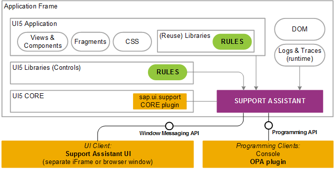

<!-- loioa34eb58aaf124f538a3ead23a6cab04a -->

# Support Assistant API

The Support Assistant can also run in silent mode and accept calls through its API. This way it can be integrated in more complex automated scenarios.


<a name="loioa34eb58aaf124f538a3ead23a6cab04a__section_fzf_d3y_zy"/>

## General Information

The Support Assistant is currently separated into two main parts:

-   Core plug-in in SAPUI5

-   UI client running in an iFrame or separate window, or programmable clients via an API


In the following diagram you can see how the Support Assistant is connected to the individual application layers.

   
  
**Support Assistant Architecture**

  

There are two different use cases for its integration:

-   Using browser window messaging protocol for agents in other window frames;

-   Using the `sap.ui.support.RuleAnalyzer` module \(for example, from the console or as part of OPA tests\).


We will take a closer look into these use cases in the following sections.


<a name="loioa34eb58aaf124f538a3ead23a6cab04a__section_n33_bky_zy"/>

## Window Messaging API

The window messaging API is an asynchronous API based on the browser low-level `postMessage`/`onMessage` APIs. It is enabled by using a custom generic communication bus component - `WindowCommunicationBus`, delivered with the Support Assistant. The `WindowCommunicationBus` is used for implementing the remote UI interaction between the Support Assistant and the application `iFrame`.


<a name="loioa34eb58aaf124f538a3ead23a6cab04a__section_cgr_r3y_zy"/>

## Programming API

This section illustrates how to use the Support Assistant programming API through specific **`sap.ui.support.RuleAnalyzer` API examples**.


### Add a Temporary Rule

After the Support Assistant has been started, if in silent mode, you can add a new temporary rule by using the `addRule` method. Then you can run an analysis with this rule.

```
sap.ui.require(["sap/ui/support/RuleAnalyzer"],
      function (RuleAnalyzer) {
         var oRule = {
            id: "Temp rule id",
            title: "Temp rule title",
            ...
         };
         RuleAnalyzer.addRule(oRule);
});
```

For more information about rule properties, see [Guidelines and Best Practices](guidelines-and-best-practices-eaeea19.md).


### Run the Analysis

The Support Assistant API allows you to:

-   Run a complete analysis on all components and rules. This analysis returns all issues.

    ```js
    sap.ui.require(["sap/ui/support/RuleAnalyzer"],
          function (RuleAnalyzer) {
    
       RuleAnalyzer.analyze().then(function() {
          var oHistory = RuleAnalyzer.getLastAnalysisHistory();
          ...
       });
    });
    ```

-   Run a complete analysis, using custom metadata. The analysis history will contain this metadata.

    ```js
    sap.ui.require(["sap/ui/support/RuleAnalyzer"],
          function (RuleAnalyzer) {
    	
    var oMetadata = {
    	…
    };
    	
       RuleAnalyzer.analyze(null, null, oMetadata).then(function() {
          var oHistory = RuleAnalyzer.getLastAnalysisHistory();
          ...
       });
    });
    ```

-   Narrow down the analysis to a specific part of the app, for example only a sub-tree.

    ```
    sap.ui.require(["sap/ui/support/RuleAnalyzer"],
          function (RuleAnalyzer) {
    
             var oExecutionScope = {
                type: "subtree",
                parentId: "panelId"
             };
    
             RuleAnalyzer.analyze(oExecutionScope).then(function() {
                var oHistory = RuleAnalyzer.getLastAnalysisHistory();
             ...
             });
    });
    ```

    For more information, see [Execution Scope](execution-scope-e15067d.md).

-   Check for issues using specific rules.

    ```
    sap.ui.require(["sap/ui/support/RuleAnalyzer"],
          function (RuleAnalyzer) {
    
             var oExecutionScope = {
                type: "subtree",
                parentId: "panelId"
             };
    
             var aRules = [{
                ruleId: "inputNeedsLabel",
                libName: "sap.m"
             }];
    
             RuleAnalyzer.analyze(oExecutionScope, aRules).then(function() {
                var oHistory = RuleAnalyzer.getLastAnalysisHistory();
             ...
             });
          });
    ```

-   Check for specific rules using rule presets.

    The rule presets are semantically grouped rules which can be custom or system defined. They can be imported and exported as `JSON` files. For more information, see [Rules Management](rules-management-3fc864a.md).

    -   Here is an example of running an analysis by using a **custom preset**:

        ```
        sap.ui.require(["sap/ui/support/RuleAnalyzer"],
              function (RuleAnalyzer) {
        
                 var oExecutionScope = {
                    type: "subtree",
                    parentId: "panelId"
                 };
        
                 var oCustomPreset = {
                    id: "CustomPreset",
                    title: "Custom",
                    description: "Custom rules",
                    selections: [{
                       ruleId: "inputNeedsLabel",
                       libName: "sap.m"
                    }]
                 };
        
                 RuleAnalyzer.analyze(oExecutionScope, oCustomPreset).then(function() {
                    var oHistory = RuleAnalyzer.getLastAnalysisHistory();
                 ...
                 });
              });
        ```

        > ### Note:  
        > You can get the preset definition from an available `JSON` file and pass it as a second parameter of the `analyze` function instead of defining it in your code.

    -   Here is an example of running an analysis by using a **system preset**:

        ```
        sap.ui.require(["sap/ui/support/RuleAnalyzer"],
              function (RuleAnalyzer) {
        
                 var oExecutionScope = {
                    type: "subtree",
                    parentId: "panelId"
                 };
        
        
                 RuleAnalyzer.analyze(oExecutionScope, "Accessibility").then(function() {
                    var oHistory = RuleAnalyzer.getLastAnalysisHistory();
                 ...
                 });
              });
        ```

    -   Here is an example of running an analysis with system preset by accessing it through the **`sap.ui.support.SystemPresets`** enumeration:

        ```
        sap.ui.require(["sap/ui/support/RuleAnalyzer"],
              function (RuleAnalyzer) {
        
                 var oExecutionScope = {
                    type: "global"
                 };
        
                 RuleAnalyzer.analyze(oExecutionScope, sap.ui.support.SystemPresets.Accessibility).then(function() {
                    var oHistory = RuleAnalyzer.getLastAnalysisHistory();
                 ...
                 });
              });
        ```


### View the Results

-   `RuleAnalyzer.getAnalysisHistory()` - Returns all the analysis history objects.

-   `RuleAnalyzer.getLastAnalysisHistory()` - Returns the last analysis history.

-   `RuleAnalyzer.getFormattedAnalysisHistory(sap.ui.support.HistoryFormats)` - Returns the history in the format that has been passed. The default format is string.


**Related Information**  


[Integrating the Rules in OPA Tests](integrating-the-rules-in-opa-tests-cfabbd4.md "The Support Assistant can be used as part of an existing OPA test to cover more test aspects of the application.")

[API Reference: `sap.ui.support`](https://ui5.sap.com/#/api/sap.ui.support)

[API Reference: `sap.ui.support.RuleAnalyzer`](https://ui5.sap.com/#/api/sap.ui.support.RuleAnalyzer)

