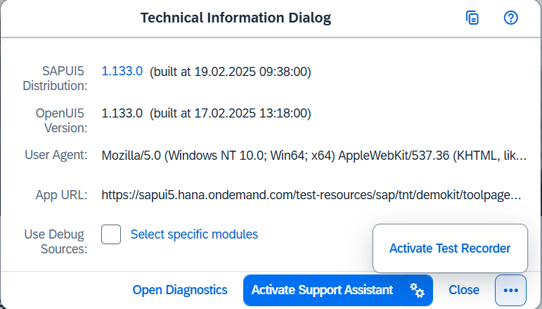
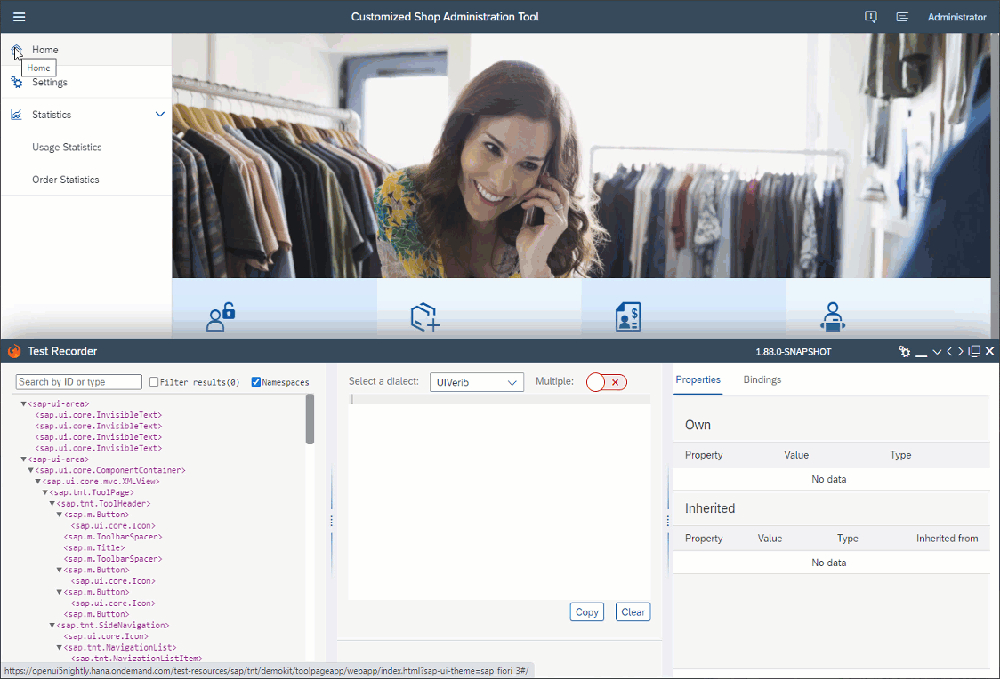

<!-- copydac59fadd5f9419d986f74ba602c6d29 -->

# Test Recorder

The Test Recorder tool supports app developers who write integration and system tests.

Test Recorder is part of the SAPUI5 framework and is available in all browsers. As of version 1.74, you can use the tool in any SAPUI5 app to inspect the rendered user interface \(UI\), view the control properties, and gain hints on writing tests. Test Recorder is aligned with the official SAPUI5 testing tool – OPA5.

<a name="copydac59fadd5f9419d986f74ba602c6d29__section_wxk_d2w_zjb"/>

## Getting Started

There are two ways to open the Test Recorder:

-   In a separate window: Enter the [shortcut](../02_Read-Me-First/keyboard-shortcuts-for-sapui5-tools-154844c.md)  [Ctrl\] + [Shift\] + [Alt\] / [Option\] + [T\] 

-   In an iFrame: Press  [Ctrl\] + [Shift\] + [Alt\] / [Option\] + [P\]  to display the *Technical Information Dialog*, and then choose *Activate Test Recorder*

      

The main sections of the tool are *Control Tree*, *Snippet*, and *Common Info*.

  

From the navigation actions at the top bar of the Test Recorder, you can minimize, resize, open it in a new window, or close the tool.

<a name="copydac59fadd5f9419d986f74ba602c6d29__section_vyg_n5d_1kb"/>

## Control Tree and Common Information

In the *Control Tree* section, you can see the DOM structure of the current app page. When navigating to another page or view, the tree is automatically updated.

You can display more information in the *Control Tree* by selecting the *Namespaces* and *Attributes* checkboxes. Entering text in the *Search* field highlights all elements that \(partially\) match by namespace, control name, or attribute values.

> ### Note:  
> Elements in the *Control Tree* get highlighted if there's a match by namespace or attribute value even when the *Namespaces* and *Attributes* checkboxes aren't selected and the information isn't visible.

There are three general types of testing-relevant information that you can gather for any control:

-   Position in the rendered control tree, type and ID – displayed in the *Control Tree* section. To see the control type, select the *Namespace* checkbox. To see the ID, select the *Attributes* checkbox.

-   Properties \(either own or inherited\) – displayed in the *Common Info* section on the *Properties* tab.

-   Bindings \(binding context, properties, and aggregations\) – displayed in the *Common Info* section on the *Bindings* tab.

> ### Note:  
> -   If an ID is not stable \(because it was generated automatically\), it's not suitable for tests. Unstable IDs start with a double underscore.
> 
> -   Many controls can have the same property or binding values. Therefore, when you use them in a control locator, the test finds multiple controls. This is a valid scenario, but it’s always more reliable to locate only one control with a highly specific locator.

<a name="copydac59fadd5f9419d986f74ba602c6d29__section_c2d_ts3_1kb"/>

## Actions

You can perform the following actions on controls, either from the *Control Tree* or from the rendered UI of the app:

-   **Highlight:** Generates a code snippet for finding the control, which can be used to assert the control state.

-   **Press:** Generates a code snippet for pressing on the control.

-   **Enter Text:** Generates a code snippet for entering text into the control.

To perform an action from the *Control Tree*, right-click and choose *Press* or *Enter Text* in the context menu. If you want to *highlight* the respective control in the rendered UI, simply select the desired element in the tree.

To perform an action from the app page, right-click on any control and select the desired action from the context menu \(the respective control is highlighted in the *Control Tree*\).

> ### Note:  
> A *Press* or *Enter Text* action snippet is generated irrespective of whether the control accepts such interactions. Keep in mind that such a snippet is not suitable for tests.

<a name="copydac59fadd5f9419d986f74ba602c6d29__section_dwd_ts3_1kb"/>

## Snippets

The code snippets generated by the Test Recorder usually contain a function invocation that locates one control on the app page. The function receives one argument – a control locator. The control location is a JSON object containing a specific combination of conditions and matchers.

The code snippet can be directly copied and pasted into your test code and is already aligned with *OPA5*. To choose the tool for which to generate a code snippet, select an option from the *Dialect* dropdown menu. The *raw selector* option gives you just the control locator with no function invocations and it can be easily used in other frameworks, such as wdi5.

> ### Tip:  
> If you want to generate several code snippets at once, turn on the *Multiple* switch.

<a name="copydac59fadd5f9419d986f74ba602c6d29__section_kns_mvt_w4b"/>

## Assertions

As of version 1.88, we introduced the option to generate code snippets with assertions. Assertions verify that the selected property will have exactly the same value during the test as it does at the moment of recording. If the value is falsy or boolean, a boolean check is generated instead of equality check.

To generate a code snippet with an assertion, first select a control \(from the app or from the control tree\) and then select the *Assert value* icon located next to each property of the selected control.

> ### Tip:  
> Assertions are available for both OPA5 and raw dialects, as well as in the multiple-snippet mode. You can edit the snippet directly in the recorder.

**Related Information**  

[Integration Testing with One Page Acceptance Tests \(OPA5\)](integration-testing-with-one-page-acceptance-tests-opa5-2696ab5.md "OPA5 is an API for SAPUI5 controls. It hides asynchronicity and eases access to SAPUI5 elements. This makes OPA especially helpful for testing user interactions, integration with SAPUI5, navigation, and data binding.")

[Stable IDs: All You Need to Know](../05_Developing_Apps/stable-ids-all-you-need-to-know-f51dbb7.md "Stable IDs are IDs for controls, elements, or components that you set yourself in the respective id property or attribute as opposed to IDs that are generated by SAPUI5. Stable means that the IDs are concatenated with the application component ID and do not have any auto-generated parts.")

[API Reference: `sap.ui.test.Opa5`](https://ui5.sap.com/#/api/sap.ui.test.Opa5)

[GitHub: `wdi5`](https://github.com/js-soft/wdi5)

