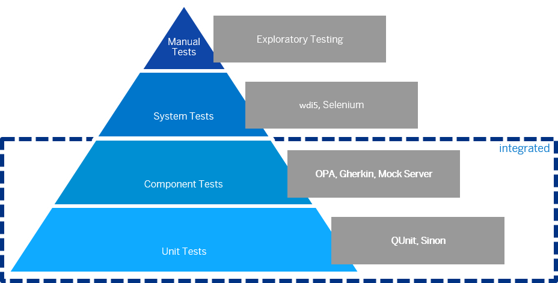

<!-- loio7cdee404cac441888539ed7bfe076e57 -->

# Testing

SAPUI5 provides several testing options, like to unit and integration tests and the OData V2 mock server.

Before you start implementing your first test, you should think about how to test the different aspects of your application. The image below shows some examples of testing tools along the agile testing pyramid.

   
  
<a name="loio7cdee404cac441888539ed7bfe076e57__fig_u2g_t2y_2t"/>Testing Pyramid

  

You can use a local test runner, such as Selenium or Karma, that automatically executes all tests whenever a file in the app project has been changed.

<a name="loio7cdee404cac441888539ed7bfe076e57__section_ojr_rzb_qnb"/>

## Recommended Tools

### OPA5

We recommend OPA5 for integration tests. OPA5 is part of SAPUI5. It is built on top of QUnit and provides good integration with SAPUI5.

### wdi5

WebdriverIO \(WDIO\) is a hugely popular end-to-end testing framework. It can work with any web app but lacks the awareness of the web framework that the application uses. wdi5, which is a WDIO plugin, bridges this gap and provides two key benefits, namely control locators and synchronization with the web framework. wdi5 uses a real browser and interacts with your app the same way a real user would.

**Related Information**  

[Tutorial: Testing](../03_Get-Started/testing-291c912.md "In this tutorial we will test application functionality with the testing tools that are delivered with SAPUI5. At different steps of this tutorial you will write tests using QUnit, OPA5, and the OData V2 mock server. Additionally, you will learn about testing strategies, Test Driven Development (TDD), and much more.")

[Continuous Integration: Ensure Code Quality](../05_Developing_Apps/continuous-integration-ensure-code-quality-fe7a158.md "This section describes the setup of a development project where multiple developers work together on the same code.")

[Integration Testing with One Page Acceptance Tests \(OPA5\)](integration-testing-with-one-page-acceptance-tests-opa5-2696ab5.md "OPA5 is an API for SAPUI5 controls. It hides asynchronicity and eases access to SAPUI5 elements. This makes OPA especially helpful for testing user interactions, integration with SAPUI5, navigation, and data binding.")

[Tutorial: Mock Server](../03_Get-Started/odata-v2-mock-server-3a9728e.md "In this tutorial, we will explore some advanced features of the OData V2 mock server.")

[wdi5 Home Page](https://github.com/js-soft/wdi5)

[Selenium Home Page](http://docs.seleniumhq.org/)

[Karma Home Page](https://www.npmjs.com/package/karma)

[Mock Server](mock-server-69d3cbd.md "A mock server mimics one or more back-end services. It is used to simplify integration testing and to decouple UI development from service development. By using a mock server you can develop and test the UI even if the service in the back end is incomplete or unstable.")

