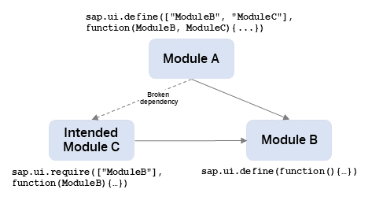
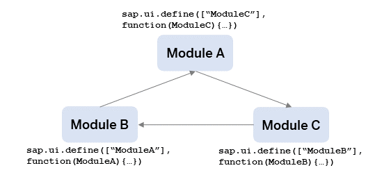
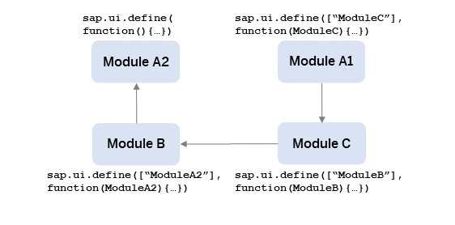
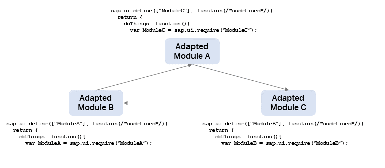

<!-- loio4363b3fe3561414ca1b030afc8cd30ce -->

# Troubleshooting for Loading Modules

The following sections give examples that you must avoid because they cause problems when loading your module.


<a name="loio4363b3fe3561414ca1b030afc8cd30ce__section_moduleloading"/>

## Why was my Module Not Loaded Correctly?

The following list contains possible reasons why your module does not load. To see how it is done correctly, see [Best Practices for Loading Modules - How to Define Modules](best-practices-for-loading-modules-00737d6.md#loio00737d6c1b864dc3ab72ef56611491c4__section_DefineModules).


### The module name is given in `sap.ui.define`

If you explicitly give the module name in `sap.ui.define`, you introduce additional complexity to the project structure which may cause inconcistencies and clashing module names. This problem is difficult to detect and can easily and proactively be avoided by omitting the module name in `sap.ui.define`.

The following example shows how it must *not* be done: The library file structure of `myLib` does not fit the module name. If there is another module named `MyModule` in the `myLib` library, the module would be hard to address. If you use an unnamed module instead, the module names would reflect the library file structure. By this, you reduce the probability of module name conflicts. In general, when addressing UI5 modules, make sure you separate all parts of the module's name with slashes instead of dots, for example `myLib/MyModule` instead of `myLib.MyModule`.

`myLib/myAdditionalPathSegment/MyModule.js`

```js
// CAUTION: BAD EXAMPLE - DON'T DO THIS
sap.ui.define("myLib.MyModule", [], function(){
    ...
});
```


### Using multiple `sap.ui.define` calls with unnamed modules

If you have more than one `sap.ui.define` call in a JavaScript file, the module loader does not know which definition actually represents the module. As there is no scenario that requires multiple module definitions in one file and in order to comply with the AMD specification \(see [https://github.com/amdjs/amdjs-api/wiki/AMD](https://github.com/amdjs/amdjs-api/wiki/AMD)\), the async variant of the SAPUI5 module loader does *not* tolerate multiple definitions anymore and throws an error.

**Example**: The `myModule` module is defined twice. This was most probably done by accident. To resolve this, the two module definitions have to be split into two separate modules.

`myModule.js`

```js
// BAD EXAMPLE - DON'T DO THIS
sap.ui.define([], function(){
    ...
});
sap.ui.define([], function(){
    ...
});
```


### Combining conditional modules with `sap.ui.define`

Conditional module definitions should *not* be used because of the following reasons:

-   The modules cannot be required with parameters because the check conditions are related to globals.

-   The export value is not consistent. This makes it difficult to consume the module.

-   The module dependencies are unclear. This prevents an efficient module bundling.


**Example**: The export value of `myModule` depends on the global `myProperty` property. In this case, it makes sense to split the two definitions into separate files for example into the two variants `myModuleA` and `myModuleB`. Another module can then make the required `myProperty` check and require the variant of `myModule` via `sap.ui.require`.

`myModule.js`

```js
// BAD EXAMPLE - DON'T DO THIS
if (myProperty){
    sap.ui.define([], function(){
        ... 
    });
else {
    sap.ui.define([], function(){
        ... 
    });
}
```


### Mixing old and new loader APIs

Using deprecated APIs is not recommended and mixing old and new loader APIs is even worse: If the synchronicity has changed between older and newer APIs, mixing them will cause timing-related issues as well as general inconsistencies.

**Example**: The namespace `myLib.myModule` is registered through the `jQuery.sap.declare` call. Besides actually defining the module export value, the subsequent `sap.ui.define` call does the same registration. So, the `jQuery.sap.declare` in this example is unnecessary and must be omitted in this example.

`myLib/MyModule.js`

```js
// BAD EXAMPLE - DON'T DO THIS
jQuery.sap.declare("myLib.myModule");
sap.ui.define([], function(){
    ...
});
```


### Using `sap.ui.require` instead of `sap.ui.define` on the top level

Although the API signature for `sap.ui.define` and `sap.ui.require` looks similar, you must use the `sap.ui.define` API to define a reusable JavaScript object \(that is, a module\). Note the following differences between `sap.ui.require` and `sap.ui.define`:


<table>
<tr>
<th valign="top">

Action


</th>
<th valign="top">

sap.ui.require


</th>
<th valign="top">

sap.ui.define


</th>
</tr>
<tr>
<td valign="top">

Value export


</td>
<td valign="top">

Not possible


</td>
<td valign="top">

The callback function defines an export to provide functionality to other modules.


</td>
</tr>
<tr>
<td valign="top">

Module name registration


</td>
<td valign="top">

Not possible


</td>
<td valign="top">

The module name is registered at the loader registry and can be used to address the module.


</td>
</tr>
<tr>
<td valign="top">

Relative dependencies


</td>
<td valign="top">

This is not possible, because no module name is registered and a reference point is missing.


</td>
<td valign="top">

Can be used.


</td>
</tr>
<tr>
<td valign="top">

Execution order


</td>
<td valign="top">

Dependent modules can be executed before the `sap.ui.require` callback has been executed. Therefore, using `sap.ui.require` instead of `sap.ui.define` can break the intended dependency graph and module execution order.


</td>
<td valign="top">

The dependent modules are waiting for the module callback execution to be finished.


</td>
</tr>
</table>

**Example**: The file for module C has one top-level `sap.ui.require` instead of a top-level `sap.ui.define` call. The module callback evaluation order starts with module B, because it has no dependencies. Afterwards, the framework can execute module A or module C, because the intended module C is not a module from the module loader perspective. Furthermore, the undefined export value of module C will most probably lead to errors in module A. If module C is defined correctly via a top-level `sap.ui.define` call, the module callback execution order is clear: B - C - A.




### Defining \(unnamed\) modules via inline scripts

It is unclear how modules that are defined via inline scripts can by addresses by other modules. Therefore, the inline scripts must be omitted.

**Example**: Module A is defined after bootstrapping UI5 and before the actual app is started. As the module is not addressable, the module definition must be moved to a separate file.

`startMyApp.html`

```html
<!-- BAD EXAMPLE - DON'T DO THIS -->
<html>
...  
    <script>  
        //Boot UI5  
    </script>  
    <script>  
        //Definition for Module A  
        sap.ui.define(function(){  
            ...  
        });  
    </script>  
    <script>  
        // Start UI5 Application  
    </script>  
...  
</html>
```


### Avoiding synchronous access to a module definition export

Never do a synchronous access to the export of a module definition because the module definition could be done asynchronously. Never rely on the synchronicity of a module definition, even if a module has no dependencies.

**Example**: The `sap.ui.define` call for the `myModule` module is made and the export value is synchronously used by creating a new object of that export. Although this may work in some scenarios, never do it this way, because it is unclear whether the module definition is already done. Instead, use the export of `myModule` in a separate module with a correctly maintained dependency to the `myModule` module.

`myLib/MyModule.js`

```js
// BAD EXAMPLE - DON'T DO THIS
sap.ui.define([], function(){
    ...
});  
...  
var oMyModule = new myLib.MyModule();  
...
```

For more information, see the API Reference for [sap.ui.define - Asynchronuous Contract](https://ui5.sap.com/#/api/sap.ui/methods/sap.ui.define).


### Avoid synchronous probing after module definition

Similar to the synchronous access of a module's export value, you also must omit the synchronous probing for modules defined in the same browser task.

**Example**: The `sap.ui.define` call for the `myModule` module is made and is synchronously checked by probing through calling `sap.ui.require`. Instead, the probing for `myModule` must be done in a separate module with a correctly maintained dependency to `myModule`.

`myLib/MyModule.js`

```js
// BAD EXAMPLE - DON'T DO THIS
sap.ui.define([], function(){
    ...
});
var MyModule = sap.ui.require('myLib/MyModule');
```


<a name="loio4363b3fe3561414ca1b030afc8cd30ce__section_moduleaddressing"/>

## What is wrong with the way I am addressing the modules?

The following examples show how you should *not* address a module. To see how it is done correctly, see [Best Practices for Loading Modules - How to Address Modules](best-practices-for-loading-modules-00737d6.md#loio00737d6c1b864dc3ab72ef56611491c4__section_AddressModules).


### Case insensitivity when addressing modules

Addressing a module inconsistently can cause various side-effects. If the server is not case sensitive, for example, the same resource can be addressed with URLs that differ only in case sensitivity. Besides that, it is bad from a performance perspective if the same resource is loaded twice and the same module is defined twice. This is similar to the example for multiple definitions above: multiple definitions of the same module can cause several issues, such as failing checks of `instanceof`.

**Example**: If we assume a server that is *not* case-sensitive, the `sap.m` library's `Button` control is loaded and evaluated twice.

`myView.xml`

```xml
<!-- BAD EXAMPLE - DON'T DO THIS -->
<mvc:View xmlns:mvc="sap.ui.core.mvc" xmlns:m="sap.m">
    ...
    <m:Button></m:Button>
    <m:button></m:button>
    ...
</mvc:View>
```

`myModule.js`

```js
...
    // BAD EXAMPLE - DON'T DO THIS
    sap.ui.require(['sap/m/button'], function(){
        ...
    });
    sap.ui.require(['sap/m/Button'], function(){
        ...
    });
...
```


### Manual loading of UI5 modules via script tags

When you load modules manually, the module loader cannot know how the module shall be named. Therefore, UI5 modules must always be loaded and evaluated via the UI5 module loader APIs.

Example: The `myModule` module is loaded via a script tag. Instead, use a `sap.ui.require` call to loading the module.

`startMyApp.js`

```html
<html>
...
    <script src="https://myhost/mypath/myModule.js"></script>
...
</html>
```


<a name="loio4363b3fe3561414ca1b030afc8cd30ce__section_cyclicdependencies"/>

## How can I remove project structures with cyclic dependencies?

When you use cyclic dependencies in the project structure, the module dependencies cannot be resolved. The UI5 module load detects the cycle and returns an undefined value instead of the correct module export.

As an exception, in specific scenarios, you may make the involved modules robust enough to handle undefined module exports at module callback execution time and use the export value via probing later. However, if you use the async variant of the loader, all modules that belong to a cycle must be able to handle undefined exports.

To see how to set up a correct project structure, see [Best Practices for Loading Modules - How to Structure a Project](best-practices-for-loading-modules-00737d6.md#loio00737d6c1b864dc3ab72ef56611491c4__section_StructureProject).

**Example**: All modules have exactly one dependency, which cannot be resolved correctly.



*Solution 1 – Resolved cycle*: The following figure shows how the cycle can be resolved by moving the functionality of module A, which is used by module B, to a separate module \(module A2\). In general, resolving cyclic dependencies can require a larger refactoring of all involved modules, especially when multiple cycles have to be resolved.



*Solution 2 – Probing modules*: In the example given in the following figure, the cycle is not resolved, but the involved modules do not access the dependent modules directly when the module callback is executed. They access them later via probing.



