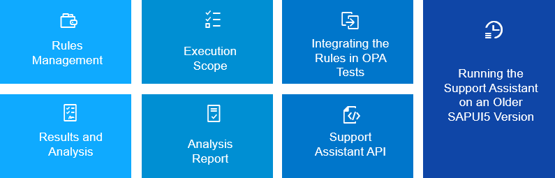

<!-- loio12572abbd4ad49eba37f2cdb23692093 -->

# Using the Support Assistant

The user interface of the Support Assistant allows you to view the available rules and load additional rulesets for an active application. You can also run an analysis and view the issues identified. The results are available in the form of a consolidated report, generated as an HTML document.

