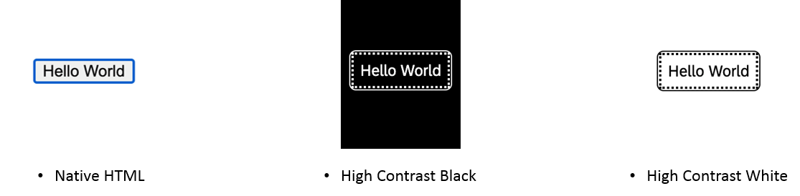

<!-- loiob3799f08e8da4af48232fe10af22feff -->

# Visualization

SAPUI5 offers visualization features out of the box.

### Minimum Contrast

SAP Fiori default theme \(Horizon\) fulfills the requirements for minimum color contrast of Web Content Accessibility Guidelines WCAG 2.1. UI5 provided themes: Morning Horizon, Evening Horizon, High Contrast White, High Contrast Black.

### Consistency of Icons

Icon library ensures consistent icon usage within a product and also across products.​ See, [Icon Explorer](https://ui5.sap.com/test-resources/sap/m/demokit/iconExplorer/webapp/index.html).

### Focus Visualization Design

Focus visualization is very important for user efficiency.​

  

### Layout Adaptation for Different Devices

The user interface needs to be adapted to the user’s device.

### Support for Text Resizing up to 200%

Users can adjust the font size themselves using the browser zoom. The responsive layout adapts to these manual adjustments automatically.

