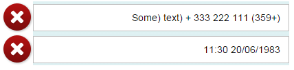
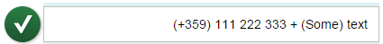

<!-- loio7e7cd0aed8bd469cbdd9b46035046dd8 -->

# API Properties for Right-to-Left Support in Text-Displaying Controls

Languages with right-to-left \(RTL\) text directionality keep the default directionality of numeric values and texts in left-to-right \(LTR\) mode. To ensure correct handling, two API properties have been introduced - `textDirection` and `textAlign`.


## Introduction

In Arabic, Hebrew and other languages that use the RTL text direction, when you see numerals or text from left-to-right languages \(like symbols\) on the UI, they are flipped to match the text direction. This common pitfall is visible when representing numerals \(phone numbers, dates, currency values, etc.\), which actually need to be displayed in LTR mode within the context of an RTL page.


## Solution

Two new properites have been introduced to determine the directionality of the target content.

-   **`textDirection`**

-   **`textAlign`**


 `textDirection` adds an HTML `dir` attribute to the part of the control that displays the target content.

 `textAlign` and is used for reversing the text alignment. Adding the `textAlign` property is only needed if the control doesn’t force the correct alignment.

The naming of the properties varies based on the actual use case of the control. For example, the `sap.m.DisplayListItem` control has `label` and `value` properties for text representation and the most common use case is to display numeric data in the `value` part of the control. The naming of the new property is `valueTextDirection` and since the control forces text alignment, the `valueTextAlign` property is not needed.


## Examples

The examples below illustrate the default behavior of numeric data in an RTL page context – the individual parts of the text are mixed:



After setting the `textDirection` and `textAlign` properties of the control \(inherited from `sap.m.InputBase`\), the numeric data is displayed in LTR mode, despite the RTL page context. When in LTR mode, the default text alignment \(**begin**\) is kept, which differs from the page text alignment. Because of this, we should use `textAlign: end` as the control doesn’t force the alignment of the text. Here is how this looks in an `sap.m.Input` control:

```js

sap.m.Input ({
     value: "(+359) 111 222 333 + (Some) text", 
     textDirection: sap.ui.core.TextDirection.LTR,
     textAlign: sap.ui.core.TextAlign.End
});
```

And here is how it looks on the screen:



This second example shows the behavior of a control that enforces correct text alignment - `sap.m.DisplayListItem`. In this case, you don't need to set the `textAlign` property.

```js

new sap.m.DisplayListItem({
     label: "Phone Correct", 
     value: "(+359) 111 222 333", 
     valueTextDirection: sap.ui.core.TextDirection.LTR
});
```

And here is how it looks on the screen:


> ### Tip:  
> To ensure that your application displays the data correctly, always test your application using RTL mode and real data.

Check the API Reference to see if your controls have these properties implemented.

