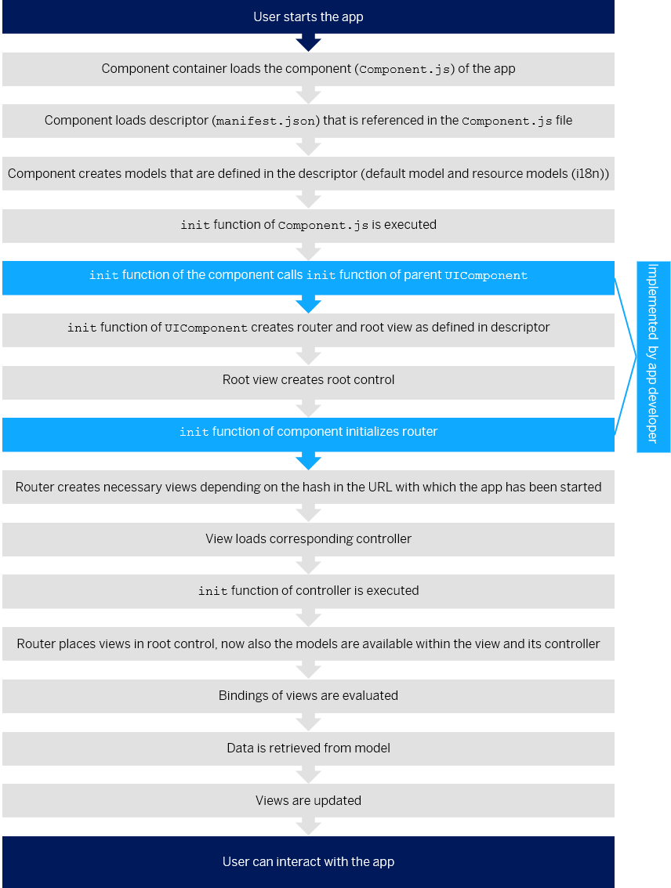

<!-- loiod2f58695fce3476f92fdfc07c9e8f7c6 -->

# App Initialization: What Happens When an App Is Started?

When a user starts an app \(in the SAP Fiori launchpad \(FLP\) or using an HTML page\), several steps will be performed in the background.

> ### Note:  
> When a user closes the app, the `destroy` function of the component is called. All models and the router are destroyed. The router will take care of destroying the views.
> 
> If a controller has created resources that need to be destroyed explicitly, for example non-aggregated controls, the app developer has to use the `onExit` function of the controller to free up resources. For more information, see [Controller](../04_Essentials/controller-121b8e6.md).

**Related Information**  

[App Overview: The Basic Files of Your App](app-overview-the-basic-files-of-your-app-28b59ca.md "We recommend creating at least three files for your app: the descriptor (manifest.json), the component (Component.js), and the main view of the app (App.view.xml).")

