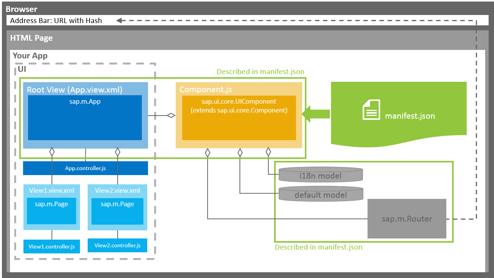

<!-- loio28b59ca857044a7890a22aec8cf1fee9 -->

# App Overview: The Basic Files of Your App

We recommend creating at least three files for your app: the descriptor \(`manifest.json`\), the component \(`Component.js`\), and the main view of the app \(`App.view.xml`\).

  

## Descriptor \(`manifest.json`\)

We recommend that you use the `manifest.json` file to configure the app settings and put all important information needed to run the app in there. Using this approach means you need to write less application code, and you can already access the information before the app is instantiated.

Some attributes in the descriptor are just for information purposes, such as the minimum SAPUI5 version \(`minUI5version`\), others help external components \(for example the SAP Fiori launchpad \(FLP\)\) to integrate the application correctly, but most of the attributes are actually used to configure specific aspects of the app that are needed frequently.

The most important configuration settings are:

-   **Models**. Examples of models are the configuration of the OData service \(default model\) and language files \(i18n model\). All models described in the `manifest.json` file are automatically instantiated when the app is started.

-   **Libraries** and **components** that are used in the app and have to be loaded during app initialization.

-   The **root view** of your application.

-   **Routing** configuration that defines the navigation between views.

## Root View \(`App.view.xml`\)

The `App.view.xml` file defines the root view of the app. In most cases, it contains an `App` control or a `SplitApp` control as a root control.

SAPUI5 supports multiple view types \(XML, HTML, JavaScript, JSON\). We recommend using XML views, as for these you have to separate the controller logic from the view definition in a controller file \(for example `App.controller.js`\).

We also recommend creating a separate view file for each view you want to use in your app.

## Component \(`Component.js`\)

The `Component.js` file holds the app setup. The `init` function of the component is automatically started by SAPUI5 when the component is instantiated.

> ### Caution:  
> Your component extends `UIComponent`. If you are overriding the init function of your component, you have to make sure that you call the `init` function of `UIComponent` and initialize the router afterwards.

In the metadata section of the component, you define a reference to the descriptor file. When the component is instantiated, the descriptor is loaded and parsed automatically.

## HTML Page

All apps are started using an HTML page that loads SAPUI5 and the component. You have two options: You can build an app for the FLP or build a standalone app.

-   **App for FLP**

    The FLP instantiates the component based on the information given in the descriptor file. The FLP can contain multiple apps at the same time. Each app can define local settings, such as supported themes or supported devices.

    This app cannot be run standalone, meaning no `index.html` file is created but only HTML files for testing the app in the FLP sandbox.

    For more information, search for *Embedding SAPUI5 Applications* in the documentation of your SAP NetWeaver version on the SAP Help Portal at [https://help.sap.com/viewer/p/SAP\_NETWEAVER](https://help.sap.com/viewer/p/SAP_NETWEAVER).

-   **Standalone app**

    If you want to run your app standalone, you need to create an `index.html` file. Within this file, you instantiate the component.

**Related Information**  

[Folder Structure: Where to Put Your Files](folder-structure-where-to-put-your-files-003f755.md "The details described here represent a best practice for structuring an application that features one component, one OData service and less than 20 views. If you're building an app that has more components, OData services and views, you may have to introduce more folder levels than described here.")

[App Initialization: What Happens When an App Is Started?](app-initialization-what-happens-when-an-app-is-started-d2f5869.md "When a user starts an app (in the SAP Fiori launchpad (FLP) or using an HTML page), several steps will be performed in the background.")

[Descriptor for Applications, Components, and Libraries \(manifest.json\)](../04_Essentials/descriptor-for-applications-components-and-libraries-manifest-json-be0cf40.md "The descriptor for applications, components, and libraries (in short: app descriptor) is inspired by the WebApplication Manifest concept introduced by the W3C. The descriptor provides a central, machine-readable, and easy-to-access location for storing metadata associated with an application, an application component, or a library.")

[Model View Controller \(MVC\)](../04_Essentials/model-view-controller-mvc-91f2334.md "The Model View Controller (MVC) concept is used in SAPUI5 to separate the representation of information from the user interaction. This separation facilitates development and the changing of parts independently.")

[Controller](../04_Essentials/controller-121b8e6.md "A controller contains methods that define how models and views interact.")

[Views](../04_Essentials/views-91f27e3.md "The view in the Model-View-Controller (MVC) concept is responsible for defining and rendering the UI. SAPUI5 supports predefined view types.")

[Models](../04_Essentials/models-e1b6259.md "A model in the Model View Controller concept holds the data and provides methods to retrieve the data from the database and to set and update data.")

[Routing and Navigation](../04_Essentials/routing-and-navigation-3d18f20.md "SAPUI5 offers hash-based navigation, which allows you to build single-page apps where the navigation is done by changing the hash. In this way the browser does not have to reload the page; instead there is a callback to which the app and especially the affected view can react. A hash string is parsed and matched against patterns which will then inform the handlers.")

[Components](../04_Essentials/components-958ead5.md "Components are independent and reusable parts used in SAPUI5 applications.")

