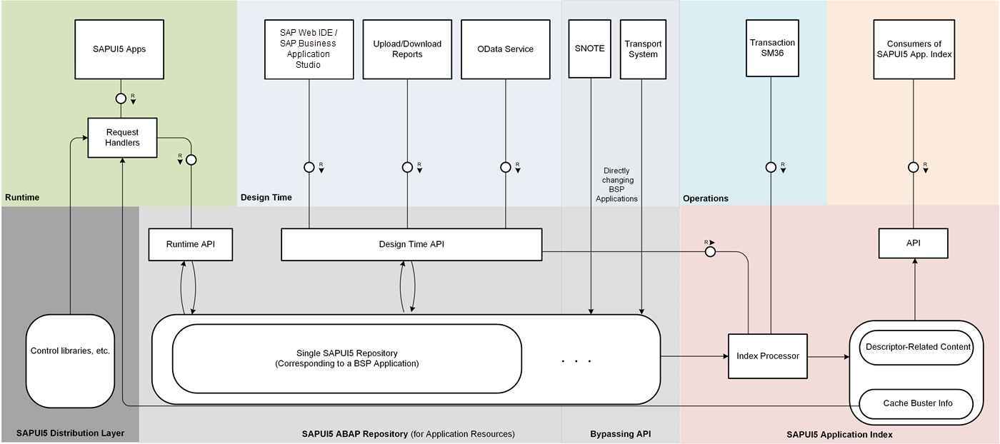

<!-- loiofc4f8ef3b8854442b519b8b3e809de03 -->

# Big Picture: How Does it All Work?

The following image shows an overview of the main tools, repositories, APIs, and parts of the ABAP back end.

 

-   The **SAPUI5 ABAP repository** contains single SAPUI5 repositories \(each represented by a BSP application\). The SAPUI5 ABAP repository is used to store SAPUI5 application resources.
-   At **design time**, you can access the SAPUI5 ABAP repository through the design time API using three different design time tools: SAP Business Application Studio, SAP Web IDE, special SAPUI5 repository upload and download reports, and OData services.
-   When applying SAP Notes with **transaction SNOTE** and using the **transport system** to transport your changes, for example to quality systems, the BSP applications that represent single SAPUI5 repositories are directly accessed \(passing over the design time API\).
-   After carrying out content changes using the design time API, the **index processor** recalculates the **SAPUI5 application index**.

    > ### Note:  
    > This doesn't happen for changes carried out using transaction `SNOTE` or the transport system. To ensure periodic recalculations of the SAPUI5 application index for these changes too, use transaction `SM36` to schedule periodic runs of the index processor triggered by the report `/UI5/APP_INDEX_CALCULATE`.

-   The SAPUI5 application index contains information related to the supported cache busting mechanisms and the content of the descriptor for SAPUI5 apps, components, and libraries. The content of the SAPUI5 application index can be **consumed by an API**, for example, by SAP Fiori launchpad. Cache busting-related information of the SAPUI5 application index can also be used by the request handlers \(at runtime, for SAPUI5 apps that are using this mechanism\).
-   At runtime, the application resources needed by SAPUI5 apps are accessed through a specific **runtime API** from the SAPUI5 ABAP repository, whereas the SAPUI5 distribution layer artifacts \(such as controls\) are retrieved from the **MIME repository**. The application resources and the SAPUI5 distribution layer artifacts are served through SAPUI5-specific request handlers assigned to the respective ICF nodes.
-   Another part of the SAPUI5 ABAP repository is the SAPUI5 text repository.

