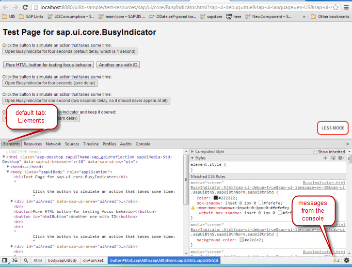
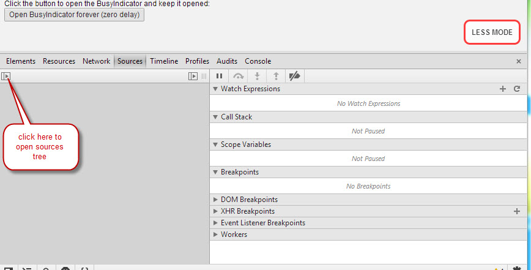
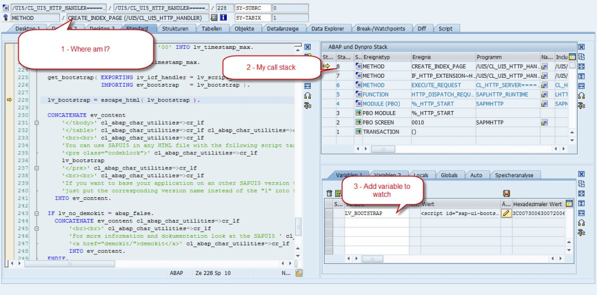
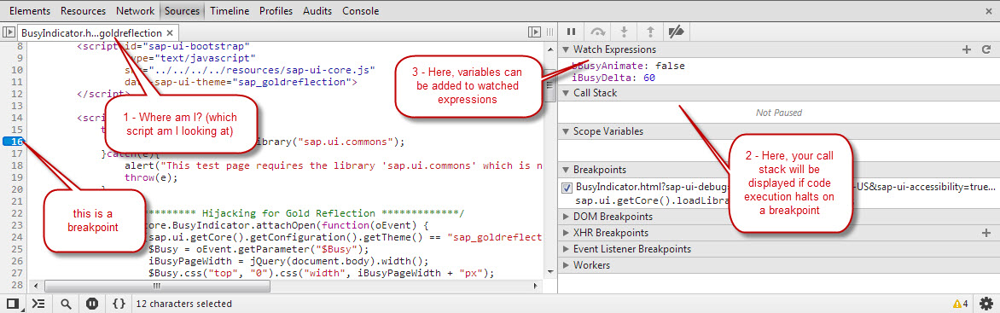

<!-- loio1e52fde5444649748809a78fd8a645da -->

# Browser Debugging for ABAP Developers

To debug in SAPUI5, use your browser's debugging tool.

When you debug code in SAPUI5, keep in mind that you can **not** debug SAPUI5 in your IDE. If you use SAP Business Application Studio, for example, a breakpoint set in SAP Business Application Studio does **not** stop your script when it is executed in your browser, unless you use the `debugger;` statement explicitly in your code. The browser does not know about your IDE and does not communicate directly with it.

## ABAP Debugger vs. Browser Debugger

This section explains how you use the debugging tool of a Chrome browser. Keep in mind that you have to test your application on all browsers that are officially supported by SAP, because the implementation differs depending on the browser used, see [Choose your Browser](../02_Read-Me-First/browser-and-platform-support-74b59ef.md). To start the debugger, use the browser menu or choose `F12` \(valid for most browsers\).

The following explanations assume that your application is up and running on your web server, either a local Tomcat, or a remote server.

In a first step, locate the lines of code you would like to inspect and set breakpoints. The following figure shows an application that is opened in the Chrome debugger. The default tab *Elements* is opened, and a small bell icon with a number located at the right border of the footer indicates the number of messages from the console.

On the *Elements* tab, the HTML elements of the DOM are displayed in a tree structure. To see the JavaScript code within the application and to set a breakpoint there, open the *Sources* tab. From there, you can open any source files that is included. When you open the tools the first time, you ususally have to click the arrow icon on the left hand side of the *Sources* tab \(as indicated in the following figure\) to open the sources tree.

To see the actual content of the HTML page and to set a breakpoint, open the HTML page from the sources tree. This is similar to the ABAP debugger when you execute and debug an application from the workbench. The following figures show the ABAP workbench debugger and the Chrome debugger.

The following figure shows the ABAP workbench debugger. The bubbles indicate the opened application and its location \(1\), the call stack \(2\), and the tab where you enter the variables you want to watch \(3\).

The next figure shows the Chrome debugger. Here, the bubbles indicate the script you are looking at \(1\), the watch expressions where you can add the variables you want to watch \(3\), the call stack that indicates if the code execution stops on a breakpoint \(2\), and the breakpoint \(4\). The call stack is only visible when the code execution is on hold.

> ### Note:  
> JavaScript does not support a forward navigation, meaning that you can not jump to a method by double clicking. Instead, you either have to jump to the method during execution, or you open the file containing the method.

If you are not sure in which file exactly a piece of code is located, Firefox offers you an option to search through several files included in your page. Chrome, however, does **not** support this option.

## Setting Breakpoints

The browser debugger supports several options for setting breakpoints. You can, for example, click once on the line number where you would like to break. To remove the breakpoint, click the respective line again. To temporarily disable or edit the breakpoint, right click on an existing breakpoint. To set a conditional breakpoint, right click on a line without breakpoint. You can also set breakpoints on a certain event or event listeners, see the option in the lower right screen area of the figure above. For more information, see the tutorials for your respective browser that are available in the internet.

> ### Note:  
> In most cases after setting a breakpoint, you have to reload the page to execute the code again and to make it stop at the respective line.

## Adding Variables to Watch

To add a variable to the list of watched variables, open the context menu for the variable in the code line and choose *Add to watch*. Another option is to choose the *\+* button at the top of the watch list to add a new line, in which you can then enter the name of the variable you want to watch.

## Modifying Variables

If you want to modify a variable to find out if the code works correctly with a different value, open the console, for example by choosing `ESC` in the debugging tool and enter the new value manually directly in the JavaScript code. To confirm the change, choose `ENTER` in Chrome and *Execute* in Firefox.

## Stepping Through Executed Code

In ABAP, a yellow arrow indicates the line of code that is currently being executed. In Chrome, the arrow is red and the code line is highlighted. The following table gives an overview of the function keys for the ABAP workbench and Java Script:

<table>
<tr>
<th valign="top">

Function

</th>
<th valign="top">

ABAP

</th>
<th valign="top">

JavaScript

</th>
</tr>
<tr>
<td valign="top">

Step-by-step execution, also stepping into functions and loops

</td>
<td valign="top">

`F5`

</td>
<td valign="top">

`F11`

</td>
</tr>
<tr>
<td valign="top">

Step-by-step execution, stepping over functions

</td>
<td valign="top">

`F6`

</td>
<td valign="top">

`F10`

</td>
</tr>
<tr>
<td valign="top">

Skipping the rest of the current function and stepping out to the last cursor position

</td>
<td valign="top">

`F7`

</td>
<td valign="top">

`SHIFT+F11`

</td>
</tr>
<tr>
<td valign="top">

Resume execution

</td>
<td valign="top">

`F8`

</td>
<td valign="top">

`F8` 

</td>
</tr>
</table>

