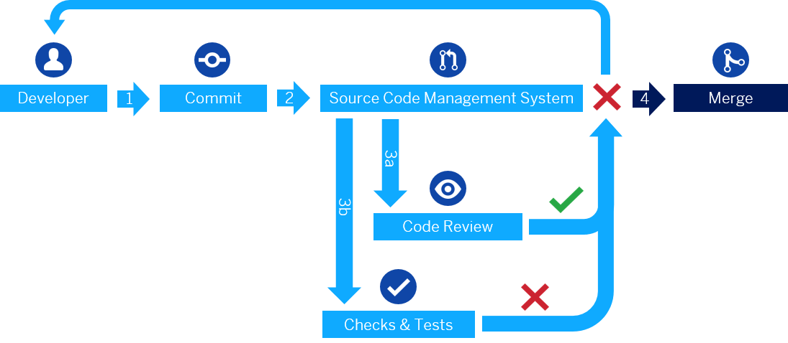

<!-- loiofe7a158313af4590ad60f844e5b43b80 -->

# Continuous Integration: Ensure Code Quality

This section describes the setup of a development project where multiple developers work together on the same code.

When you develop an app, you want, of course, to deliver high code quality. To do so, you have various tools at hand:

-   Unit and integration tests to make sure that your change doesn't break the app or other tests \(see [Unit Testing with QUnit](../04_Essentials/unit-testing-with-qunit-09d145c.md) and [Integration Testing with One Page Acceptance Tests \(OPA5\)](../04_Essentials/integration-testing-with-one-page-acceptance-tests-opa5-2696ab5.md)\)

-   Code analyzer \(or "linter"\) to check whether the code follows the code style conventions that apply to your project

-   A code coverage analyzer to check the test coverage of your code

-   A code collaboration tool to let other experts review your code

-   An automation server that orchestrates the automated task

If you work in a team where you share the same code with your colleagues, or if you work in a continuous delivery context where an app is updated on a regular basis, you need the support of automated continuous integration processes.

Continuous integration makes sure that only code that has passed various automated and manual checks is merged to productive use.

In an SAPUI5 project, the process, for example, can look like this:

1.  When the code is ready, the developer commits the code to the source code management system \(SCMS, for example, *Gerrit Code Review*\) and assigns experts that should review the code.

2.  The SCMS calls an automation server \(for example, *Jenkins*\).

3.  The developer triggers the peer code review and the automation server starts a voter job that triggers, among others:

    -   Static code checks \(for example, *ESLint*\) to check the code style

    -   Unit and integration test automated by a test runner \(for example, *Karma*\)

    -   Analysis to check whether all parts of the code are covered with automated tests \(for example, with *Karma* plug-in *Istanbul Code Coverage*\)

4.  When the voter job and the human reviewer have both given their OK, the change can be merged.

  
  
<a name="loiofe7a158313af4590ad60f844e5b43b80__fig_rgh_cfj_pbb"/>Code cannot be merged because automated tests failed

  

**Related Information**  

[Testing](../04_Essentials/testing-7cdee40.md "SAPUI5 provides several testing options, like to unit and integration tests and the OData V2 mock server.")

[*Gerrit Code Review*Home Page](https://www.gerritcodereview.com)

[*Jenkins* Home Page](https://jenkins.io/)

[*ESLint* Home Page](https://eslint.org/)

[*Karma* Home Page](https://karma-runner.github.io/)

[*Istanbul Code Coverage* Home Page](https://istanbul.js.org/)

