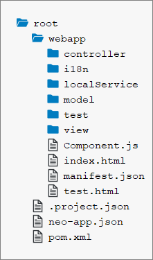
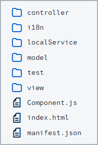
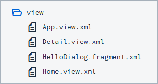
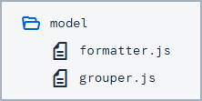
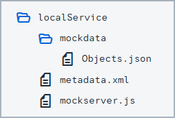
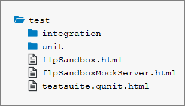
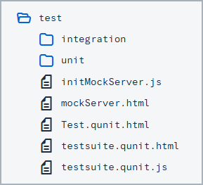
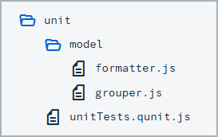
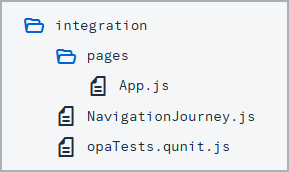

<!-- loio003f755d46d34dd1bbce9ffe08c8d46a -->

# Folder Structure: Where to Put Your Files

The details described here represent a best practice for structuring an application that features one component, one OData service and less than 20 views. If you're building an app that has more components, OData services and views, you may have to introduce more folder levels than described here.

## The 3 Main Folders

The 3 main folders in an application are the `root` folder, the `webapp` folder and the `test` folder. Regarding their structure, the `webapp` folder should be inside the `root` folder, and the `test` folder should be located inside the `webapp` folder, as shown below:

> ### Note:  
> The image above shows a screenshot taken from SAP Web IDE, and is only meant to serve as an example. This applies to all images contained within this topic.

**The `root` Folder**

The root folder should contain files that are not part of your application coding. Examples are build configuration files, such as a `pom.xml` for maven or a `Gruntfile.js` for node/grunt, and documentation files like `readme.md` or `txt`. These files may also be grouped in folders if needed. For example, you could group all documentation files into a `doc` folder.

**The `webapp` Folder**

The `webapp` folder contains all the code that is related to the application. This means running and extending the application using the **extensibility** mechanism offered by SAPUI5. This includes the JavaScript files for the logic, view files written in xml, html, json or js format, and also files for **localization**, such as `i18n.properties` files. Any files that are only relevant for testing should be put inside the `test` folder. For more details about the `webapp` folder, see the section below. For more information about extensibility and localization, see [Extending Apps](../08_Extending_SAPUI5_Applications/extending-apps-a264a9a.md) and [Localization](../04_Essentials/localization-91f217c.md) respectively.

**The `test` Folder**

The `test` folder contains all of the files needed for running automated tests for your application, as well as for launching your application in a sandbox mode so that you can do manual testing. For more details about the `test` folder, see the section below.

**Why Use 3 Separate Folders?**

To achieve sound performance when loading your application, the code you deploy to your production servers should only contain a `component-preload.js` and a `manifest.json` file. This means that when you create a package with a build, it is easier if all the files you really want to deploy are inside **one** folder. This is true no matter which build framework you use. We recommend using the `webapp` folder for this. Nothing inside the `root` folder is needed for running the app, so it's not included on a production server serving your application. The content of the `test` folder has to be executed in design time and during the automated test execution on a central server. We choose to include it inside the `webapp` folder, to be able to reference resources of the `webapp` folder relatively to the `test` folder. This folder has to be excluded when you are building a `component-preload.js`. You should never reference resources of the `test` folder from your application, because when you deploy to a productive environment, the resource cannot be loaded. For more information about the `manifest.json` file, see [Descriptor for Applications, Components, and Libraries \(manifest.json\)](../04_Essentials/descriptor-for-applications-components-and-libraries-manifest-json-be0cf40.md).

## The `webapp` Folder in Detail

Aside from the `test` folder, the `webapp` folder contains 3 folders related to the MVC \(model, view, controller\) pattern used in SAPUI5, as well as a localization folder and a local-services folder used for emulating OData services. Each of these folders is outlined below.

For standalone app, this folder also contains an `index.html` file that is used to start the app and to instantiate the component. If your apps is built for the SAP Fiori launchpad no `index.html` file is created but only files for testing the app in the FLP sandbox.

**The `view` Folder**

In the `view` folder, you should put all SAPUI5 **views** and **fragments**. This folder should not contain any application logic, so no JavaScript files unless you are using JavaScript views. JavaScript views are not recommended because it is easier to mix controller logic when building up a view. In declarative views this is not possible. In the example shown below, the `view` folder contains a mixture of views and fragments. If this folder gets too big, you might consider adding subfolders to group views by their semantics. In this example for instance, you could add a `detail` folder and move all views that are related to the detail area of your application to this subfolder.

For more information about views and fragments, see [Views](../04_Essentials/views-91f27e3.md) and [Reusing UI Parts: Fragments](../04_Essentials/reusing-ui-parts-fragments-36a5b13.md) respectively.

**The `controller` Folder**

The `controller` folder contains all the controllers used by your views, and might also contain additional logic files that are used by one or more controllers. The structure of the `controller` folder should mirror the `view` folder. If a view is in a subfolder, the controller of the view should also be in the corresponding subfolder.

**The `model` Folder**

The `model` folder is where you put any files needed for creating models and logic relating to model data. This includes grouping, filtering and formatting data.

In the above example, `models.js` is a factory for creating models that are used by our application.

**Localization Folder - `i18n`**

We also have one dedicated folder for **localization** files. An SAPUI5 app will potentially be translated into many languages. Each of those languages has its own `.properties` file. Note that although the `ResourceModel` is an SAPUI5 model from a technical point of view, the localization folder is **not** part of the `model` folder. This is because the `.properties` files have a different semantic since they are used for translation. The code needed to instantiate the `ResourceModel` is located in the `model` folder. For more information about localization, see [Localization](../04_Essentials/localization-91f217c.md). For more information about the `ResourceModel`, see the [API Reference](https://ui5.sap.com/#/api/sap.ui.model.resource.ResourceModel) in the Demo Kit.

> ### Note:  
> The path to the `i18n` file must not exceed 100 characters.

**The `localService` Folder**

The `localService` folder is used to emulate OData services for tests or as a preview mode for your application. It is also intended for design-time tools since it contains the `metadata.xml` file, which describes the backend connection of your application. You need to have one `metadata.xml` file per OData service, which exactly matches the remote service’s metadata. The location of this file also needs to be maintained in the data sources section of the `manifest.json` file. For more information, see [Descriptor for Applications, Components, and Libraries \(manifest.json\)](../04_Essentials/descriptor-for-applications-components-and-libraries-manifest-json-be0cf40.md).

For integration tests, it is helpful if you are able to mock your back end with stable data. A second use case for this is for running an application in a **preview** mode so that it serves data locally instead of connecting to a back end. This is why this folder also contains files necessary for starting up the OData V2 mock server. The data served by the mock server is put inside the `mockdata` folder. If you need to, you can also include multiple sets of mock data here, by giving each set its own folder. For more information about the OData V2 mock server, see the [API Reference](https://ui5.sap.com/#/api/sap.ui.core.util.MockServer) in the Demo Kit.

For information about mock server functionality for OData V4, see [OData V4 Mock Server](../04_Essentials/mock-server-69d3cbd.md#loio69d3cbd4150c4ffb884e788f7f60fd93__section_od4_mock_server).

## The `test` Folder in Detail

<table>
<tr>
<th valign="top">

`test` folder for apps that are build for the SAP Fiori launchpad 

</th>
<th valign="top">

`test` folder for standalone apps

</th>
</tr>
<tr>
<td valign="top">

</td>
<td valign="top">

</td>
</tr>
</table>

The `test` folder contains three sets of files: files related to unit tests, files related to integration tests, and html files for either launching the tests or for testing the application manually. Inside the `unit` folder, the structure of the `webapp` folder is replicated for the files that are being tested.

In this example shown above, the files being tested are `webapp/model/formatter.js` and `webapp/model/models.js`. You may be using JavaScript files or html files to run your tests, depending on the runners you are executing your tests with. We recommend using `.js` files for writing your tests, so that you can run them with tools such as karma for instance.

The `integration` folder contains the OPA tests of your application. We decided to separate our unit and integration tests, since the execution time of the integration tests is much longer. While the unit tests run in less than 10 seconds, the integration tests run for over 2 minutes. These times will vary a lot depending on the size of your project. If the project grows and grows, the difference in the execution time will also grow. For this reason, we recommend making both kind of tests separately executable so that developers can choose which sets of tests they want to run during design time.

