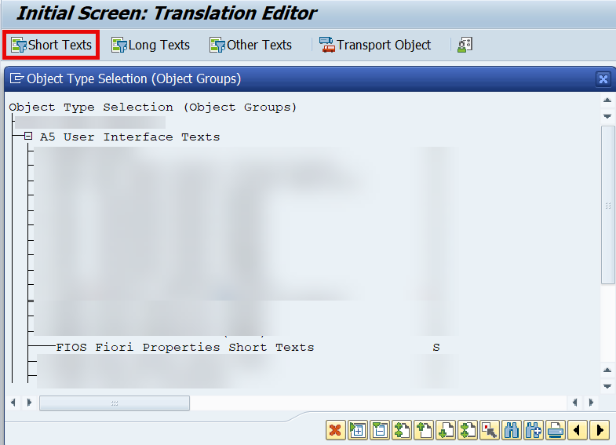
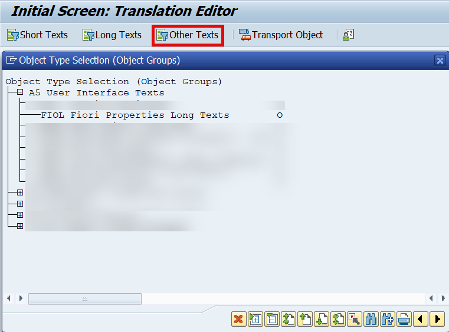

<!-- loio17d242da9f0a4b36a37d6d49acf4fe5f -->

# Information for Translators

The following information is relevant for translators.

-   Texts can be translated in transaction SE63. For more information, see [Transaction SE63](https://help.sap.com/docs/ABAP_PLATFORM_NEW/74453a577ffe4e628ab0aa8dd84e1d1b/46e52cb0bf0e30c1e10000000a11466f.html?version=latest) 
-   The texts are treated as:
    -   `Short texts` with translation object type `A5` \(User Interface Texts\) → `FIOS`\(Fiori Properties Short Texts\).

        

    -   `Other texts` with translation object type `A5` \(User Interface Texts\) -\> `FIOL` \(Fiori Properties Long Texts\). This includes texts that are longer than 196 characters and/or contain xhtml markup.

        

-   The translation object name is formed the following way:

    `<UI5 ABAP Repository Name> <File Id>`

    The repository name is padded with spaces up to 30 chars. The file ID is the hash of the filename of the default properties file.

-   The text key of each text element consists of the text type and a hash of the text name.
-   The texts are stored as texts of the BSP page of the default properties file. However, they are not visible in the BSP page editor in the ABAP Workbench. They are stored in the following database tables:

    <table>
    <tr>
    <th valign="top">

    Database Table
    
    </th>
    <th valign="top">

    What Does it Contain?
    
    </th>
    </tr>
    <tr>
    <td valign="top">
    
    `O2PAGDIR` \(File Table\)
    
    </td>
    <td valign="top">
    
    -   Hashed file name of the default properties file \(part of the translation object name\)
    -   Repository name, default file name

    
    </td>
    </tr>
    <tr>
    <td valign="top">
    
    `O2PAGPROP` \(Text Key table\)
    
    </td>
    <td valign="top">
    
    -   Text name
    -   Unique text GUID
    -   Text type
    -   Additional context information
    -   Translation object name GUID \(from the properties file\)
    -   Repository name, default file name, text GUID

    
    </td>
    </tr>
    <tr>
    <td valign="top">
    
    `O2PAGPROPT` \(language-dependent short text table\)
    
    </td>
    <td valign="top">
    
    -   Source and translated text shorter than 255 characters
    -   Keys: Repository name, default file name, text GUID as in table `O2PAGPROP`, and language key

    
    </td>
    </tr>
    </table>
    

