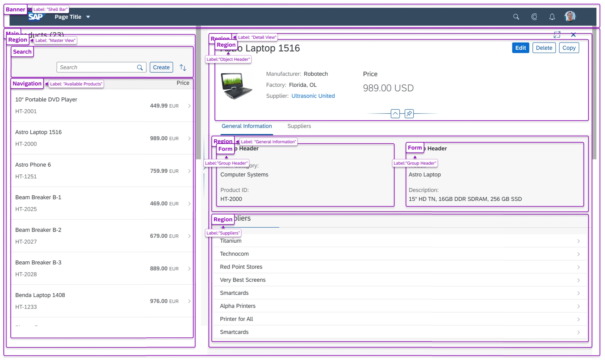

<!-- loiofd7f9d41ca9c46d891c45f1dcc0682bf -->

# Landmark API

The landmark API allows app developers to set different roles and labels that allow users to access the sections of the page using the screen reader functions/shortcuts.

Landmark roles \(or "landmarks"\) identify sections of a page. Landmarks help assistive technology users to orient themselves in a page and help them navigate easily to various sections within a page. Landmarks also provide an easy way for assistive technology users to skip over blocks of content that are repeated on multiple pages and inform them of the structure of a page. For instance, if there is a common navigation menu found on every page, landmarks can be used to skip over it and navigate from one section to another.

<a name="loiofd7f9d41ca9c46d891c45f1dcc0682bf__section_vft_ghf_fqb"/>

## Landmark APIs in SAPUI5

Support for landmark roles is provided for:

-   `sap.f.DynamicPage`

-   `sap.m.Page`
-   `sap.m.Panel`
-   `sap.uxap.ObjectPage`
-   `sap.f.FlexibleColumnLayout`

Before seeing how a landmark is set for these controls, you must understand which landmark roles we can use.

The picture below is an example of different landmarks with assigned labels in a `sap.uxap.ObjectPageLayout`. 

Supported landmark roles in SAPUI5 are stored in the `sap.ui.core.AccessibleLandmarkRole` enum. For more information, see the [API Reference: `sap.ui.core.AccessibleLandmarkRole`](https://ui5.sap.com/#/api/sap.ui.core.AccessibleLandmarkRole). 

<a name="loiofd7f9d41ca9c46d891c45f1dcc0682bf__section_jx5_b5b_jqb"/>

## sap.ui.core.AccessibleLandmarkRole

Here is a list of all of the values of the enum showing the part of the web page for which each of them is appropriate:

`sap.ui.core.AccessibleLandmarkRole:`

-   `sap.ui.core.AccessibleLandmarkRole.Banner`: Represents the ARIA [`banner`](https://www.w3.org/TR/wai-aria/#banner) role.

    A region that contains the prime heading or internal title of a page.

-   `sap.ui.core.AccessibleLandmarkRole.Complementary`: Represents the ARIA [`complementary`](https://www.w3.org/TR/wai-aria/#complementary) role.

    Any section of the document that supports the main content, yet is separate and meaningful on its own.

-   `sap.ui.core.AccessibleLandmarkRole.ContentInfo`: Represents the ARIA [`complementary`](https://www.w3.org/TR/wai-aria/#complementary) role.

    A region that contains information about the parent document such as copyrights and links to privacy statements.

-   `sap.ui.core.AccessibleLandmarkRole.Form`: Represents the ARIA [`form` role.](https://www.w3.org/TR/wai-aria/#form)

    A region of the document that represents a collection of form-associated elements, some of which can represent editable values that can be submitted to a server for processing.

-   `sap.ui.core.AccessibleLandmarkRole.Main`: Represents the ARIA [`main` role.](https://www.w3.org/TR/wai-aria/#main)

    The main content in a document. In almost all cases, a page will have only one `role="main"`.

-   `sap.ui.core.AccessibleLandmarkRole.Navigation`: Represents the ARIA [`navigation` role.](https://www.w3.org/TR/wai-aria/#navigation)

    A collection of links suitable for use when navigating the document or related documents.

-   `sap.ui.core.AccessibleLandmarkRole.Region`: Represents the ARIA [`region` role.](https://www.w3.org/TR/wai-aria/#region)

    A collection of links suitable for use when navigating the document or related documents.

-   `sap.ui.core.AccessibleLandmarkRole.Search`: Represents the ARIA [`search` role.](https://www.w3.org/TR/wai-aria/#search)

    The search tool of a web document.

-   `sap.ui.core.AccessibleLandmarkRole.None`: No explicit role is applicable.

    The interpretation of this value depends on the control/element that defines a property with this type. Normally this value means that no accessible landmark should be written.

