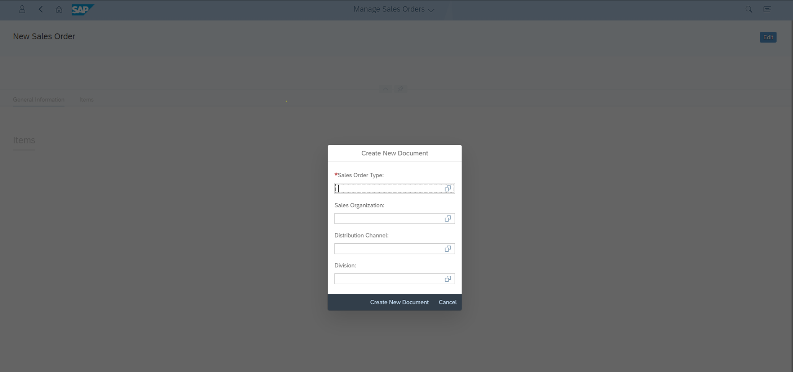
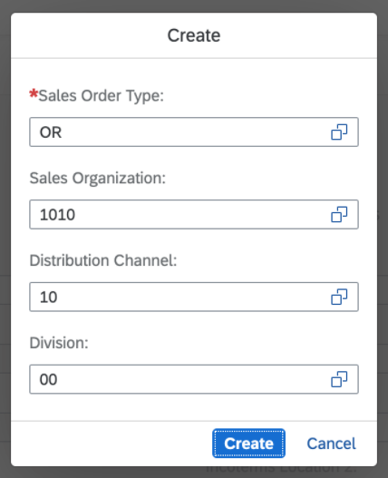
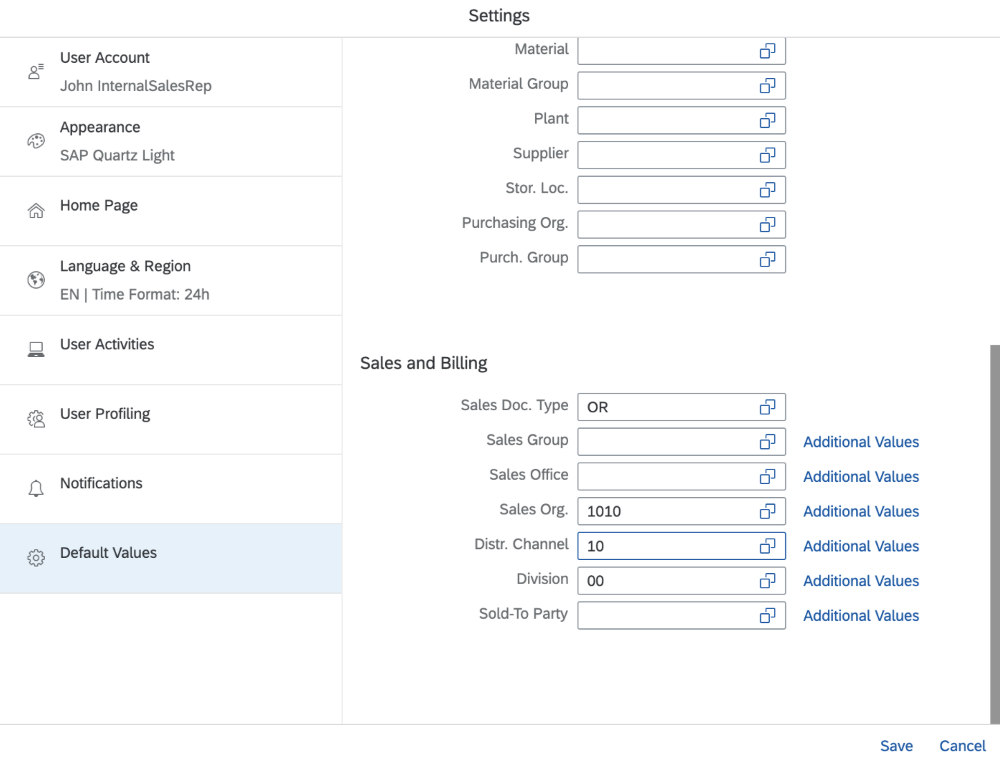
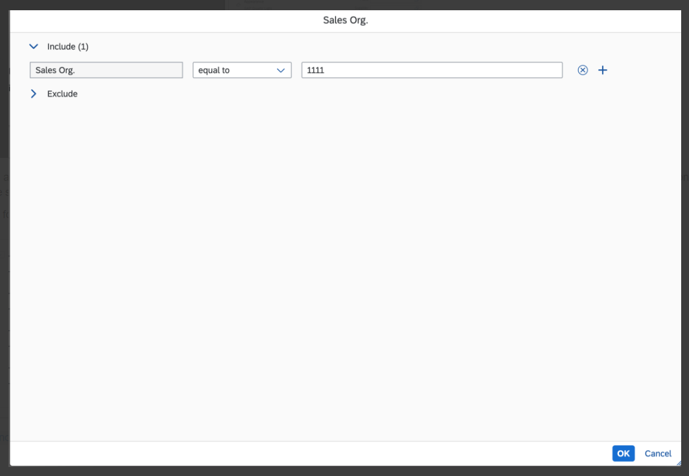
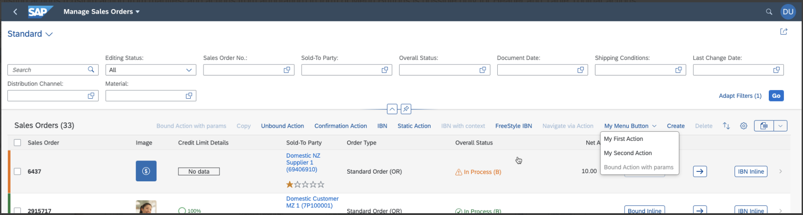

<!-- loiocbf16c599f2d4b8796e3702f7d4aae6c -->

# Actions

You can use generic actions provided by SAP Fiori elements and implement application-specific actions using annotations or extension points.

Application-specific actions either trigger an interaction with the back end, calling an OData service, or they trigger navigation. Depending on where you want to place an action, and how you want to use it, specific attributes, prerequisites, and guidelines apply. The details are described in this topic and in the floorplan-specific sections. For details about navigation, see [Configuring Navigation](configuring-navigation-a424275.md).


<a name="loiocbf16c599f2d4b8796e3702f7d4aae6c__section_rkb_c1j_l4b"/>

## Overview


<table>
<tr>
<th valign="top">

 


</th>
<th valign="top">

Action Type


</th>
<th valign="top">

Context Dependency


</th>
<th valign="top">

Use


</th>
</tr>
<tr>
<td valign="top" colspan="4">

Global Actions


</td>
</tr>
<tr>
<td valign="top" rowspan="4">

 


</td>
<td valign="top" rowspan="3">

custom action


</td>
<td valign="top" rowspan="3">

context independent


</td>
<td valign="top">

List Report

Object Page

[Adding Custom Actions Using Extension Points](adding-custom-actions-using-extension-points-7619517.md)


</td>
</tr>
<tr>
<td valign="top">

Overview Page

[Custom Actions](custom-actions-02fb273.md)


</td>
</tr>
<tr>
<td valign="top">

Analytical List Page

[Defining Custom Actions](defining-custom-actions-c3de5c0.md)


</td>
</tr>
<tr>
<td valign="top">

annotation-based


</td>
<td valign="top">

-   SAP Fiori elements for OData V2: page content is passed

-   SAP Fiori elements for OData V4: dependent on whether action is defined as bound or unbound


</td>
<td valign="top">

Object Page

[Enabling Actions in the Object Page Header](enabling-actions-in-the-object-page-header-5fe4396.md)


</td>
</tr>
<tr>
<td valign="top" colspan="4">

Actions in the Table Toolbar


</td>
</tr>
<tr>
<td valign="top" rowspan="5">


</td>
<td valign="top" rowspan="3">

annotation-based


</td>
<td valign="top" rowspan="3">

depends \(see linked topics\)


</td>
<td valign="top">

List Report

Object Page

[Adding Actions to Tables](adding-actions-to-tables-b623e0b.md)

[Generic Action Buttons in Tables on the Object Page: Additional Considerations](generic-action-buttons-in-tables-on-the-object-page-additional-considerations-d27ae99.md)


</td>
</tr>
<tr>
<td valign="top">

Analytical List Page


</td>
</tr>
<tr>
<td valign="top">

 [Configuring the Table-Only View as the Default Option](configuring-the-table-only-view-as-the-default-option-d074e26.md) 


</td>
</tr>
<tr>
<td valign="top" rowspan="2">

custom action


</td>
<td valign="top" rowspan="2">

context independent


</td>
<td valign="top">

List Report

Object Page

[Adding Custom Actions Using Extension Points](adding-custom-actions-using-extension-points-7619517.md)


</td>
</tr>
<tr>
<td valign="top">

Analytical List Page

[Defining Custom Actions](defining-custom-actions-c3de5c0.md)


</td>
</tr>
<tr>
<td valign="top">

More Information about Actions in the Object Page


</td>
<td valign="top">

n/a


</td>
<td valign="top">

n/a


</td>
<td valign="top">

[Displaying Actions on the Object Page](displaying-actions-on-the-object-page-f65e8b1.md)

[Enabling the Related Apps Button](enabling-the-related-apps-button-8dcfe2e.md)


</td>
</tr>
<tr>
<td valign="top" colspan="4">

Actions in Forms and Sections on the Object Page


</td>
</tr>
<tr>
<td valign="top" rowspan="2">

 


</td>
<td valign="top">

annotation-based


</td>
<td valign="top">

depends \(see linked topics\)


</td>
<td valign="top">

 [Adding Action Buttons to Forms in Sections](adding-action-buttons-to-forms-in-sections-e64efda.md) 


</td>
</tr>
<tr>
<td valign="top">

custom action


</td>
<td valign="top">

context independent


</td>
<td valign="top">

 [Adding Custom Actions Using Extension Points](adding-custom-actions-using-extension-points-7619517.md) 


</td>
</tr>
<tr>
<td valign="top" colspan="4">

Actions in the Chart Toolbar


</td>
</tr>
<tr>
<td valign="top" rowspan="3">

 


</td>
<td valign="top" rowspan="2">

annotation-based


</td>
<td valign="top" rowspan="2">

depends \(see linked topics\)


</td>
<td valign="top">

 [Defining Actions in the Chart Toolbar](defining-actions-in-the-chart-toolbar-7d1fa83.md) 


</td>
</tr>
<tr>
<td valign="top">

Analytical List Page

[Configuring the Chart-Only View as the Default Option](configuring-the-chart-only-view-as-the-default-option-8e6e885.md)


</td>
</tr>
<tr>
<td valign="top">

using `manifest.json` settings


</td>
<td valign="top">

depends \(see linked topics\)


</td>
<td valign="top">

Analytical List Page

[Defining Custom Actions](defining-custom-actions-c3de5c0.md)


</td>
</tr>
<tr>
<td valign="top" colspan="4">

Determining Actions


</td>
</tr>
<tr>
<td valign="top" rowspan="3">

 


</td>
<td valign="top" rowspan="2">

annotation-based


</td>
<td valign="top">

-   SAP Fiori elements for OData V2: page content is passed

-   SAP Fiori elements for OData V4: dependent on whether action is defined as bound or unbound


</td>
<td valign="top">

Object Page

[Defining Determining Actions](defining-determining-actions-1743323.md)


</td>
</tr>
<tr>
<td valign="top">

available content is passed


</td>
<td valign="top">

Analytical List Page

[Configuring the Table-Only View as the Default Option](configuring-the-table-only-view-as-the-default-option-d074e26.md)


</td>
</tr>
<tr>
<td valign="top">

custom action


</td>
<td valign="top">

context independent


</td>
<td valign="top">

Object Page

[Adding Custom Actions Using Extension Points](adding-custom-actions-using-extension-points-7619517.md)


</td>
</tr>
<tr>
<td valign="top" colspan="4">

Actions in the Quick View Card


</td>
</tr>
<tr>
<td valign="top" rowspan="2">

 


</td>
<td valign="top" rowspan="2">

annotation-based


</td>
<td valign="top">

context dependent


</td>
<td valign="top">

Overview Page

[Quick View Cards](quick-view-cards-c4bd35e.md)


</td>
</tr>
<tr>
<td valign="top">

 


</td>
<td valign="top">

List Report

Object Page

[Enabling Quick Views for Link Navigation](enabling-quick-views-for-link-navigation-307ced1.md)


</td>
</tr>
</table>


<a name="loiocbf16c599f2d4b8796e3702f7d4aae6c__section_akm_d3l_ylb"/>

## Generic and Application-Specific Actions


### Generic Actions

In the list report and on the object page, the standard actions *Create* \(+\), *Delete*, and *Edit*, as well as actions that trigger external navigation to related apps, are provided by SAP Fiori elements. You can enable or disable these actions.

For more information, see:

-   [Adding Actions to Tables](adding-actions-to-tables-b623e0b.md)

-   [Actions in the List Report](actions-in-the-list-report-993e99e.md)

-   [Enabling the Related Apps Button](enabling-the-related-apps-button-8dcfe2e.md)


### App-Specific Actions

As an application developer, there are different ways to configure custom actions.

-   Annotation-based actions

    -   Actions that require user confirmation, for example, those for critical actions that can have severe consequences. The system opens a dialog in which the user has to confirm the action.

        For more information, see [Adding Confirmation Popovers for Actions](adding-confirmation-popovers-for-actions-87130de.md).

    -   Actions that require additional user input, for example, an approval comment. The system opens a dialog with one or more entry elements in which the user enters the required data. The system can prefill data, if applicable.

    -   Actions that require none of the above. The system triggers the action.


-   Custom actions \(via manifest extension\)

    Application developers can also configure custom actions by changing the `manifest.json` file. For more information, see [Adding Custom Actions Using Extension Points](adding-custom-actions-using-extension-points-7619517.md).


<a name="loiocbf16c599f2d4b8796e3702f7d4aae6c__section_ukw_hvb_jmb"/>

## Application-Specific Actions by Position on the UI


### Global Actions

Global actions are placed at the top of the page and refer to the whole page \(for example *Display Log*\). They can be configured either via annotations \(applicable for the object page only\), or via manifest entries \(applicable for the list report and object page\).


### Actions in the Table Toolbar

You can display actions in the toolbar to allow users to perform an action for one or more lines in the table.

You can also configure inline actions. They’re displayed in a column \(specified in the annotation\) in the individual line item. When the user triggers the action, it affects only the individual line item.


### Determining Actions

Determining actions are placed in the footer of the app. These actions are also called finalizing actions and are meant for those actions that apply to the whole page. Don’t define actions that are specific to a control or parts of the page as finalizing actions.

Example: *Save* or *Accept/Reject* in an object page.

> ### Note:  
> Determining actions aren’t appropriate for the list report, since the list report holds several records and the finalizing actions are applicable to the whole page, and not just some selected records of the list report table.


<a name="loiocbf16c599f2d4b8796e3702f7d4aae6c__section_ax2_h1m_ylb"/>

## Context-Dependent and Context-Independent Actions

Both actions calling OData function imports \(`UI.DataFieldForAction`\) and actions for external navigation \(`UI.DataFieldForIntentBasedNavigation`\) can be either context-independent or context-dependent. For context-dependent actions, users have to select line items in a table. Only then are the buttons that visualize these actions enabled. However, they are always visible. For context-independent actions, users don’t have to select line items in a table. Buttons visualizing context-independent actions are always enabled.


### Handling Within `UI.DataFieldForIntentBasedNavigation` Buttons

When you configure navigation buttons, you have two options:

-   You can configure the button so that the end user must explicitly select a context \(`RequiresContext=true`\).

-   You can configure the button so that the end user doesn’t need to select a context \(`RequiresContext=false`\), meaning that the available context is passed.


### Context-Independent Actions for External Navigation

The following coding sample shows the annotations for a context -independent action for external navigation \(`UI.DataFieldForIntentBasedNavigation`\) \(Property="`RequiresContext`" Bool="`false`"\):

> ### Sample Code:  
> XML Annotation
> 
> ```xml
> <Record Type="UI.DataFieldForIntentBasedNavigation" >
>             <PropertyValue Property="Label" String="Navigation Tester with RequiresContext"/>
>             <PropertyValue Property="SemanticObject" String="Object"/>
>             <PropertyValue Property="Action" String="Action"/>
>             <PropertyValue Property="RequiresContext" Bool="false"/>
>        </Record> 
> ```

> ### Sample Code:  
> ABAP CDS Annotation
> 
> ```
> {
>     label: 'Navigation Tester with RequiresContext',
>     semanticObject: ‘Object’,
>     semanticObjectAction: 'Action', 
>     requiresContext: false,
>     type: #FOR_INTENT_BASED_NAVIGATION
> }
> 
> ```

> ### Sample Code:  
> CAP CDS Annotation
> 
> ```
> 
> {
>     $Type : 'UI.DataFieldForIntentBasedNavigation',
>     Label : 'Navigation Tester with RequiresContext',
>     SemanticObject : 'Object',
>     Action : 'Action',
>     RequiresContext : false
> }
> ```


### Context-Dependent Actions for External Navigation

The following coding sample shows the annotations for a context-dependent action for external navigation \(`UI.DataFieldForIntentBasedNavigation`\).

> ### Sample Code:  
> XML Annotation
> 
> ```xml
> <Record Type="UI.DataFieldForIntentBasedNavigation" >
>             <PropertyValue Property="Label" String="Navigation Tester with RequiresContext"/>
>             <PropertyValue Property="SemanticObject" String="Object"/>
>             <PropertyValue Property="Action" String="Action"/>
>             <PropertyValue Property="RequiresContext" Bool="true"/>
> </Record> 
> ```

> ### Sample Code:  
> ABAP CDS Annotation
> 
> ```
> {
>     label: 'Navigation Tester with RequiresContext',
>     semanticObject: ‘Object’,
>     semanticObjectAction: 'Action', 
>     requiresContext: true,
>     type: #FOR_INTENT_BASED_NAVIGATION
> }
> 
> ```

> ### Sample Code:  
> CAP CDS Annotation
> 
> ```
> {
>     $Type : 'UI.DataFieldForIntentBasedNavigation',
>     Label : 'Navigation Tester with RequiresContext',
>     SemanticObject : 'Object',
>     Action : 'Action',
>     RequiresContext : true
> }
> ```


### Handling Within `UI.DataFieldForAction` Buttons

In SAP Fiori elements for OData V2, you can choose to pass the context when the `UI.DataFieldForAction` button is invoked.

In SAP Fiori elements for OData V4, it depends on the configuration of the `IsBound` property. Context is only passed for actions with `IsBound=true`. For more information, see the section *Additional Features in SAP Fiori Elements for OData V4* in this topic.

**Grouping of Multiple Invocations of the Same Action via Multiple Selections in the Table**

Application developers can control the grouping of the multiple invocations of the action for each instance when an action is executed.

To do so, use the `UI.DataFieldForAction` annotation.

> ### Sample Code:  
> XML Annotation
> 
> ```xml
> <Record Type="UI.DataFieldForAction">
>   <PropertyValue Property="Label" String="My Action"/>
>   <PropertyValue Property="Action" String="STTA_SALES_ORDER_WD_20_SRV.STTA_SALES_ORDER_WD_20_SRV_Entities/C_STTA_SalesOrder_WD_20My_FunctionImport"/>
>   <PropertyValue Property="InvocationGrouping" EnumMember="UI.OperationGroupingType/Isolated"/>
> </Record>
> 
> ```

> ### Sample Code:  
> ABAP CDS Annotation
> 
> ```
> 
>  {
>     label: 'My Action',
>     dataAction: 'PUSHDOWN:C_STTA_SalesOrder_WD_20My_FunctionImport',
>     invocationGrouping: #ISOLATED,
>     type: #FOR_ACTION,
>     position: 1 
>   }
> ```

> ### Sample Code:  
> CAP CDS Annotation
> 
> ```
> 
> {
>     $Type : 'UI.DataFieldForAction',
>     Label : 'My Action',
>     Action : 'STTA_SALES_ORDER_WD_20_SRV.STTA_SALES_ORDER_WD_20_SRV_Entities/C_STTA_SalesOrder_WD_20My_FunctionImport',
>     InvocationGrouping : #Isolated
> },
> ```

The `InvocationGrouping` property denotes how multiple invocations of the same action on multiple instances are grouped. This annotation is optional. The value is `String enum`. The following enumerations are available:


<table>
<tr>
<th valign="top">

Value


</th>
<th valign="top">

Description


</th>
</tr>
<tr>
<td valign="top">

UI.OperationGroupingType/Isolated


</td>
<td valign="top">

-   In SAP Fiori elements for OData V2:

    The request for each selected instance is sent in a separate changeset within a single batch.

-   In SAP Fiori elements for OData V4:

    The request for each selected instance is sent in a different batch and is processed sequentially.


Even if an error occurs for one or more selected instances when an action is executed, the other selected instances are still executed.


</td>
</tr>
<tr>
<td valign="top">

UI.OperationGroupingType/ChangeSet


</td>
<td valign="top">

-   The request for each selected instance is sent in the same changeset within a single batch.

-   Even if only a single selected instance results in an error when an action is executed, none of the selected instances are executed. This means that the action is either executed successfully for all instances, or isn't executed for any of the selected instances.


</td>
</tr>
</table>

> ### Note:  
> If you use context-independent actions, you need to label them in a way that makes it clear to the app user that the action is context independent.


<a name="loiocbf16c599f2d4b8796e3702f7d4aae6c__section_egb_j2l_ylb"/>

## Additional Features in SAP Fiori Elements for OData V2

> ### Note:  
> The overview page only supports micro actions, for example, actions in the quick view cards that open when you click the right-hand side of the stack card. For more information, see [Quick View Cards](quick-view-cards-c4bd35e.md) and [Custom Actions](custom-actions-02fb273.md).


### App-Specific Actions

You can also implement your own actions by using extension points.

For the analytical list page, you can define actions in the chart toolbar. For more information, see [Configuring the Chart-Only View as the Default Option](configuring-the-chart-only-view-as-the-default-option-8e6e885.md) and [Defining Custom Actions](defining-custom-actions-c3de5c0.md).


### Actions Calling OData Function Imports

**Bound Actions \(Context-Dependent\)**

Context-dependent function imports provide an `sap:action-for` annotation defining the entity type for the required context.

> ### Sample Code:  
> ```
> <FunctionImport Name="C_STTA_SalesOrder_WD_20Setdisabledstatus"
> ReturnType="STTA_SALES_ORDER_WD_20_SRV.C_STTA_SalesOrder_WD_20Type"
> EntitySet="C_STTA_SalesOrder_WD_20" m:HttpMethod="POST" sap:action-for="STTA_SALES_ORDER_WD_20_SRV.C_STTA_SalesOrder_WD_20Type"
> sap:applicable-path="Setdisabledstatus_ac">
> ```

**Action Parameters for Bound Actions \(Context-Dependent\)**

Bound actions can have parameters that are defined by the backend. If the name of the parameter matches with any property of the bound entity, then the value of that property is used from the selected row. In case of multi select, the action parameters are not filled with the selected context values.

> ### Note:  
> Bound action parameters that matches with the key properties of the bound entity are not displayed in the action parameter dialog.

**Unbound Actions \(Context-Independent\)**

Context-independent function imports don’t provide an `sap:action-for` annotation.

> ### Sample Code:  
> ```
> <FunctionImport Name="C_STTA_SalesOrder_WD_20Create_simple" 
> ReturnType="STTA_SALES_ORDER_WD_20_SRV.C_STTA_SalesOrder_WD_20Type" 
> EntitySet="C_STTA_SalesOrder_WD_20" m:HttpMethod="POST" />
> ```

Context-independent actions calling OData function imports can be placed in the table and smart chart toolbars of the list report and the object page as determining actions in the list report or in the object page header.

**Action Parameters for Unbound Actions \(Context-Independent\)**

Unbound actions can have parameters that are defined by the backend. All the function import properties are displayed in the action parameter dialog. The action dialog displays a parameter as mandatory if it is marked `‘Nullable:false’` in the function import definition.

> ### Note:  
> You can also call function imports with or without input parameters using multiselection in tables.


### Context-Independent Actions for External Navigation

For internal use only! Corresponding CDS annotation:

 `{position:30, importance: #HIGH, type: #FOR_INTENT_BASED_NAVIGATION, requiresContext: false, semanticObjectAction: 'showItemFinancialPlanningWD', label: 'Financial Planning' },` 


### Context-Dependent Actions for External Navigation

For internal use only! Corresponding CDS annotation:

 `{position:30, importance: #HIGH, type: #FOR_INTENT_BASED_NAVIGATION, requiresContext: true, semanticObjectAction: 'showItemFinancialPlanningWD', label: 'Financial Planning' },` 


### Prefilling Action Parameter Values Using `DefaultValuesFunction`

The action parameters can be prefilled with the values returned from a default value function.

For more information, see [Prefilling Fields Using the DefaultValuesFunction](prefilling-fields-using-the-defaultvaluesfunction-5ada91c.md).


<a name="loiocbf16c599f2d4b8796e3702f7d4aae6c__section_ntd_h2l_ylb"/>

## Additional Features in SAP Fiori Elements for OData V4


### Enabling Custom Actions Defined via Annotations

You can use annotations to control the enablement of operations \(annotation-based actions\) – in this case `Core.OperationAvailable`. This property can be set either to a static value \(Boolean `true` or `false`\), or to a dynamic value \(path pointing to a property\).

-   `OperationAvailable` with Boolean `true`:

    If you set to `true` the action button is always enabled, irrespective of the context that's selected.

    > ### Sample Code:  
    > XML Annotation
    > 
    > ```xml
    > <Annotations Target="SAP__self.CreateWithSalesOrderType>
    >    <Annotation Term="SAP__Core.OperationAvailable" Bool="true"/>
    > </Annotations>
    > ```

    > ### Sample Code:  
    > ABAP CDS Annotation
    > 
    > No ABAP CDS annotation is required, since the setting is made according to the modeling \(create, update, delete, etc.\) in RAP BDEF \(behavior definition\).

    > ### Sample Code:  
    > CAP CDS Annotation
    > 
    > ```
    > 
    > annotate SAP__self.CreateWithSalesOrderType @(
    >   Core.OperationAvailable : true 
    > );
    > 
    > ```

    > ### Caution:  
    > Don't set Boolean to `false`. Remove the action from the service definition \(metadata\) instead. Setting Boolean to `false` implies that the action button is always disabled, irrespective of the context that's selected. The button is not usable and won't be rendered.

-   `OperationAvailable` with `path`: If you set to `path` then the button is enabled if there is at least one selected context for which `OperationAvailable` path evaluates to `true`.

    > ### Sample Code:  
    > XML Annotation
    > 
    > ```xml
    > <Annotations Target="SAP__self.CreateWithSalesOrderType>
    >    <Annotation Term="SAP__Core.OperationAvailable" path="Delivered"/>
    > </Annotations>
    > ```

    > ### Sample Code:  
    > ABAP CDS Annotation
    > 
    > No ABAP CDS annotation is required, since the setting is made according to the modeling \(create, update, delete, etc.\) in RAP BDEF \(behavior definition\).

    > ### Sample Code:  
    > CAP CDS Annotation
    > 
    > ```
    > annotate SAP__self.CreateWithSalesOrderType @(
    >   Core.OperationAvailable : Delivered
    > );
    > 
    > ```

    The path can also point to a field in the parent entity set. You can see this in the following example:

    > ### Sample Code:  
    > XML Annotation
    > 
    > ```xml
    > <Annotations Target="SAP__self.SalesOrderItems>
    >    <Annotation Term="SAP__UI.CreateHidden" Path="_SalesOrder/Delivered">
    > </Annotations>
    > <EntityType Name="SalesOrderItemType">
    >     ...
    >     <NavigationProperty Name="_SalesOrder" Type="SAP__self.SalesOrderType" Partner="_SalesOrderItem" />
    >     ...
    > <EntityType Name="SalesOrderType">
    >     ...
    >     <Property Name="Delivered" Type="Edm.Boolean" />
    >     ...
    >     <NavigationProperty Name="_SalesOrderItem" Type="SAP__self.SalesOrderItemType" />
    > ```

    > ### Note:  
    > In the example above, the `"_SalesOrder"` navigation entity set or annotations association points to the parent entity set, that is `<EntityType Name="SalesOrderItemType">`, if the following conditions apply:
    > 
    > 1.  The entity type pointed to by the navigation property is single valued, meaning `"SAP__self.SalesOrderType"` has `$isCollection != true` set in the metadata.
    > 
    > 2.  The value of the `Partner` property of the navigation property is also a navigation property in the parent entity set pointing back to the child entity set. This means that `"SalesOrderType"` has a navigation property called `"_SalesOrderIem"`, which is the value of the `Partner` property and this navigation property points back to the `"SalesOrderItemType"` entity set. You can see this condition in the previous annotation sample.

    > ### Sample Code:  
    > ABAP CDS Annotation
    > 
    > No ABAP CDS annotation sample is available. Please use the local XML annotation.

    > ### Sample Code:  
    > CAP CDS Annotation
    > 
    > ```
    > 
    > annotate SAP__self.SalesOrderItems @(
    >   UI.CreateHidden : _SalesOrder.Delivered
    > );
    > 
    > ```

    In the example above, the *Create* button in the list of sales order items is no longer visible for delivered sales orders. The `Partner` property associates `_SalesOrder` as the alias for the parent entity set of `_SalesOrderItem`, that is, to the `SalesOrder` entity set.


### Bound and Unbound Actions

Actions can either be classified as bound or unbound. Bound actions are those that need a context from the underlying control. Such actions can’t be invoked without passing a context \(usually selected by user actions, such as selecting a row from a table\). In the metadata, these actions are marked with the `IsBound` property.

> ### Sample Code:  
> XML Annotation
> 
> ```xml
> <Action Name="REUNION" IsBound="true">
>    <Parameter Name="_it" Type="com.sap.gateway.srvd.sadl_gw_appmusicro_definition.v0001.ArtistsType" Nullable="false" />
>    <ReturnType Type="com.sap.gateway.srvd.sadl_gw_appmusicro_definition.v0001.ArtistsType" Nullable="false" />
> </Action>
> <Action Name="UnboundAction" IsBound="false">
>    <ReturnType Type="com.sap.gateway.srvd.sadl_gw_appmusicro_definition.v0001.ArtistsType" Nullable="false" />
> </Action>
> 
> ```

> ### Sample Code:  
> ABAP CDS Annotation
> 
> Action definitions aren’t part of ABAP CDS annotations. They come from the action definition in the ABAP back end.

> ### Sample Code:  
> CAP CDS Annotation
> 
> ```
> entity entityName as projection on db.baseEntity {
> *
> } actions {
> @cds.odata.bindingparameter.name : '_it'
> action REUNION() returns Artists;
> };
> action UnboundAction() returns Artists;
> 
> ```

> ### Note:  
> When an action is inside a control, the bound and unbound actions are referred to differently. A bound action is referred via `<SchemaNamespace>.<ActionName>`, while an unbound action is referred via `<SchemaNamespace>.<EntityContainerName>/<ActionImportName>`.

-   Bound Action

    > ### Sample Code:  
    > XML Annotation
    > 
    > ```xml
    > <Record Type="UI.DataFieldForAction">
    >         <PropertyValue Property="Label" String="Reunion" />
    >         <PropertyValue Property="Action" String="com.sap.gateway.srvd.sadl_gw_appmusicro_definition.v0001.REUNION" /> 
    >                <!-- The bound action (REUNION) is referred above via <SchemaNamespace>.<ActionName> -->
    > </Record>
    > 
    > ```

    > ### Sample Code:  
    > ABAP CDS Annotation
    > 
    > ```
    > {
    >     label: 'Reunion',
    >     dataAction: 'com.sap.gateway.srvd.sadl_gw_appmusicro_definition.v0001.REUNION',
    >     type: #FOR_ACTION
    > }
    > 
    > ```

    > ### Sample Code:  
    > CAP CDS Annotation
    > 
    > ```
    > action myBoundAction() returns SalesOrderItem; 
    > {
    >         $Type  : 'UI.DataFieldForAction',
    >         Label  : 'Bound Action',
    >         Action : 'com.c_salesordermanage_sd.myBoundAction'
    > }
    > 
    > ```

-   Unbound Action

    > ### Sample Code:  
    > XML Annotation
    > 
    > ```xml
    > <Record Type="UI.DataFieldForAction">
    >         <PropertyValue Property="Label" String="Break Up" />
    >         <PropertyValue Property="Action" String="com.sap.gateway.srvd.sadl_gw_appmusicro_definition.v0001.MyContainer/BREAK_ACTION" />
    >                <!-- The unbound action (BREAK_ACTION) is referred above via <SchemaNamespace>.<EntityContainerName>/<ActionImportName> -->
    > </Record>
    > 
    > ```

    > ### Sample Code:  
    > ABAP CDS Annotation
    > 
    > ```
    > {
    >     label: 'Break Up',
    >     dataAction: ' com.sap.gateway.srvd.sadl_gw_appmusicro_definition.v0001.MyContainer/BREAK_ACTION ', 
    >     type: #FOR_ACTION
    > }
    > 
    > ```

    > ### Sample Code:  
    > CAP CDS Annotation
    > 
    > ```
    > action myUnboundAction() 
    > {
    >         $Type  : 'UI.DataFieldForAction',
    >         Label  : 'Unbound Action',
    >         Action : 'com.c_salesordermanage_sd.EntityContainer/myUnboundAction'
    > }
    > 
    > ```


The visibility of the action is controlled via the `UI.Hidden` annotation and the enablement is controlled via the `OperationAvailable` annotation.


### Using Singletons to Influence the Visibility of the *Create*, *Delete*, and *Edit* Buttons

> ### Tip:  
> Using singletons to control the visibility of actions is available for the list report, object page, and analytical list page.

You can use the `UI.CreateHidden`, `UI.DeleteHidden`, and `UI.UpdateHidden` annotations to point to a singleton property path. The following sample code shows how to do this:

> ### Sample Code:  
> Hide the Create, Delete, and Update \(Edit\) functionality based on singleton properties
> 
> ```
> <EntityContainer Name="EntityContainer">
>    <Singleton Name="SingletonOne" Type="com.namespace.SingletonOne"/>
> </EntityContainer>
>  
> <EntityType Name="SingletonOne">
>    ...
>    <Property Name="HiddenCreate" Type="Edm.Boolean"/>
>    <Property Name="HiddenDelete" Type="Edm.Boolean"/>
>    <Property Name="HiddenUpdate" Type="Edm.Boolean"/>
> </EntityType>
>  
> <Annotations Target="com.namespace.EntityContainer/TargetEntitySet">
>     <Annotation Term="UI.CreateHidden" Path="/com.namespace.EntityContainer/SingletonOne/HiddenCreate" />
>     <Annotation Term="UI.DeleteHidden" Path="/com.namespace.EntityContainer/SingletonOne/HiddenDelete" />
>     <Annotation Term="UI.UpdateHidden" Path="/com.namespace.EntityContainer/SingletonOne/HiddenUpdate" />
> </Annotations>
> ```

Please note that the path pointing to the singleton property must be absolute and via the `EntityContainer`.

The CAP CDS syntax to define such a reference uses the inline `edmJson` mechanism.

> ### Note:  
> `$edmJson` is supported only with CDS compiler 2.3.0 or higher.

> ### Sample Code:  
> CAP CDS example for `$edmJson` syntax
> 
> ```
> UI.CreateHidden : { $edmJson: { $Path: '/com.namespace.EntityContainer/SingletonOne/HiddenCreate' } }
> ```


### Static Actions

Unlike bound actions, where a context must be passed, static actions don’t need a user-selected context to be passed. But, in contrast to unbound actions, some context is always passed to static actions, namely the header context of the collection for which the static action is defined.

You define a static action via the `"Collection(...)"` in the `Type` property of the `"_it"` parameter, as shown in the following code sample:

> ### Sample Code:  
> XML Annotation
> 
> ```xml
> <Action Name="createActiveTravel" EntitySetPath="_it" IsBound="true">
>             <Parameter Name="_it" Type="Collection(com.sap.gateway.srvd.dmo.ui_travel_processor_uuid.v0001.TravelType)"/>
>             <ReturnType Type="com.sap.gateway.srvd.dmo.ui_travel_processor_uuid.v0001.TravelType" Nullable="false"/>
> </Action>
> ```

> ### Sample Code:  
> ABAP CDS Annotation
> 
> Action definitions aren't part of ABAP CDS annotations. They come from the action definition in the ABAP back end.

> ### Sample Code:  
> CAP Annotation
> 
> ```
> entity entityName as projection on db.baseEntity {
> *
> } actions {
> @cds.odata.bindingparameter.collection
> @cds.odata.bindingparameter.name : '_it'
> action createActiveTravel () returns Travel;
> };
> 
> ```

You can see how to refer to the static action defined like this in the following sample code:

> ### Sample Code:  
> XML Annotation
> 
> ```xml
> <Record Type="UI.DataFieldForAction">
>         <PropertyValue Property="Label" String="Static Action"/>
>         <PropertyValue Property="Action" String="com.c_salesordermanage_sd.myCreateAction(com.c_salesordermanage_sd.SalesOrderManage)"/>
> </Record>
> 
> ```

> ### Sample Code:  
> ABAP CDS Annotation
> 
> ```
> {
>     label: 'Static Action',
>     dataAction: 'com.c_salesordermanage_sd.myCreateAction(com.c_salesordermanage_sd.SalesOrderManage)',
>     type: #FOR_ACTION
> }
> 
> ```

> ### Sample Code:  
> CAP CDS Annotation
> 
> ```
> action myCreateAction() returns SalesOrderManage; 
> {
>         $Type  : 'UI.DataFieldForAction',
>         Label  : 'Static Action',
>         Action : 'com.c_salesordermanage_sd.myCreateAction(com.c_salesordermanage_sd.SalesOrderManage)'
> }
> 
> ```


### Action Parameters

Bound and unbound actions can have associated parameters. The back end that defines the action also defines the parameters associated with the action. Some of these actions might be marked as mandatory, which means that the action can’t be invoked without supplying a value for the parameter.

> ### Tip:  
> Action parameters can have single values and collections.

Annotations showing single values:

> ### Sample Code:  
> XML Annotation
> 
> ```xml
> <Action Name="CreateWithSalesOrderType" EntitySetPath="_it" IsBound="true">
>     <Parameter Name="_it" Type="Collection(com.sap.gateway.srvd.c_salesordermanage_sd.v0001.SalesOrderManageType)" Nullable="false"/> <!-- This one is ignored -->
>     <Parameter Name="SalesOrderType" Type="Edm.String" Nullable="false" MaxLength="4"/>
>     <Parameter Name="SalesOrganization" Type="Edm.String" Nullable="false" MaxLength="4"/>
>     <Parameter Name="DistributionChannel" Type="Edm.String" Nullable="false" MaxLength="2"/>
>     <Parameter Name="OrganizationDivision" Type="Edm.String" Nullable="false" MaxLength="2"/>
>     <ReturnType Type="com.sap.gateway.srvd.c_salesordermanage_sd.v0001.SalesOrderManageType" Nullable="false"/>
> </Action>
> ```

> ### Sample Code:  
> ABAP CDS Annotation
> 
> Action definitions aren't part of ABAP CDS annotations. They come from the action definition in the ABAP back end.

> ### Sample Code:  
> CAP CDS Annotation
> 
> ```
> entity entityName as projection on db.baseEntity {
> *
> } actions {
> @cds.odata.bindingparameter.name : '_it'
> action CreateWithSalesOrderType(
>      SalesOrderType : sd.param.SalesOrderType not null, 
>      SalesOrganization : sd.param.SalesOrganization not null, 
>      OrganizationDivision : sd.param.OrganizationDivision not null, 
>      DistributionChannel : sd.param.DistributionChannel not null
> ) returns SalesOrderManage;
> 
> ```

Annotations showing a collection:

> ### Sample Code:  
> XML Annotation
> 
> ```
> <Action Name="CreateFromSalesOrder" IsBound="true" EntitySetPath="_it">
>      <Parameter Name="_it" Type="Collection(com.c_salesordermanage_sd.SalesOrderManage)"/>
>      <Parameter Name="SalesOrderId" Type="Edm.String" MaxLength="10" Nullable="false"/>
>      <Parameter Name="SalesOrderItemId" Type="Collection(Edm.Int32)" Nullable="false"/>
>      <ReturnType Type="com.c_salesordermanage_sd.SalesOrderManage"/>
> </Action>
> ```

> ### Sample Code:  
> ABAP CDS Annotation
> 
> No ABAP CDS annotation sample is available. Use the local XML annotation.

> ### Sample Code:  
> CAP CDS Annotation
> 
> ```
> type SalesOrderId : String(10)@(
>      title : 'Sales Order',
>      Label : 'Sales Order ID'
> );
> type SalesOrderItemId : many Integer@(
>      title : 'Sales Order Item',
>      Label : 'Sales Order Item'
> );
> 
> action CreateFromSalesOrder(
>      SalesOrderId : sd.param.SalesOrderId not null, 
>      SalesOrderItemId : sd.param.SalesOrderItemId
> ) returns SalesOrderManage;
> ```

> ### Note:  
> Bound actions have the defined OData binding parameter alias as the first parameter \(`"_it"` in the example above\).

More information about the parameter itself, such as the label for the parameter, or whether it's mandatory, comes via the annotation for the action:

> ### Sample Code:  
> ```
> <Annotations Target="SAP__self.CreateWithSalesOrderType/SalesOrderType">
>     <Annotation Term="SAP__common.Label" String="SalesOrder Type"/>
>     <Annotation Term="SAP__common.FieldControl" EnumMember="SAP__common.FieldControlType/Mandatory"/>
>     <Annotation Term="SAP__common.ValueListReferences">
>         <Collection>
>             <String>
>                 ../../../../srvd_f4/sap/c_salesordertypevh_f1873/0001;ps='srvd-c_salesordermanage_sd-0001';va='com.sap.gateway.srvd.c_salesordermanage_sd.v0001.ae-c_salesordermanage.createwithsalesordertype.salesordertype'/$metadata
>             </String>
>         </Collection>
>     </Annotation>
> </Annotations>
> ```

When an action with parameters is invoked, an action parameter dialog opens up showing all of the parameter fields. An exception is the `New` action, where the action dialog only comes up if there are mandatory parameters.

  


### Default Values for Action Parameters

Applications can ensure that the action parameter dialogs are filled with default values.

The following default values are available:

-   Default Values Defined by the Application

    The application can define `ParameterDefaultValue` annotations for action parameters. A `ParameterDefaultValue` annotation contains either a path or a fixed string for describing the source value. The path typically points to a value inside a table column \(as in the following example\), but could also point to values placed outside the table:

    > ### Sample Code:  
    > XML Annotation
    > 
    > ```xml
    > 
    > <Annotations Target="SalesOrder.CreateWithSalesOrderType/SalesOrderType">
    >    <Annotation Term="UI.ParameterDefaultValue" Path="_it/SalesOrderType"/>
    > </Annotations>
    > <Annotations Target="SalesOrder.CreateWithSalesOrderType/SalesOrganization">
    >    <Annotation Term="UI.ParameterDefaultValue" String="0001"/>
    > </Annotations>
    > ```

    > ### Sample Code:  
    > CAP CDS Annotation
    > 
    > ```
    > 
    > annotate SalesOrder.CreateWithSalesOrderType with {
    >     UI.ParameterDefaultValue : _it.SalesOrderType
    >     SalesOrderType
    > };
    > annotate SalesOrder.CreateWithSalesOrderType with {	
    >     UI.ParameterDefaultValue : '0001'
    >     SalesOrganization
    > };
    > ```

    > ### Sample Code:  
    > ```abap
    > 
    > annotate sd.param.SalesOrderType with @(UI.ParameterDefaultValue: _it.SalesOrderType);
    > annotate sd.param.SalesOrganization with @(UI.ParameterDefaultValue: '0001');
    > ```

    In multiselection scenarios \(when the user has selected multiple table lines to execute a bound action\), the parameter value is only prefilled if all source values are the same.

    > ### Note:  
    > The path inside a `ParameterDefaultValue` annotation must reference values that have already been loaded into the table. If you want to reference values that aren't loaded by default \(for example if there's no corresponding table column on the UI\), you can use the `PresentationVariant` or the `RequestAtLeast` annotation to ensure that the needed values are being requested as well.

-   Default Values that are `LateProperty`

    If you define a property whose value is to be used as the default for a parameter value, and this property isn't in the current binding, it is known as a `LateProperty`. This means that the OData binding has to read this property from the back end. If you have set up ETags, OData will recognize when the data in the back end has been updated since it was read in the current user session. When this occurs, the system provides a warning message and leaves the default parameter empty. Depending on the action implementation, the action might not be executed correctly.

-   Default Values Coming from FLP User Default Settings

    The default value that is currently considered is the one from the FLP user default settings. The parameters in the action parameter dialog get prefilled with the values set in the FLP user defaults. The parameter in the dialog gets the value of the FLP user default settings parameter with the same technical name. The user default parameters must be configured appropriately in FLP:

    -   User defaults configured as `UserDefault.<parameterName>` are single-valued, so the value will always be considered for the action parameter with the same technical name.

          

          

    -   User defaults configured as `UserDefault.extended.<parameterName>` can result in multiple values. Since only single values are supported, a value added in the additional parameters dialog is considered only when the condition is set as ‘EQ’ \(equal to\). Note that only one such condition is allowed.

    -   If multiple conditions are found for the same property, then the values are ignored for the action parameter with the same technical name.

          


-   Default Values Calculated in the Back End

    You can calculate default values for action parameters through a back-end function. As a result on the UI, when the user opens the action parameter dialog, the parameter fields are prefilled with the returned values of the back-end function.

    To achieve this, application developers must annotate the action with `Common.DefaultValuesFunction`.

    A returned value of the function is taken into account only if there isn't already a default coming from either the user application preferences or the `UI. ParameterDefaultValue` annotation set on the corresponding action parameter.

    In multiselection scenarios \(when the user has selected multiple table lines to execute a bound action\), the function is called for each context. The parameter value is only prefilled if all returned values are the same.

    When you define such functions, consider the following:

    -   Annotation on the action

        For a custom action, annotate on the action level:

        > ### Sample Code:  
        > ```
        > <Annotations Target="myService.CustomAction(myService.SalesOrderManage)">
        >          <Annotation Term="Common.DefaultValuesFunction" String=" myService.GetDefaultParamsForCustomAction " />
        > </Annotations>
        > 
        > ```

        For the standard create action, annotate at the entity level:

        > ### Sample Code:  
        > ```
        > <Annotations Target=" myService.EntityContainer/SalesOrderManage">
        >          <Annotation Term="Common.DefaultValuesFunction" String="GetDefaultParamsForSalesOrderCreate" />
        > </Annotations>
        > 
        > ```

        You can also annotate a navigation property. When you create an item from a parent entity, the default values function of the navigation property is read at the parent entity level. If not present, the default value's function annotated on the table entity is read.

        > ### Sample Code:  
        > ```
        > <Annotations Target=" myService.EntityContainer/SalesOrderManage/_Item">
        >          <Annotation Term="Common.DefaultValuesFunction" String="GetDefaultParamsForItemCreate" />
        > </Annotations>
        > 
        > ```

    -   Declaration of the function

        The `GetDefaultParamsForSalesOrderCreate()` function returns `defaultParamsForSalesOrderCreate`. Note that the function returns a complex type that embeds all, or just a set of, the underlying action parameters. The name and type of the action parameters have to match the name and type returned by the function:

        > ### Sample Code:  
        > ```
        > service myService {
        >   type defaultParamsForSalesOrderCreate {
        >      SalesOrderType: db.SalesOrderManage : SalesOrderType;
        >      IncotermsLocation1: db.SalesOrderManage:IncotermsLocation1;
        >       CustomerPaymentTerms: db.SalesOrderManage: CustomerPaymentTerms;
        >       OverallSDProcessStatus: db.SalesOrderManage: OverallSDProcessStatus;
        >       DescriptionFieldForOPACleanup: db.SalesOrderManage: DescriptionFieldForOPACleanup
        > };
        > 
        > ```

    -   Code of the function

        The function is implemented in the service in the same way that any action is built:

        > ### Sample Code:  
        > ```
        > srv.on("GetDefaultParamsForCustomAction", "SalesOrderManage", async req => {
        >         const tx = cds.transaction(req);
        >         const salesOrderItem = await tx.run(SELECT.one.from(SalesOrderManage).where(req.query.SELECT.from.ref[0].where));
        >         if (!salesOrderItem) throw new Error("Not found");
        >         const overallSDProcessStatus = salesOrderItem.OverallSDProcessStatus;
        >         var currentDateTime = getCurrentDateTime();
        > 
        >         return {
        >             OverallSDProcessStatus: overallSDProcessStatus,
        >             SalesOrderType: "SE",
        >             LastChangedDateTime: currentDateTime
        >         };
        > });
        > 
        > ```

        In the sample code above, the default parameter values in the dialog \(if no `UI.ParameterDefaultValue` is used for the action\) are:

        -   The current `overallSDProcessStatus` value of the selected item

        -   A hard-coded `SalesOrderType`

        -   The current date time


        If several items are selected, and if the `overallSDProcessStatus` values aren't all the same, this parameter will be kept empty in the dialog.


-   Default Values Defined at the Front End

    The values of parameters in the action dialog can be prefilled by an extension function. To do so, app developers define an extension function by setting the `defaultValuesFunction` property to the `fullName` of the action \(`<path>.<functionName>`\). This extension function needs to return an object containing the parameter names and values to be set as default values. The parameters returned by this function overwrite default values coming from annotations \(for example `UI.ParameterDefaultValue` or `Common.DefaultValuesFunction`\). You can use the `defaultValuesFunction` setting in the manifest for table, header, and footer actions:

    > ### Sample Code:  
    > Manifest Settings
    > 
    > ```
    > "sap.ui5": {
    >         "routing": {
    >             "targets": {
    >                 "SalesOrderManageList": {
    >                     "options": {
    >                         "settings": {
    >                             "controlConfiguration": {
    >                                 "@com.sap.vocabularies.UI.v1.LineItem": {
    >                                     "actions": {
    >                                         "DataFieldForAction::com.c_salesordermanage_sd.CreateWithSalesOrderType": {
    >                                             "defaultValuesFunction": "SalesOrder.custom.CustomActions.getDefaultValues"
    >                                         }
    >                                     }
    >                                 }
    >                             }
    >                         }
    >                     }
    >                 }
    > }
    > }
    > }
    > 
    > ```

    > ### Sample Code:  
    > Extension Function
    > 
    > ```
    > getDefaultValues: function(oContext, aSelectedContexts) {
    >             var oDefaultParams;
    >             if (aSelectedContexts.length > 1) {
    >                 oDefaultParams = {
    >                     "SalesOrderType": "SO03",
    >                     "SalesOrganization": "1111"
    >                 };
    >             } else {
    >                 oDefaultParams = {
    >                     "SalesOrderType": "SE",
    >                     "SalesOrganization": "",
    >                     "DistributionChannel": "03"
    >                 };
    >             }
    >             return oDefaultParams;
    >         },
    > 
    > ```

    > ### Note:  
    > Hidden or read-only parameter fields are intended to not allow data input by the user. However, you can still pass values via default values.

-   Evaluation Order

    When determining the default value for an action parameter X, the `ParameterDefaultValue` takes precedence over the FLP user default settings. So, the evaluation order is as follows:

    1.  If there's a `ParameterDefaultValue` annotation for parameter X, it is evaluated.

        1.  If there's a common source value \(which can also be null\), this value is used as the default and displayed in the action parameter dialog.

        2.  If there are different source values \(which can only occur in multiselection scenarios\), no default value is displayed in the action parameter dialog.


    2.  If there's no `ParameterDefaultValue` annotation for parameter X, the FLP user default settings are checked. If there's a corresponding value for parameter X there, then this value is used as a default and displayed in the action parameter dialog.


### Hiding Action Parameters

App developers can use the `UI.hidden` annotation to hide an action parameter.

The annotation contains either a path to a property \(for which the data type must be Boolean\), or just a Boolean value to describe the source value. The path typically points to a value inside a table column, but can also point to values placed outside the table. On an action parameter, the `UI.hidden` annotation also supports a dynamic expression.

The following sample code shows different ways to hide an action parameter:

> ### Sample Code:  
> XML Annotation
> 
> ```xml
> <Action Name="actionWithHiddenParameters" IsBound="true">
>      <Parameter Name="_it" Type="sap.fe.manageitems.TechnicalTestingService.LineItems"/>
>      <Parameter Name="myParameterHiddenFalse" Type="Edm.String"/>
>      <Parameter Name="myParameterHiddenTrue" Type="Edm.String"/>
>      <Parameter Name="myParameterHiddenDynamicPath" Type="Edm.String"/>
>      <Parameter Name="myParameterHiddenDynamicExp" Type="Edm.String"/>
> </Action>
> 
> <Annotations Target="sap.fe.manageitems.TechnicalTestingService.actionWithHiddenParameters(sap.fe.manageitems.TechnicalTestingService.LineItems)/myParameterHiddenFalse">
>      <Annotation Term="UI.Hidden" Bool="false"/>
>      <Annotation Term="Common.Label" String="Testparameter (Hidden=false)"/>
> </Annotations>
> 
> <Annotations Target="sap.fe.manageitems.TechnicalTestingService.actionWithHiddenParameters(sap.fe.manageitems.TechnicalTestingService.LineItems)/myParameterHiddenTrue">
>      <Annotation Term="UI.Hidden" Bool="true"/>
>      <Annotation Term="Common.Label" String="Testparameter (Hidden=true)"/>
> </Annotations>
> 
> <Annotations Target="sap.fe.manageitems.TechnicalTestingService.actionWithHiddenParameters(sap.fe.manageitems.TechnicalTestingService.LineItems)/myParameterHiddenDynamicPath">
>      <Annotation Term="UI.Hidden" Path="_it/preferredItem"/>
>      <Annotation Term="Common.Label" String="Testparameter (Hidden=Dynamic via path)"/>
> </Annotations>
> 
> <Annotations Target="sap.fe.manageitems.TechnicalTestingService.actionWithHiddenParameters(sap.fe.manageitems.TechnicalTestingService.LineItems)/myParameterHiddenDynamicExp">
>      <Annotation Term="UI.Hidden">
>           <If>
>                <Eq>
>                     <Path>myParameterHiddenFalse</Path>
>                     <String>Show myParameterHiddenDynamicExp parameter</String>
>                </Eq>
>                <Bool>false</Bool>
>                <Bool>true</Bool>
>           </If>
>      </Annotation>
>      <Annotation Term="Common.Label" String="Testparameter (Hidden=Dynamic via path)"/>
> </Annotations>
> ```

> ### Sample Code:  
> ABAP CDS Annotation
> 
> No ABAP CDS annotation sample is available. Please use the local XML annotation.

> ### Sample Code:  
> CAP CDS Annotation
> 
> ```
>        @cds.odata.bindingparameter.name : '_it'
>        action actionWithHiddenParameters(
> 
>                 @title                           : 'Testparameter (Hidden=false)'
>                 @UI.Hidden                       : false
>                 myParameterHiddenFalse           : String,
>                 
>                 @title                           : 'Testparameter (Hidden=true)'
>                 @UI.Hidden                       : true
>                 myParameterHiddenTrue            : String,
>                 
>                 @title                           : 'Testparameter (Hidden=Dynamic via path)'
>                 @UI.Hidden                       : _it.preferredItem
>                 myParameterHiddenDynamicPath     : String,
> 
>                 @title                           : 'Testparameter (Hidden=Dynamic via path)'
>                 @UI.Hidden                       : {$edmJson: {$If: [{$Eq: [{$Path: 'myParameterHiddenFalse'}, 'Show myParameterHiddenDynamicExp parameter']}, false, true]}}  
>                 myParameterHiddenDynamicExp      : String
>             );
> 
> ```


### Grouping Actions as Menu Buttons

Actions that have a similar business purpose can be grouped together and rendered in the form of menu buttons. Listing actions \(custom actions from the manifest and actions from annotations\) in the form of menu buttons is currently possible for header actions, table toolbar actions, and form actions. The footer action doesn't support menu buttons.

In the following screenshot, *My Menu Button* has grouped three actions:

-   *My First Action* and *My Second Action* are actions from the `manifest.json`.

-   *Bound Action with params* is an action maintained via annotations.


  

If a `DataField` action is named `com.c_salesordermanage_sd.BoundActionWithParams`, its corresponding key is `DataFieldForAction::com.c_salesordermanage_sd.BoundActionWithParams`. If the action name contains parentheses, as in `DataFieldForAction::com.c_salesordermanage_sd.BoundActionWithParams(com.c_salesordermanage_sd.SalesOrderManage)`, the corresponding key is `DataFieldForAction::com.c_salesordermanage_sd.BoundActionWithParams::com.c_salesordermanage_sd.SalesOrderManage`.

> ### Note:  
> -   When all the menu items are disabled, the menu button as a whole is disabled.
> 
> -   When all the menu items are hidden, the menu button as a whole is hidden.

Make the following settings in the manifest to group actions under a menu button for header actions:

> ### Sample Code:  
> Grouping Header Actions
> 
> ```
> "SalesOrderManageObjectPage": {
>     "type": "Component",
>     "id": "SalesOrderManageObjectPage",
>     "name": "sap.fe.templates.ObjectPage",
>     "options": {
>         "settings": {
>            "content": {
>               "header": {
>                 "actions": {
>                     "myFirstAction": {
>                         "press": "SalesOrder.custom.CustomActions.message",
>                         "text": "My First Action"
>                     },
>                     "mySecondAction": {
>                         "press": "SalesOrder.custom.CustomActions.message",
>                         "text": "My Second Action"
>                     },
>                     "MenuActions": {
>                         "text": "My Menu Button",
>                         "menu": [
>                             "myFirstAction",
>                             "mySecondAction",
>                             "DataFieldForAction::com.c_salesordermanage_sd.BoundActionWithParams"
>                             ]
>                         }
>                     }
>                 }
>             }
>         }
>     }
> }
> ```

Make the following settings in the manifest to group actions under a menu button for form actions:

> ### Sample Code:  
> Grouping Form Actions
> 
> ```
> "options": {
>     "settings": {
>         "entitySet": "SalesOrderManage",
>         "controlConfiguration": {
>             "@com.sap.vocabularies.UI.v1.FieldGroup#OrderData": {
>                 "actions": {
>                     "myFirstAction": {
>                         "press": "SalesOrder.custom.CustomActions.getCustomerName",
>                         "visible": true,
>                         "enabled": true,
>                         "text": "My First Action"
>                     },
>                     "mySecondAction": {
>                         "press": "SalesOrder.custom.CustomActions.message",
>                         "text": "My Second Action"
>                     },
>                     "MenuActions": {
>                         "text": "My Menu Button",
>                         "menu": [
>                            "myFirstAction",
>                            "mySecondAction",
>                            "DataFieldForAction::com.c_salesordermanage_sd.BoundActionWithParams"
>                         ]
>                     }
>                 }
>             }
>         } 
>     }
> }
> ```

Make the following settings in the manifest to group actions under a menu button for table toolbar actions:

> ### Sample Code:  
> Grouping Table Actions
> 
> ```
> "options": {
>     "settings": {
>         "entitySet": "SalesOrderManage",
>         "controlConfiguration": {
>             "@com.sap.vocabularies.UI.v1.LineItem": {
>                 "actions": {
>                     "myFirstAction": {
>                         "press": "SalesOrder.custom.CustomActions.getCustomerName",
>                         "visible": true,
>                         "enabled": true,
>                         "text": "My First Action"
>                     },
>                     "mySecondAction": {
>                         "press": "SalesOrder.custom.CustomActions.message",
>                         "text": "My Second Action"
>                     },
>                     "MenuActions": {
>                         "text": "My Menu Button",
>                         "menu": [
>                            "myFirstAction",
>                            "mySecondAction",
>                            "DataFieldForAction::com.c_salesordermanage_sd.BoundActionWithParams"
>                         ]
>                     }
>                 }
>             }
>         }  
>     }
> }
> ```

> ### Tip:  
> If you want to push `DataFieldForIntentBasedNavigation` buttons into the menu, use both the semantic object name and the action name within the manifest entry. This is shown in the following sample code:
> 
> > ### Sample Code:  
> > Pushing `DataFieldForIntentBasedNavigation` buttons into the menu
> > 
> > ```
> > "MenuActions": {
> >      "text": "My Menu Button",
> >      "menu": [
> >           "myFirstAction",
> >           "DataFieldForIntentBasedNavigation::<Semantic Object>::<Action>"
> >      ]
> > }
> > ```


### Defining a Default Action for a Menu Button

When you define a default action for a menu button, clicking the button triggers the desired action directly. This is possible in list reports, object page headers, and forms.

To define a default action, make the following settings in the `manifest.json`:

> ### Sample Code:  
> ```
> "MenuActionsCreateFromTemplate": {
>      "text": "Usage Example of a defaultAction",
>      "defaultAction": "DataFieldForIntentBasedNavigation::SalesOrder::defaultActionToBeCalled",
>      "menu": [
>           "DataFieldForAction::com.c_salesordermanage_sd.CreateFromCustomer",
>           "DataFieldForAction::com.c_salesordermanage_sd.CreateFromSalesOrder",
>           "DataFieldForIntentBasedNavigation::SalesOrder::manageInline"
>      ]
> }
> ```

You can either use an already existing entry from the `"menu"` definition, or use your own explicit action.


### Overriding Annotation-Based Actions via the Manifest

For certain properties, you can overwrite the annotation-based values via the manifest.

> ### Caution:  
> By doing so, the annotation-based logic is ignored for the specified action and doesn't consider any default behavior \(like a bound action only being enabled when an item in a table is selected\).

> ### Sample Code:  
> `manifest.json` Configuration for Adjusting an Annotation-Based Action
> 
> ```
> "controlConfiguration": {
>     "@com.sap.vocabularies.UI.v1.LineItem": {
>         "actions": {
>             "DataFieldForAction::com.c_salesordermanage_sd.CreateWithSalesOrderType": {
>                 "enabled": "SalesOrder.custom.CustomActions.enabledIfTwoSelected"
>                 "visible": "SalesOrder.custom.CustomActions.visibleIfAConditionIsTrue"
>             }
>         }
>     }
> }
> ```

You can override the enablement through the `enabled` property, and the visibility through the `visible` property. As shown in the sample code above, you can combine this with a handler function. For more information, see [Adding Custom Actions Using Extension Points](adding-custom-actions-using-extension-points-7619517.md).

> ### Note:  
> The functionality is currently only available as follows:
> 
> -   For header actions on the object page
> 
> -   For table actions, regardless of where you place them
> 
> -   For footer actions on the object page
> 
> -   For form actions on the object page

Add this function to `CustomActions.js`:

> ### Sample Code:  
> `CustomActions.js`
> 
> ```
> enabledIfTwoSelected: function (oBindingContext, aSelectedContexts) {
>   return aSelectedContexts.length === 2;
> },
> visibleIfAConditionIsTrue: function (oBindingContext, aSelectedContexts) {
>   // Condition returning a Boolean value
> }
> ```

To get the key, you need to select the action applicable in your specific scenario, see [Finding the Right Key for the Anchor](finding-the-right-key-for-the-anchor-6ffb084.md).

**Related Information**  


[Adding Confirmation Popovers for Actions](adding-confirmation-popovers-for-actions-87130de.md "You can display a confirmation popover when a user triggers an action.")

[Using Action Control for Context-Dependent Actions](using-action-control-for-context-dependent-actions-5b0b686.md "Action control refers to the ability of applications to be able to configure app-specific actions so that they are only enabled for certain instances of the object, but not others.")

[Adding Action-Specific Messages to Confirmation Dialog Boxes](adding-action-specific-messages-to-confirmation-dialog-boxes-f5a04c7.md "You can create message texts for specific critical actions. They are displayed in the confirmation dialog box for the action.")

[Configuring Navigation](configuring-navigation-a424275.md "SAP Fiori elements control the navigation within an app (internal navigation) and the navigation to and from an app (external navigation).")

