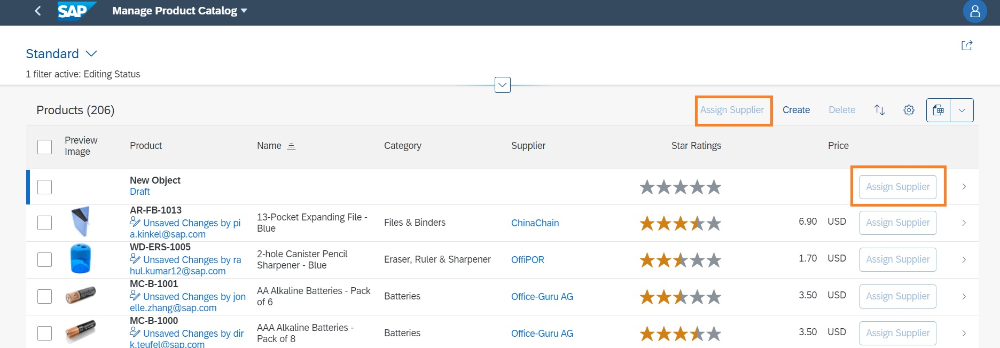
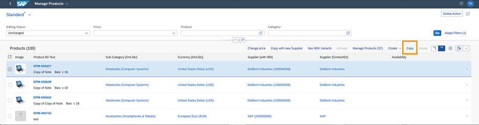

<!-- loio993e99eae4414b73bc7afef9518c79bf -->

# Actions in the List Report

The list report supports a number of actions.


<a name="loio993e99eae4414b73bc7afef9518c79bf__section_rfx_pry_cnb"/>

## Actions by Position on the UI


### Global Actions

Applications can define custom global actions via enhancements to the `manifest.json` file.

For more information, see [Adding Custom Actions Using Extension Points](adding-custom-actions-using-extension-points-7619517.md).


### Actions in the Table Toolbar

The table toolbar in the list report contains buttons used to trigger actions for the entire list report or for selected items. These actions can include generic functions offered by SAP Fiori elements or app-specific actions.

For more information, see [Adding Actions to Tables](adding-actions-to-tables-b623e0b.md).

   
  
**Example: Table Toolbar Actions and Inline Actions**

  


### **Generic and Application-Specific Actions**

**Generic Actions**

You can use the following generic actions in the table toolbar:

-   Create a new item if the entity set can be created

-   Delete of one or more items if the entity set can be deleted


**App-Specific Actions**

Depending on your use case, you can define actions that are displayed in the table toolbar for your app, for example, *Copy* and *Approve*. You can define the following types of actions for your app:

-   Actions that require user confirmation, for example, for critical actions that have severe consequences. The system opens a dialog in which the user has to confirm the action.

-   Actions that require additional user input, for example, an approval comment. The system opens a dialog with one or more entry elements in which the user enters the required data.

-   Actions that require none of the above. The system triggers the action.

-   Actions that trigger external navigation.


<a name="loio993e99eae4414b73bc7afef9518c79bf__section_qzm_wjs_tnb"/>

## Standard Actions

You can display actions to allow users to perform an action for one or more lines in the table:

-   **Delete Action**

    Display the *Delete* button as an action on a table. For more information, see [Adding Actions to Tables](adding-actions-to-tables-b623e0b.md).

-   **Create Action**

    Set up your annotations so that the *Create* action is rendered in the table toolbar of the list report.

-   **Copy Action**


### Copy Action

The *Copy* button is not available by default. However, applications can define a standard copy action by annotating `dataFieldForAction` with `isCopyAction`.

This *Copy* button is automatically placed after the *Create* button.

  

> ### Sample Code:  
> XML Annotation
> 
> ```xml
> <Annotation Term="UI.LineItem">
>   <Collection>
>       <Record Type="UI.DataFieldForAction">
>           <PropertyValue Property="Label" String="Copy" />
>           <PropertyValue Property="Action" String="STTA_PROD_MAN.STTA_PROD_MAN_Entities/STTA_C_MP_ProductCopy" />
>           <Annotation Term="UI.IsCopyAction" Bool="true" />
>      </Record>
> 
> ```

> ### Sample Code:  
> CAP CDS Annotation
> 
> ```
> UI.LineItem : [
>     {
>         $Type : 'UI.DataFieldForAction',
>         Label : 'Copy',
>         Action : 'STTA_PROD_MAN.STTA_PROD_MAN_Entities/STTA_C_MP_ProductCopy',
>         ![@UI.IsCopyAction] : true,
>     },
> ], 
> 
> ```

Applications can define a label for this button. If no custom label is provided, the default label is *Copy*.


<a name="loio993e99eae4414b73bc7afef9518c79bf__section_ryd_n3h_mtb"/>

## Additional Features in SAP Fiori Elements for OData V2


### Standard Action: Create

The *Create* action is enabled by default, because the entity set is creatable.

`sap:creatable="true"` is set for the entity set.

By default, a POST call is made when the *Create* button is clicked. However, in draft-enabled application, you can configure applications to make a call to a function import specified in `newAction` by making the `useNewActionForCreate` manifest setting. This is possible if `newAction` is defined in the `draftRoot` annotation as follows:

> ### Sample Code:  
> ```
> 
> <Annotation Term="Common.DraftRoot">
> <Record>
> <PropertyValue Property="NewAction" 
>     String="cds_zrc_ce_localized_srv.cds_zrc_ce_localized_srv_Entities/Create"/>
> </Record>
> </Annotation>
> 
> 
> ```

Make the following manifest setting to turn on draft creation with `newAction`:

> ### Sample Code:  
> ```
> 
> "ListReport|Localized": {
> 	"entitySet": "Localized",
> 	"component": {
> 	"name": "sap.suite.ui.generic.template.ListReport",
> 	"list": true,
> 	"settings": {
> 	"useNewActionForCreate": true
> 	}
> },
> ```

For more information about actions, see [Adding Actions to Tables](adding-actions-to-tables-b623e0b.md).

When a new function import has parameters, a popup appears upon clicking the *Create* button. You can define the title for the parameter dialog using the following annotation.

> ### Sample Code:  
> ```
> 
> <Annotations Target="SAP.FCLM_BAM_ACCOUNTWD_SRV_Entities/FunctionImportName">
> <Annotation Term="Common.Label" String="Create"/>
> </Annotations>
> 
> ```

If the title is not defined in the annotation, the default title is displayed from the `DIALOG_TITLE_NEW_ACTION_FOR_CREATE` i18n key. Applications can modify the title by using the same i18n key. For more information, see [Localization of UI Texts](localization-of-ui-texts-b8cb649.md).

The button label for the new action within the list page table toolbar is *Create* by default. However, applications can overwrite it by modifying the `CREATE_OBJECT` i18n key.

The button within the dialog box says *Continue*. However, applications can overwrite it by modifying the `DIALOG_ACTION_BUTTON_NEW_ACTION_FOR_CREATE` i18n key.


## Additional Features in SAP Fiori Elements for OData V4


### Standard Action: Create

The *Create* button in a list report is enabled based on the presence of `NewAction` in the metadata. This is the default behavior for draft-based applications:

> ### Sample Code:  
> ```
> 
> <Annotation Term="Common.DraftRoot">
> <Record Type="Common.DraftRootType">
> <PropertyValue Property="ActivationAction" String="com.c_salesordermanage_sd.draftActivate"/>
> <PropertyValue Property="EditAction" String="com.c_salesordermanage_sd.draftEdit"/>
> <PropertyValue Property="PreparationAction" String="com.c_salesordermanage_sd.draftPrepare"/>
> <PropertyValue Property="NewAction" String="com.c_salesordermanage_sd.ReturnInProcess"/>
> </Record>
> </Annotation>
> ```

The `InsertRestrictions` on the table entity set is completely ignored when you enable *Create* in a list report due to the presence of `NewAction`. The button is always enabled, if visible, and the visibility can be controlled via the `OperationAvailable` property through the following logic:

-   If `OperationAvailable=false`, then the *Create* button will not be displayed in the list report table.

-   If `OperationAvailable=true` or is not specified, then the *Create* button will be displayed.

-   If `OperationAvailable=null` is ignored and the *Create* button is displayed, this is equivalent to `OperationAvailable` not being specified.


For more information, see the **Enablement of Operations** section in [Adding Actions to Tables](adding-actions-to-tables-b623e0b.md).

**Related Information**  


[Configuring Custom Actions that Create New Objects](configuring-custom-actions-that-create-new-objects-8cd6877.md "Applications can configure custom actions that create new objects.")

