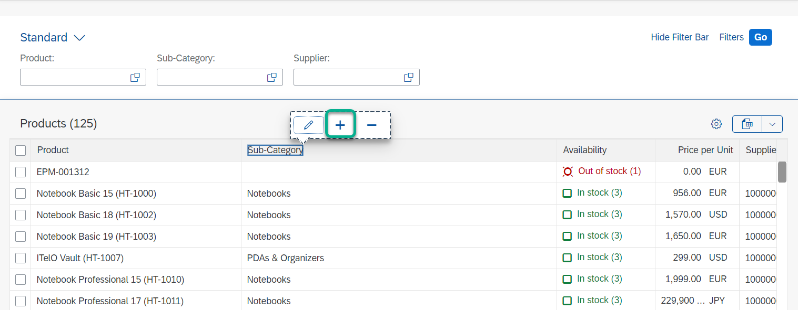
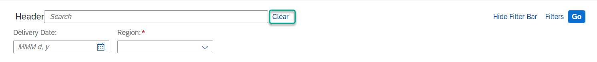
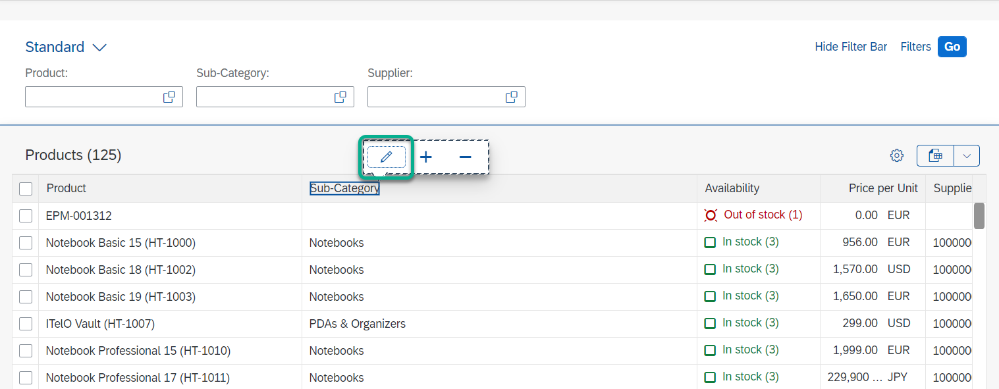
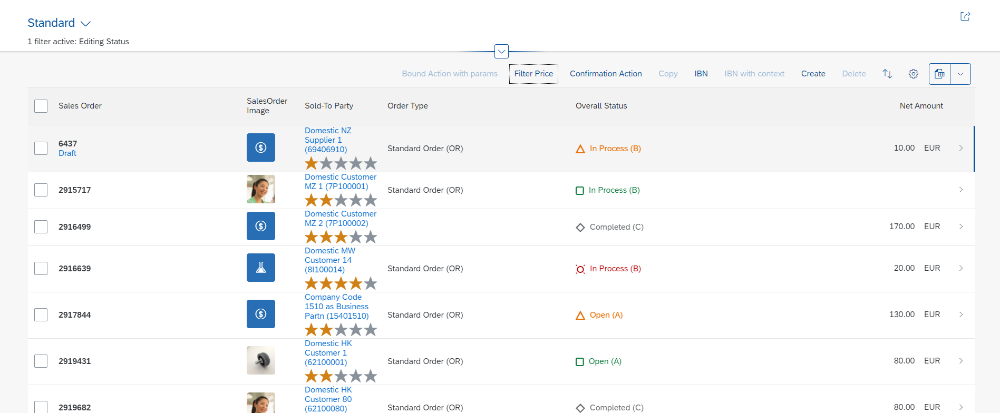

<!-- loioa269671fc49e4c75920c108961bf31f2 -->

# Adaptation Extension Example: Adding a Button to the Table Toolbar in the List Report

In this example, you add a button to the table toolbar in the list report and extend it to filter only the records which have a price that is greater than or equal to 1000.


<a name="loioa269671fc49e4c75920c108961bf31f2__prereq_u32_mjk_kfb"/>

## Prerequisites

> ### Note:  
> This topic is currently only applicable to SAP Fiori elements for OData V2.

You have performed the steps described in [Extending Delivered Apps Using Adaptation Extensions](extending-delivered-apps-using-adaptation-extensions-52fc48b.md).


## Procedure

1.  Select the table tool bar and choose *Add Fragment*.

      

2.  Under *Target Aggregation*, select *content* and choose your preferred index value. Choose *Create New* to create the fragment. If the fragment is already there, you can search for it.

      

3.  Enter a fragment name, for example, `FilterPriceButton`, and choose *Create*.

4.  Write the following code in the auto-generated `FilterPriceButton.fragment.xml` file. Note that the bold code needs a supporting function in the extension controller. This is described in the next step.

    > ### Sample Code:  
    > ```
    > <core:FragmentDefinition xmlns:core='sap.ui.core' xmlns='sap.m'>
    > <Button id="PriceBtnID" text="Filter Price" press=".extension.ProdMan.AdaptProject.ListReportExtension.handleFilterPricePress"></Button>
    > </core:FragmentDefinition>
    > ```

    > ### Note:  
    >  `".extension.ProdMan.AdaptProject.ListReportExtension.handleFilterPricePress"` consists of the following elements that are connected with a dot \(.\).
    > 
    > `.extension`: Required according to the UI adaptation tool guidelines
    > 
    > `ProdMan.AdaptProject`: Name of the project
    > 
    > `ListReportExtension`: Controller extension file name
    > 
    > `handleFilterPricePress`: Function in the controller extension file

5.  Create a controller extension. Select the table toolbar as described under step 1 and choose *Extend with Controller*.

      

6.  Enter the controller name, for example, `ListReportExtension`, and choose *Extend*.

    The system generates the controller extension file `ListReportExtension.js`.

    This auto-generated file contains predefined life-cycle functions under the *Override* block. All extensibility functions provided by SAP Fiori elements should be consumed inside *Override*. The custom-defined functions should be consumed outside the *Override* block.

    To complete the example, copy and paste the code shown below to `ListReportExtension.js`.

    > ### Note:  
    > `handleFilterPricePress` is a custom-defined function and `addFilters` is the extensibility function provided by SAP Fiori elements.

    > ### Sample Code:  
    > In this example, there is a property named *Price* in your list report entity type.
    > 
    > ```
    > /**
    > *@controller Name: sap.suite.ui.generic.template.ListReport.view.ListReport,
    > *@viewId:STTA_MP::sap.suite.ui.generic.template.ListReport.view.ListReport::STTA_C_MP_Product
    > */
    > sap.ui.define(["sap/ui/core/mvc/Controller", "sap/ui/core/mvc/ControllerExtension"], function (Controller, ControllerExtension) {
    > return ControllerExtension.extend("ProdMan.AdaptProject.ListReportExtension", {
    >  
    > 
    > handleFilterPricePress : function() {
    >      this.iPriceRestriction = "1000";
    >      var oExtensionAPI = this.base.templateBaseExtension.getExtensionAPI();
    >      oExtensionAPI.rebindTable(); 
    > },
    > //override an existing method of the Main.controller
    > override: {
    > //adding a life cycle method
    > /**
    > * Called when a controller is instantiated and its View controls (if available) are already created.
    > * Can be used to modify the View before it is displayed, to bind event handlers and do other one-time initialization.
    > * @memberOf src.client.uiadaptation
    > */
    > onInit: function () {
    > },
    > /**
    > * Similar to onAfterRendering, but this hook is invoked before the controller's View is re-rendered
    > * (NOT before the first rendering! onInit() is used for that one!).
    > * @memberOf src.client.uiadaptation
    > */
    > onBeforeRendering: function () {
    > },
    > /**
    > * Called when the View has been rendered (so its HTML is part of the document). Post-rendering manipulations of the HTML could be done here.
    > * This hook is the same one that SAPUI5 controls get after being rendered.
    > * @memberOf src.client.uiadaptation
    > */
    > onAfterRendering: function () {
    > },
    > /**
    > * Called when the Controller is destroyed. Use this one to free resources and finalize activities.
    > * @memberOf src.client.uiadaptation
    > */
    > onExit: function () {
    > },
    > "templateBaseExtension": {
    > addFilters : function(fnAddFilter, sControlId){
    > if(this.iPriceRestriction){
    > fnAddFilter(this, new sap.ui.model.Filter("Price", "GE", this.iPriceRestriction));
    > }
    > }
    > }
    > }
    > });
    > });
    > ```

7.  In the adaptation editor, choose the *Preview* tab page and choose *Go*. Check the value in the *Price* field for all records.

8.  Choose *Filter Price* and check the value in the *Price* field for the filtered records.

      


