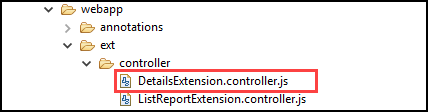

<!-- loiob95adf3545fc4c578ca50d1ee3ec34a1 -->

# Adapting Texts in the Delete Dialog Box \(Object Page with Nested Smart Table\)

You can adapt the text of the *Delete* dialog box that is displayed when you delete items from nested smart tables on the object page.


## Context

> ### Note:  
> This topic is currently only applicable to SAP Fiori elements for OData V2.

> ### Caution:  
> Use app extensions with caution and only if you cannot produce the required behavior by other means, such as manifest settings or annotations. To correctly integrate your app extension coding with SAP Fiori elements, use only the `extensionAPI` of SAP Fiori elements. For more information, see [Using the extensionAPI](using-the-extensionapi-bd2994b.md).
> 
> After you've created an app extension, its display \(for example, control placement and layout\) and system behavior \(for example, model and binding usage, busy handling\) lies within the application's responsibility. SAP Fiori elements provides support only for the official `extensionAPI` functions. Don't access or manipulate controls, properties, models, or other internal objects created by the SAP Fiori elements framework.

On an object page with a nested smart table, you can choose the *Delete* button in the table toolbar to delete the selected table items.

Perform these steps to be able to use the extension:


## Procedure

1.  Register your extension with the app descriptor \(manifest.json\):

    > ### Sample Code:  
    > ```
    > 
    > "extends": {
    >    "extensions": {
    >       ... 
    >       "sap.ui.controllerExtensions": {
    >          ...
    >          "sap.suite.ui.generic.template.ObjectPage.view.Details": {
    >             ...
    >             "controllerName": "MY_APP.ext.controller.DetailsExtension",
    >             ...
    >          }
    >       } 
    >       ...
    > 
    > ```

2.  Maintain the controller extension files in your app:

      

3.  The *Delete* dialog box contains the following text:

    -   title: always appears

    -   text: always appears

    -   undeletableText: appears only if one or more selected table items cannot be deleted using the `deletablePath` feature.


    Implement the `beforeLineItemDeleteExtension` function in the controller extension file of the object page. You have several options to determine the delete dialog:

    -   The easy way

        > ### Sample Code:  
        > ```
        > 
        > beforeLineItemDeleteExtension: function(oBeforeLineItemDeleteProperties) {
        >     if (oBeforeLineItemDeleteProperties.sUiElementId !== "My_APP::sap.suite.ui.generic.template.ObjectPage.view.Details::MY_EntitySet--to_NavProperty::com.sap.vocabularies.UI.v1.LineItem::Table") {
        >         return;
        >     }
        >     var oMessageText = {
        >         title: "My title";
        >         text: "My text",
        >         undeletableText: "My undeletable text"
        >     };
        >     return oMessageText;
        > }
        > 
        > ```

    -   Using promises

        > ### Sample Code:  
        > ```
        > 
        > beforeLineItemDeleteExtension: function(oBeforeLineItemDeleteProperties) {
        >     if (oBeforeLineItemDeleteProperties.sUiElementId !== "My_APP::sap.suite.ui.generic.template.ObjectPage.view.Details::MY_EntitySet--to_NavProperty::com.sap.vocabularies.UI.v1.LineItem::Table") {
        >         return;
        >     }
        >     var oMessageText = {
        >         title: "My title";
        >         text: "My text",
        >         undeletableText: "My undeletable text"
        >     };
        >     return Promise.resolve(oMessageText);
        > }
        > 
        > ```

    -   Using the `extensionAPI.SecuredExecution` \(see also [Using the SecuredExecution Method](using-the-securedexecution-method-6a39150.md)\)

        > ### Sample Code:  
        > ```
        > 
        > beforeLineItemDeleteExtension: function(oBeforeLineItemDeleteProperties) {
        >     if (oBeforeLineItemDeleteProperties.sUiElementId !== "My_APP::sap.suite.ui.generic.template.ObjectPage.view.Details::MY_EntitySet--to_NavProperty::com.sap.vocabularies.UI.v1.LineItem::Table") {
        >         return;
        >     }
        >     var oMessageText = {
        >         title: "My title";
        >         text: "My text",
        >         undeletableText: "My undeletable text"
        >     };
        >     return this.extenionAPI.securedExecution(function() {
        >         return new Promise(function(resolve) {
        >             ...
        >             resolve(oMessageText);
        >             ...
        >         });
        >     });
        > }
        > 
        > ```


    > ### Note:  
    > The property `oBeforeLineItemDeleteProperties` contains information about the selected items that are to be deleted from the nested smart table. For example, `sUiElementId` identifies the UI element \(here, the nested smart table\) from which something is to be deleted.


