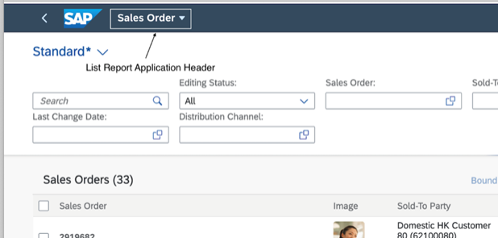
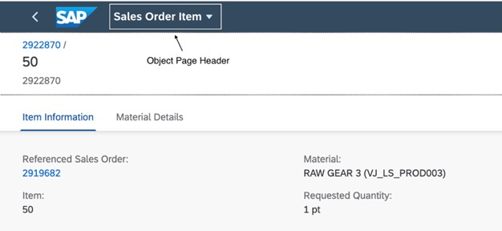

<!-- loioac70343fdf16499e8b39d42cec7593be -->

# Adapting the Application Header

If required, you can change the application header that is generated from the SAP Fiori launchpad.

<a name="loioac70343fdf16499e8b39d42cec7593be__section_yrc_r1x_cnb"/>

## List Report

   
  
**Application Header in List Report**

  

To change the application header on the object page, change the `@UI.headerInfo.typeName` annotation.

<a name="loioac70343fdf16499e8b39d42cec7593be__section_q2s_v1x_cnb"/>

## Object Page

   
  
**Application Header on Object Page**

  

To change the application header on the object page, change the `@UI.headerInfo.typeName` annotation.

<a name="loioac70343fdf16499e8b39d42cec7593be__section_vfr_y1x_cnb"/>

## Additional Features in SAP Fiori Elements for OData V2

Additionally, you can also change the application header of overview pages and analytical list reports.

<a name="loioac70343fdf16499e8b39d42cec7593be__section_ph5_31q_1cb"/>

## Related Links

-   For information about changing the table header in a list report, see [Setting the Table Header](setting-the-table-header-f996207.md).

-   For information about changing object page titles and subtitles, see [Adapting the Object Page Header Title and Description](adapting-the-object-page-header-title-and-description-333f850.md).

