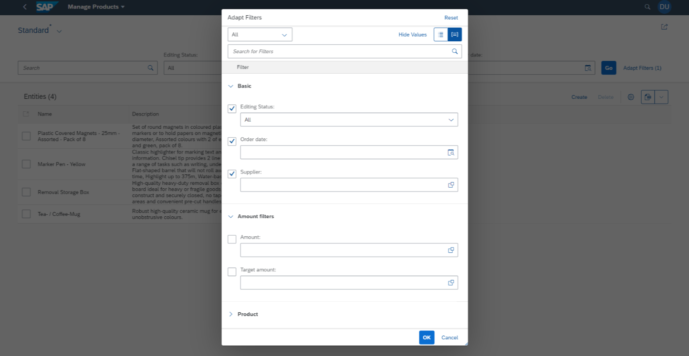

<!-- loio609c39a7498541559dbef503c1ffd194 -->

# Adapting the Filter Bar

You can define application-specific selection fields by using `com.sap.vocabularies.UI.v1.SelectionFields` and field groups for the filter popup.


<a name="loio609c39a7498541559dbef503c1ffd194__section_obh_1xm_kmb"/>

## Adding Filters

Use `com.sap.vocabularies.UI.v1.SelectionFields` to add filter fields to the filter bar. Specify additional `PropertyPath` values as shown in the following sample code:

> ### Sample Code:  
> XML Annotation
> 
> ```xml
> <Annotations Target="SEPMRA_PROD_MAN.SEPMRA_C_PD_ProductType">
>     ...
>     <Annotation Term="UI.SelectionFields">
>         <Collection>
>             <PropertyPath>Price</PropertyPath>
>             <PropertyPath>Supplier</PropertyPath>
>         </Collection>
> </Annotation>
> ```

> ### Sample Code:  
> ABAP CDS Annotation
> 
> ```
> annotate view SEPMRA_C_PD_PRODUCT with {
>     @UI.SelectionField: [{ position: 10 }]
>     price;
>  
>     @UI.SelectionField: [{ position: 20 }]
>     supplier;
> }
> ```

> ### Sample Code:  
> CAP CDS Annotation
> 
> ```
> annotate SEPMRA_PROD_MAN.SEPMRA_C_PD_ProductType with @(
>     UI.SelectionFields : [
>         Price,
>         Supplier
>     ]
> );
> ```


<a name="loio609c39a7498541559dbef503c1ffd194__section_yqy_fd2_xsb"/>

## Setting the Default Filter Value

> ### Sample Code:  
> XML Annotation
> 
> ```xml
> <Annotations Target="STTA_PROD_MAN.STTA_C_MP_ProductType/Supplier">
>     <Annotation Term="Common.FilterDefaultValue" String="100000047"/>
> </Annotations>
> ```

> ### Sample Code:  
> ABAP CDS Annotation
> 
> ```
> @Consumption.filter.defaultValue: '100000047'
> Supplier
> ```

> ### Sample Code:  
> CAP CDS Annotation
> 
> ```
> annotate STTA_PROD_MAN.STTA_C_MP_ProductType with (
>     @Common.FilterDefaultValue : '100000047'
>     Supplier
> };
> ```


<a name="loio609c39a7498541559dbef503c1ffd194__section_dq3_pd2_xsb"/>

## Grouping of Filter Fields

Field groups are used in the filter bar to group the fields. The grouping can only be seen in the *Adapt Filters* dialog. Any label specified in the annotations is used to override the property's default label.

The groups and the filter fields they contain are ordered alphabetically.

To explicitly define which field groups you want to display in the *Adapt Filters* dialog, use the `UI.FilterFacets` annotation. If you don't define any field groups using the `UI.FilterFacets` annotation, all field groups are displayed in the *Adapt Filters* dialog.

Each filter field is displayed only once in the *Adapt Filters* dialog. If a single field is used in multiple field groups, the field is displayed in the last group that is processed and contains this field. Exception: All fields that are part of the `UI.SelectionFields` annotation – these fields are always grouped under *Basic*.

If the field groups don't contain all properties of the entity, the remaining properties are all grouped under the label for the entity. If no label is defined for the entity, the entity name is displayed.

   
  
**List Report: Adapt Filters Popup**

  

> ### Sample Code:  
> XML Annotation
> 
> ```xml
> <Annotation Term="UI.FilterFacets">
>     <Collection>
>         <Record Type="UI.ReferenceFacet">
>             <PropertyValue Property="Target" AnnotationPath="@UI.FieldGroup#FilterFacet1"/>
>             <PropertyValue Property="Label" String="Amount filters"/>
>         </Record>
> </Collection>
> </Annotation>
> <Annotation Term="UI.FieldGroup" Qualifier="FilterFacet1">
>     <Record Type="UI.FieldGroupType">
>         <PropertyValue Property="Data">
>             <Collection>
>                 <Record Type="UI.DataField">
>                     <PropertyValue Property="Value" Path="amount"/>
>                     </Record>
>                 <Record Type="UI.DataField">
>                     <PropertyValue Property="Value" Path="targetAmount"/>
>                 </Record>
>             </Collection>
>         </PropertyValue>
>     </Record>
> </Annotation>
> ```

> ### Sample Code:  
> CAP CDS Annotation
> 
> ```
> annotate producService.Products with @(
>     UI.FilterFacets : [
>         {
>             Target : '@UI.FieldGroup#FilterFacet1',
>             Label : '{i18n>Amount filters}',
>         },
>     ],
> 
>     UI.FieldGroup #FilterFacet1 : {
>         Data : [
>             {Value: amount},
>             {Value: targetAmount},
>         ]
>     }
> );
> ```

> ### Note:  
> The *Editing Status* filter is added automatically if you have a draft service.


<a name="loio609c39a7498541559dbef503c1ffd194__section_spb_4vm_kmb"/>

## Additional Features in SAP Fiori Elements for OData V2

The below video shows the step-by-step procedure for adding a default filter to the filter bar: 

To set default filter value, refer [Configuring Default Filter Values](configuring-default-filter-values-f27ad7b.md).

For more information about the smart filter bar, see [SmartFilterBar](https://ui5.sap.com/#/api/sap.ui.comp.smartfilterbar.SmartFilterBar).


<a name="loio609c39a7498541559dbef503c1ffd194__section_q5m_cnn_d4b"/>

## Additional Features in SAP Fiori Elements for OData V4

The filter bar only shows filter fields defined via the `@com.sap.vocabularies.UI.v1.SelectionFields` annotation. Additional fields available for adaptation are all direct simple properties of the current entity type.


### Including Navigation Properties

To include navigation properties for filtering, you can directly define them within the same annotation so that they appear as filter fields in the filter bar. To add further filter fields to the adaptation, you can use the `navigationProperties` setting. It is an array of \(navigation\) property paths relative to the current entity type. If the path points to a navigation property or a complex property, all simple properties of that type are added to the adaptation. If the path points to a simple property, then only this field becomes available as a filter field.

> ### Sample Code:  
> ```
> navigationProperties:  [ "_DistributionChannel", "_Partner/FullName" ]
> ```

-   all properties of the navigation type `_DistributionChannel` will be added to the filter adaptation \(unless they are marked as `Hidden` or `HiddenFilter`\)

-   the single property `FullName` of the `Partner` association will be added to the filter adaptation \(unless it is marked as `Hidden` or `HiddenFilter`\)


> ### Note:  
> You can only define navigation properties with one level. Nested navigation properties aren't supported.


### Using Case Insensitive Filtering

Case sensitivity in filtering depends on the back end that is consumed by the app:

-   RAP and CAP Node.js support case insensitive filtering at DB level.

-   CAP Java supports case sensitive filtering at DB level by default.


To override this behavior, use the `"@Org.OData.Capabilities.V1.FilterFunctions"` annotation defined in the `EntityContainer`. This annotation defines all the filter functions supported by the OData service. An example is shown in the following sample code:

> ### Sample Code:  
> `FilterFunctions` annotation
> 
> ```
> <Annotations Target="namespace.EntityContainer">
>     <Annotation Term="Org.OData.Capabilities.V1.FilterFunctions">
>       <Collection>
>         ....
>         <String>tolower</String>
>         ...
>       </Collection>
>     </Annotation>
> </Annotations>
> ```

SAP Fiori elements for OData V4 checks for the existence of the `tolower` filter function in the service metadata, and sets the case sensitivity for filtering as shown in the following table:

**Case Sensitivity for FilterFunction**


<table>
<tr>
<th valign="top">

`FilterFunction`


</th>
<th valign="top">

`caseSensitive`


</th>
</tr>
<tr>
<td valign="top">

`tolower` exists


</td>
<td valign="top">

false


</td>
</tr>
<tr>
<td valign="top">

`tolower` does not exist


</td>
<td valign="top">

true \(back end decides the default behavior\)


</td>
</tr>
<tr>
<td valign="top">

No annotation is configured


</td>
<td valign="top">

true \(back end decides the default behavior\)


</td>
</tr>
</table>

This logic is valid for filtering on the following use cases:

-   Filter bar

-   Table personalization filters

-   Filters created from semantic keys

-   Value help dialogs


### Adding a *Clear* Button

You can add a *Clear* button to the filter bar in the list report by making the following setting for the `showClearButton` in your `manifest.json`:

> ### Sample Code:  
> `showClearButton`
> 
> ```
> "SalesOrderManageList": {
>     "options": {
>         "settings": {
>             "controlConfiguration": {
>                 "@com.sap.vocabularies.UI.v1.SelectionFields": {
>                     "showClearButton": true,
>                 }
>             }
>         }
>     }
> }
> ```

The functionality of the *Clear* button is as follows:

-   All filter values are cleared when a user clicks the *Clear* button.

    Note that the filter values aren't restored to the default values, but really cleared.

-   If there's an active filter on the *Editing Status*, it is reset to the value *All* when a user clicks the *Clear* button.


You can add further clearing functionality by implementing the controller extension `onAfterClear`, as shown in the following sample code:

> ### Sample Code:  
> `onAfterClear`
> 
> ```
> onAfterClear: function (oEvent) {    
>   var oView = this.getView();        
>   oView.byId("CustomSegmentedButton").setSelectedKey("none"); 
> }
> ```

**Related Information**  


[Smart Filter Bar](../10_More_About_Controls/smart-filter-bar-7bcdffc.md "The sap.ui.comp.smartfilterbar.SmartFilterBar control analyzes the $metadata document of an OData service and renders a FilterBar control that can be used to filter, for example, a table or a chart.")

[Enabling the Search Function](enabling-the-search-function-3cdebee.md "You can enable the Search function in the list report, for example.")

[Enabling Semantic Operators in the Filter Bar](enabling-semantic-operators-in-the-filter-bar-fef65d0.md "You can use semantic date values, such as Today or Last Week, on the filter bar of list report and analytical list page applications.")

