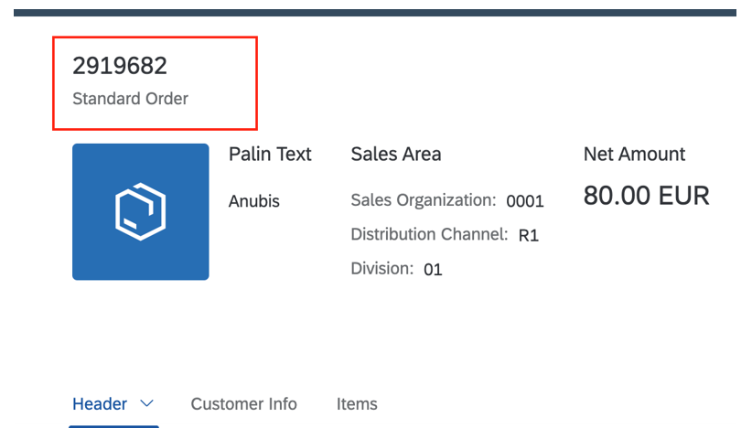

<!-- loio333f85086c2e43039f6773be15f3ed50 -->

# Adapting the Object Page Header Title and Description

You can use annotations to adapt the object page header title and description.


  
  
**Object Page Header: Title and Description**

  

To define or change the object page header title and description, adapt the OData annotations:

> ### Sample Code:  
> XML Annotation
> 
> ```xml
> <Annotations Target="STTA_PROD_MAN.STTA_C_MP_ProductType">
>     <Annotation Term="UI.HeaderInfo">
>         <Record>
>             <PropertyValue Property="Title">
>                 <Record Type="UI.DataField">
>                     <PropertyValue Property="Value" Path="to_ProductTextInOriginalLang/Name"/>
>                 </Record>
>             </PropertyValue>
>             <PropertyValue Property="Description">
>                 <Record Type="UI.DataField">
>                      <PropertyValue Property="Value" Path="ProductForEdit"/>
>                 </Record>
>             </PropertyValue>
>         </Record>
>     </Annotation>
> </Annotations>
> 
> ```

> ### Sample Code:  
> ABAP CDS Annotation
> 
> ```
> 
> @UI.headerInfo: {
>   title: {
>     value: '_PRODUCTTEXTINORIGINALLANG.NAME',
>     type: #STANDARD
>   },
>   description: {
>     value: 'PRODUCTFOREDIT',
>     type: #STANDARD
>   }
> }
> annotate view STTA_C_MP_PRODUCT with {
> 
> }
> ```

> ### Sample Code:  
> CAP CDS Annotation
> 
> ```
> 
> annotate STTA_PROD_MAN.STTA_C_MP_ProductType with @(
>   UI.HeaderInfo : {
>     Title : {
>         $Type : 'UI.DataField',
>         Value : to_ProductTextInOriginalLang.Name
>     },
>     Description : {
>         $Type : 'UI.DataField',
>         Value : ProductForEdit
>     }
>   }
> );
> ```

**Related Information**  


[Changing Default Titles of New and Unnamed Objects](changing-default-titles-of-new-and-unnamed-objects-63946c0.md "When a user creates new items for a list report or object page table, a default title is displayed. When a user removes the title and activates the object, SAP Fiori elements also provides a default title.")

